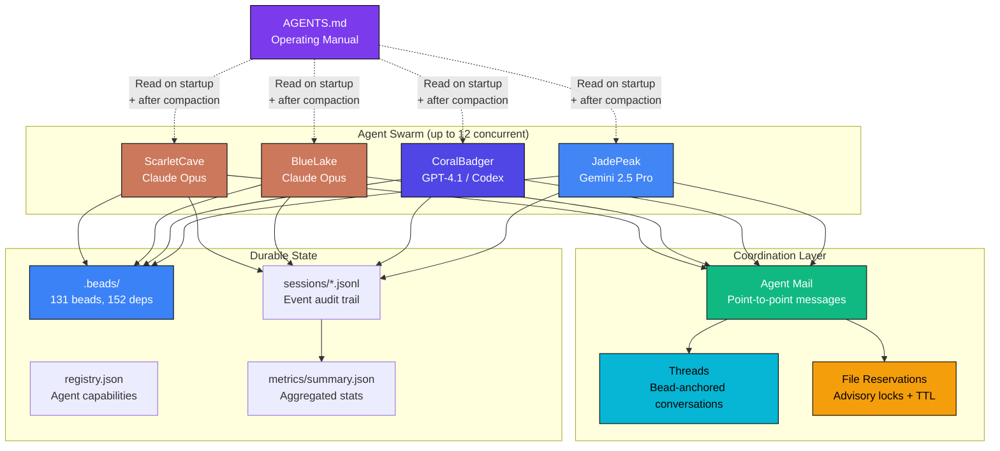
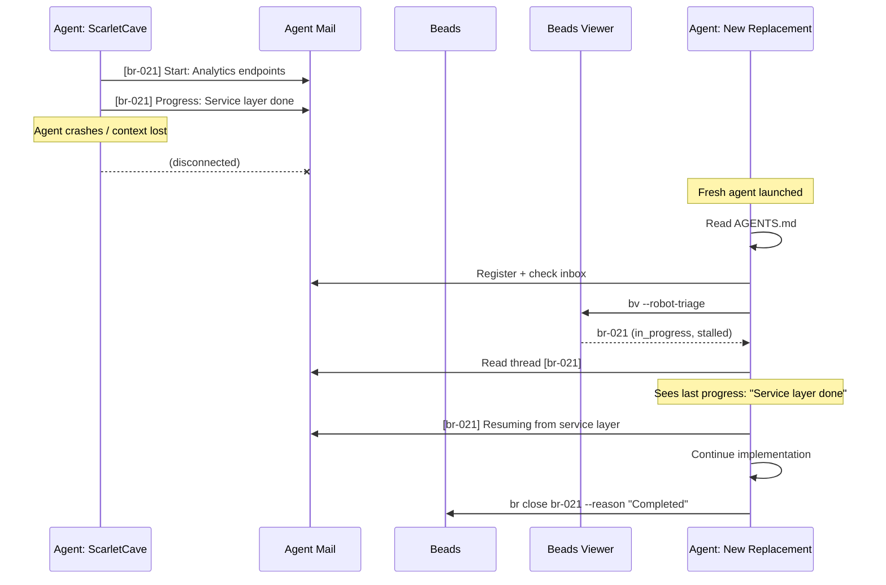
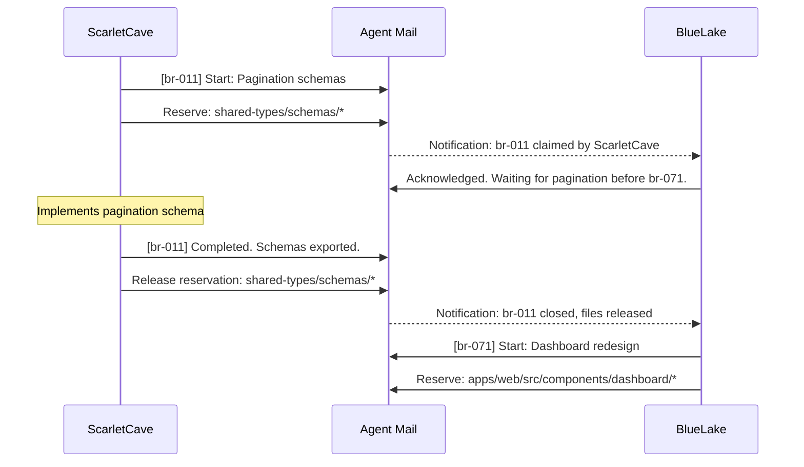
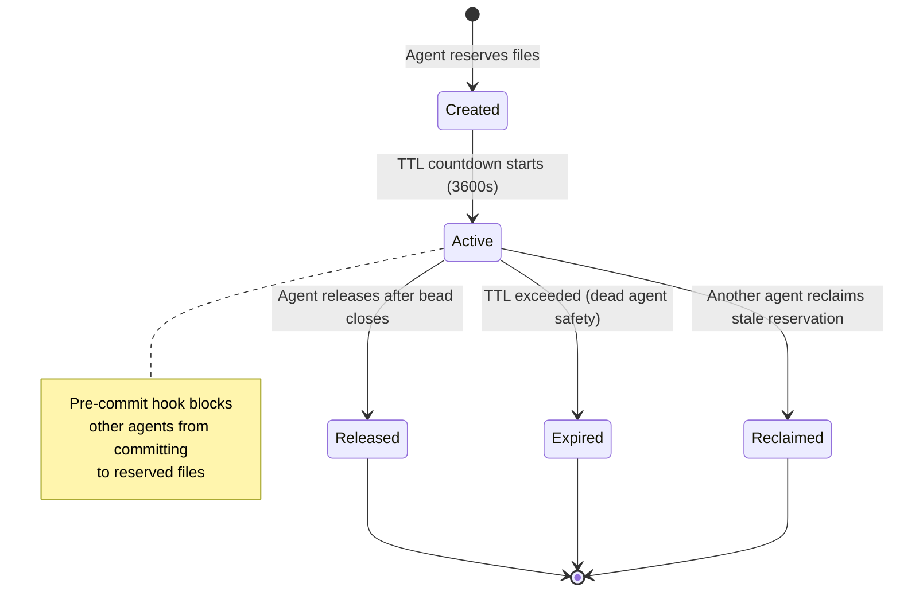
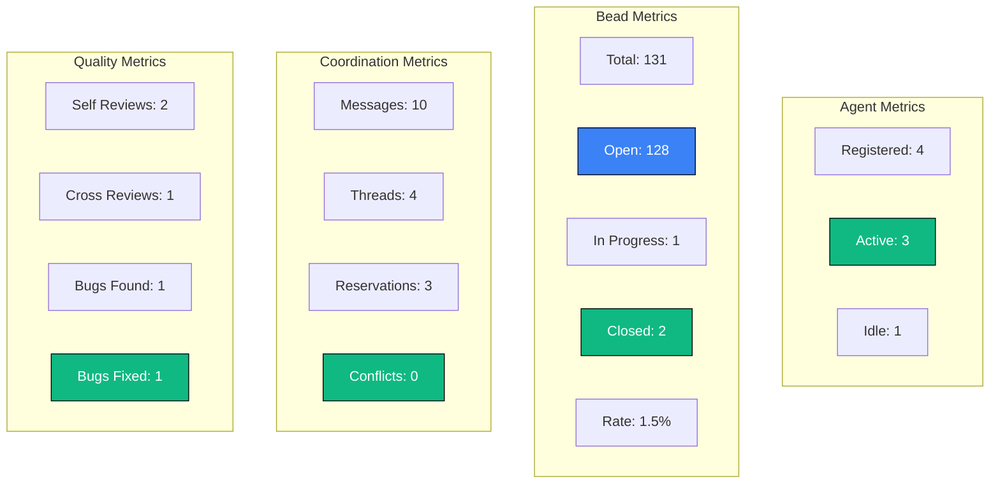

# Agent Sessions - WealthWise Coordination Infrastructure

This directory contains the **multi-agent coordination infrastructure** for WealthWise, implementing the Agent Mail protocol from the [Agentic Coding Flywheel](https://agent-flywheel.com/) methodology. It enables multiple AI coding agents to work concurrently in the same repository without conflicts, using point-to-point messaging, file reservations, and session tracking.

---

## How It Works

The coordination system solves three problems that arise when multiple agents work in parallel:

1. **Who is doing what?** Agents register on startup and announce which beads they are working on.
2. **Who owns which files?** Advisory file reservations prevent two agents from editing the same files simultaneously.
3. **What happened?** Session logs and threaded messages provide a durable audit trail of all agent activity.

All coordination is **artifact-based**, not agent-based. No single agent acts as a coordinator or ringleader. Any agent can crash and be replaced without disrupting the system.

### Coordination Overview



---

## Directory Structure

```
.agent-sessions/
├── README.md              # This file
├── config.json            # Coordination configuration
├── registry.json          # Registered agents and their capabilities
├── mail/
│   ├── messages.jsonl     # Point-to-point and broadcast messages
│   ├── threads.jsonl      # Threaded conversations anchored to bead IDs
│   └── reservations.jsonl # Advisory file reservations with TTL
├── metrics/
│   └── summary.json       # Aggregated coordination metrics
└── sessions/
    ├── session-001.jsonl   # Per-agent event logs
    ├── session-002.jsonl
    └── session-003.jsonl
```

---

## Configuration

`config.json` defines the coordination rules:

### Coordination Settings

| Setting | Value | Description |
|---------|-------|-------------|
| `agent_mail_enabled` | `true` | Enable Agent Mail for inter-agent communication |
| `file_reservations_enabled` | `true` | Enable advisory file locking |
| `reservation_ttl_seconds` | `3600` | Reservations expire after 1 hour |
| `thread_prefix` | `br-` | Thread IDs match bead IDs |
| `broadcast_mode` | `point-to-point` | Targeted delivery (not broadcast-to-all) |
| `max_agents` | `12` | Maximum concurrent agents |

### Session Defaults

| Setting | Value | Description |
|---------|-------|-------------|
| `auto_register` | `true` | Agents register automatically on startup |
| `compaction_reminder` | `true` | Remind agents to re-read AGENTS.md after compaction |
| `agents_md_path` | `AGENTS.md` | Path to the operating manual |
| `post_compaction_action` | `reread_agents_md` | What to do after context compaction |

### Git Policy

| Setting | Value | Description |
|---------|-------|-------------|
| `branch_policy` | `single-branch` | All agents commit to the same branch |
| `target_branch` | `master` | The single target branch |
| `commit_style` | `logically-grouped` | Commits grouped by logical change, not by time |
| `destructive_commands_blocked` | `true` | DCG blocks `--force`, `reset --hard`, etc. |

---

## Agent Registry

`registry.json` tracks all registered agents with their capabilities and current state.

Each agent entry includes:

| Field | Description |
|-------|-------------|
| `name` | Whimsical identifier (e.g., ScarletCave, BlueLake) |
| `model` | Underlying model (claude-opus-4-6, gpt-4.1, gemini-2.5-pro) |
| `status` | `active`, `idle`, or `offline` |
| `session_id` | Current session file reference |
| `capabilities` | Array of domain labels the agent can work on |
| `beads_completed` | Running count of closed beads |
| `current_bead` | The bead currently claimed (or null) |

### Agent Fungibility

All agents are **generalists**. There is no role specialization. Any agent can pick up any bead. This prevents single points of failure: if an agent crashes, any other agent can resume its work from the bead state and Agent Mail thread history.

Agent names are **semi-persistent and whimsical** (color + noun combinations like ScarletCave, BlueLake, CoralBadger). They are meaningful enough for coordination but disposable enough that losing one does not corrupt the system.

### Agent Crash Recovery



---

## Agent Mail

### Messages (`mail/messages.jsonl`)

Point-to-point messages between agents. Each message includes:

- `from`: Sending agent name
- `to`: Target agent name (or `broadcast` for all)
- `thread_id`: The bead ID this message relates to (e.g., `br-011`)
- `type`: `start`, `progress`, `completed`, `question`, `review`, `handoff`
- `body`: Message content
- `timestamp`: ISO 8601 timestamp

**Message flow for a bead:**



### Threads (`mail/threads.jsonl`)

Conversations grouped by bead ID. Each thread tracks:

- `thread_id`: Matches a bead ID (e.g., `br-011`)
- `subject`: Human-readable title prefixed with `[br-XXX]`
- `status`: `active` or `closed`
- `participants`: Array of agent names involved
- `message_count`: Total messages in the thread
- `created_by`: Agent that started the thread

### File Reservations (`mail/reservations.jsonl`)

Advisory locks that prevent file editing collisions:

| Field | Description |
|-------|-------------|
| `reservation_id` | Unique ID (e.g., `res-001`) |
| `agent_name` | Agent holding the reservation |
| `paths` | Array of file paths or glob patterns reserved |
| `ttl_seconds` | Time-to-live (default 3600s / 1 hour) |
| `exclusive` | Whether the reservation is exclusive |
| `reason` | Bead ID and description |
| `status` | `active` or `released` |

**Reservation lifecycle:**



**Key design decisions:**

- **Advisory, not enforced**: Reservations are coordination signals, not hard locks. A dead agent cannot deadlock the system.
- **TTL-based expiry**: Reservations expire automatically. No manual cleanup needed.
- **Glob patterns supported**: Reserve `apps/web/src/components/dashboard/*` instead of listing every file.
- **Pre-commit guard**: A hook blocks commits to files reserved by another agent as a safety net.

---

## Session Logs

### Session Event Flow

```mermaid
graph LR
    START["session_start"] --> READ["agents_md_read"]
    READ --> EXPLORE["codebase_exploration"]
    EXPLORE --> CLAIM["bead_claimed"]
    CLAIM --> RESERVE["file_reserved"]
    RESERVE --> IMPL["implementation"]
    IMPL --> TEST["test_run"]
    TEST -->|fail| IMPL
    TEST -->|pass| REVIEW["self_review"]
    REVIEW -->|bugs| IMPL
    REVIEW -->|clean| CLOSE["bead_closed"]
    CLOSE --> COMMIT["commit"]
    COMMIT --> CLAIM
    COMMIT --> END["session_end"]

    style START fill:#10B981,stroke:#000,color:#fff
    style CLAIM fill:#3B82F6,stroke:#000,color:#fff
    style IMPL fill:#F59E0B,stroke:#000,color:#000
    style CLOSE fill:#10B981,stroke:#000,color:#fff
    style END fill:#EF4444,stroke:#000,color:#fff
```



Each agent session is logged in `sessions/session-NNN.jsonl`. Events include:

| Event Type | Description |
|------------|-------------|
| `session_start` | Agent boots and registers |
| `agents_md_read` | Agent reads AGENTS.md |
| `codebase_exploration` | Agent scans the repository |
| `bead_claimed` | Agent claims a bead via `br update` |
| `file_reserved` | Agent reserves files via Agent Mail |
| `implementation` | Agent writes code |
| `test_run` | Agent runs tests |
| `self_review` | Agent reviews its own work |
| `bead_closed` | Agent closes a completed bead |
| `commit` | Agent commits changes |
| `session_end` | Agent session terminates |

---

## Metrics

`metrics/summary.json` provides aggregated statistics:



Summary of tracked categories:

- **Agents**: Total registered, active, idle counts
- **Beads**: Open, in-progress, closed counts and completion rate
- **Sessions**: Active sessions and total events
- **Coordination**: Messages sent, threads created, file reservations, conflicts detected
- **Git**: Commits, files modified, lines added/removed
- **Quality**: Self-reviews, cross-reviews, bugs found and fixed

---

## Relationship to Other Systems

| System | Relationship |
|--------|-------------|
| **Beads** (`.beads/`) | Bead IDs are the primary threading anchor for all coordination |
| **AGENTS.md** | The operating manual that all agents must read on startup and after compaction |
| **Git** | Single-branch model; all agents commit to `master` |
| **Skills** | `bead-workflow` skill encodes the claim/implement/review/close lifecycle |
| **Hooks** (`.claude/settings.json`) | PostToolUse auto-formats; PreToolUse warns on destructive git commands |

---

## For Contributors

### Adding a New Agent

Agents self-register on startup by reading AGENTS.md and joining Agent Mail. No manual registry editing is needed. To launch a new agent:

1. Start a new Claude Code, Codex, or Gemini-CLI session
2. Give it the standard marching orders from AGENTS.md Section 16
3. The agent reads AGENTS.md, registers, discovers other agents, and claims work

### Staggered Starts

When launching multiple agents, stagger starts by at least 30 seconds to avoid the "thundering herd" problem where all agents grab the same bead simultaneously.

### Post-Compaction Recovery

After context compaction, agents must:

1. Re-read the entire AGENTS.md file
2. Check their Agent Mail inbox for pending messages
3. Review the current bead status with `br list --status in_progress`
4. Resume work on their claimed bead

### Recovering from Agent Crashes

1. Check the Agent Mail thread for the bead's last progress update
2. Launch a fresh agent with standard marching orders
3. The new agent discovers the abandoned bead via `bv --robot-triage` and picks it up
4. The bead state and thread history provide continuity
