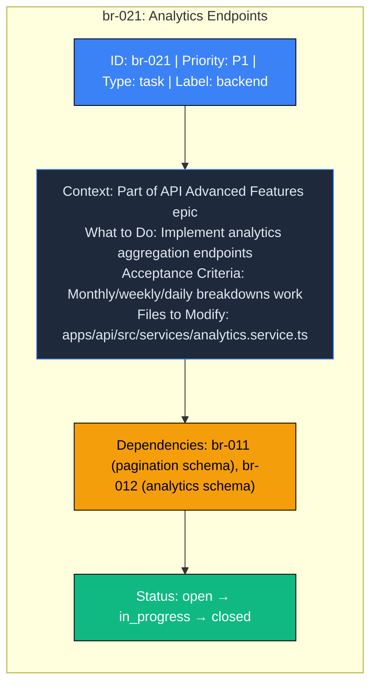
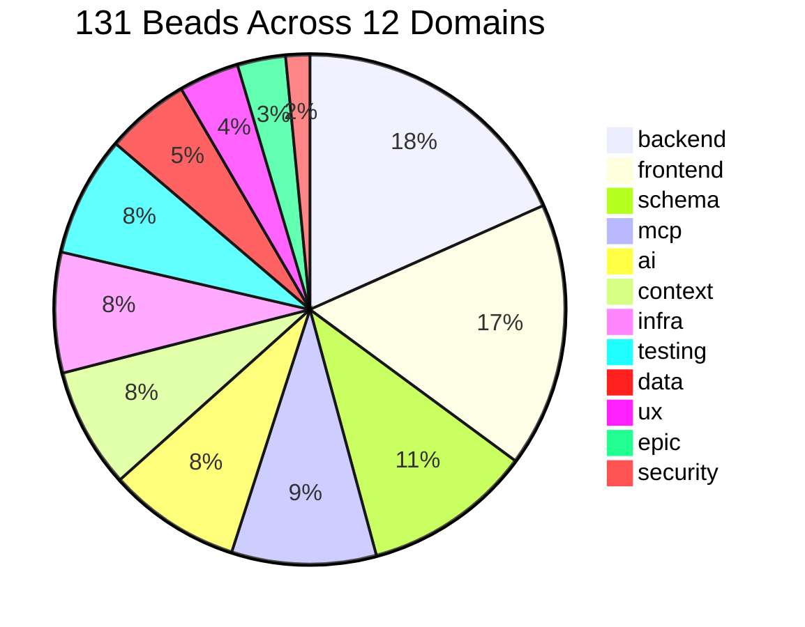
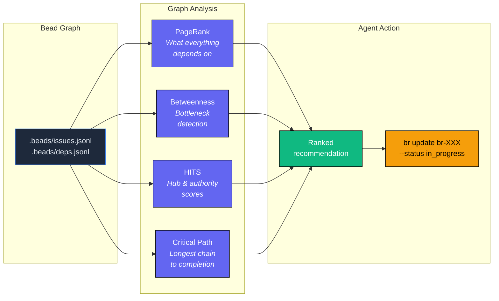
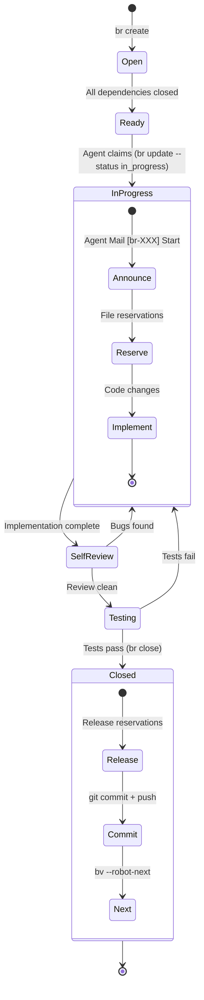
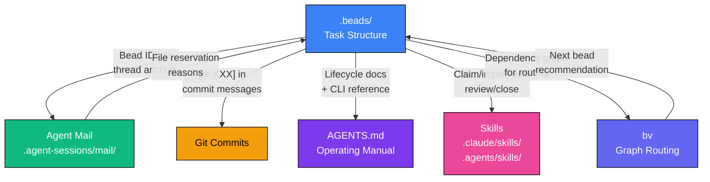

# Beads - WealthWise Task Management

This directory contains the **beads-based task management system** for WealthWise, part of the [Agentic Coding Flywheel](https://agent-flywheel.com/) methodology. Beads are self-contained work units optimized for execution by AI coding agents, with explicit dependencies, acceptance criteria, and context embedded directly in each task.

---

## What Are Beads?

A **bead** is a single, atomic unit of work with enough embedded context that an agent can implement it without consulting external plan documents. Each bead carries:

- **Title and description** with full implementation context
- **Priority** (P0 critical through P4 backlog)
- **Type** (task, bug, feature, epic, question, docs)
- **Labels** for domain classification (backend, frontend, schema, mcp, ai, context, infra, testing, data, ux, epic, security)
- **Dependencies** on other beads, forming a directed acyclic graph
- **Acceptance criteria** defining what "done" looks like
- **Files to modify** so agents know their edit surface

Beads replace traditional issue trackers (Jira, Linear) with a local-first, JSONL-based format that commits with the code and is queryable by CLI tools.

### Bead Anatomy



---

## Directory Structure

```
.beads/
├── README.md            # This file
├── config.json          # Repository configuration (project key, labels, priority map)
├── issues.jsonl         # All beads (one JSON object per line)
├── deps.jsonl           # Dependency edges between beads
├── comments.jsonl       # Threaded comments on beads
└── labels.jsonl         # Label definitions with colors and descriptions
```

---

## Configuration

`config.json` defines the project-level bead settings:

| Field | Value | Description |
|-------|-------|-------------|
| `project_key` | `wealthwise` | Unique project identifier |
| `bead_prefix` | `br` | ID prefix (beads are `br-001`, `br-002`, etc.) |
| `branch_policy` | `master` | All work targets the `master` branch |
| `default_priority` | `2` (medium) | Default priority for new beads |
| `default_type` | `task` | Default bead type |
| `agents_md` | `AGENTS.md` | Path to the agent operating manual |
| `plan_file` | `PLAN.md` | Path to the markdown plan (if present) |

---

## Current Inventory

| Metric | Value |
|--------|-------|
| **Total beads** | 131 |
| **Labels** | 12 (backend, frontend, schema, mcp, ai, context, infra, testing, data, ux, epic, security) |
| **Dependencies** | 152 edges |
| **Priority levels** | P0 critical, P1 high, P2 medium, P3 low, P4 backlog |
| **Types** | task, bug, feature, epic, question, docs |

### Bead Distribution by Label



---

## Labels

| Label | Color | Scope |
|-------|-------|-------|
| `backend` | #3B82F6 | API, services, models, middleware |
| `frontend` | #8B5CF6 | Next.js pages, components, hooks |
| `schema` | #EC4899 | Zod schemas and shared types |
| `mcp` | #F59E0B | MCP server tools and resources |
| `ai` | #10B981 | Agentic AI agents and orchestration |
| `context` | #06B6D4 | Knowledge graph and context engine |
| `infra` | #6366F1 | CI/CD, Docker, Kubernetes, Terraform |
| `testing` | #EF4444 | Unit tests, E2E tests, benchmarks |
| `data` | #F97316 | Data import/export and analytics |
| `ux` | #14B8A6 | UX, onboarding, accessibility, i18n |
| `epic` | #7C3AED | Epic-level organizational beads |
| `security` | #DC2626 | Security hardening, authentication |

---

## CLI Reference (br)

The `br` CLI manages beads locally. All commands operate on the JSONL files in this directory.

```bash
# Create a new bead
br create --title "Add pagination to transactions" --priority 2 --label backend

# List open beads
br list --status open --json

# Show unblocked (ready) beads
br ready --json

# View a specific bead
br show br-021

# Claim a bead (mark as in-progress)
br update br-021 --status in_progress

# Close a completed bead
br close br-021 --reason "Implemented with tests passing"

# Add a dependency (br-021 depends on br-011)
br dep add br-021 br-011

# Add a comment to a bead
br comments add br-021 "Found edge case with empty result sets"

# Export to JSONL (no git operations)
br sync --flush-only
```

### Priority Map

| Level | Label | Use for |
|-------|-------|---------|
| P0 | Critical | Blocking the entire project |
| P1 | High | Required for current milestone |
| P2 | Medium | Important but not blocking |
| P3 | Low | Nice to have |
| P4 | Backlog | Future consideration |

---

## Graph-Theory Routing (bv)

The `bv` CLI reads the bead dependency graph and computes optimal task ordering using PageRank, betweenness centrality, HITS, and critical-path analysis.

```bash
# Full recommendations with scores (primary command for agents)
bv --robot-triage

# Single top pick with claim command
bv --robot-next

# Parallel execution tracks
bv --robot-plan

# Full graph metrics
bv --robot-insights

# Priority recommendations with reasoning
bv --robot-priority
```

**Always use `--robot-*` flags.** Bare `bv` launches an interactive TUI that blocks agent sessions.

### How bv Routes Work



### Pattern Interpretation

| PageRank | Betweenness | Meaning | Action |
|----------|-------------|---------|--------|
| High | High | Critical bottleneck | Fix first |
| High | Low | Foundation piece | Important but not blocking |
| Low | High | Unexpected chokepoint | Investigate |
| Low | Low | Leaf work | Safe to parallelize |

---

## Bead Lifecycle



**Step by step:**

1. **Find** the highest-leverage bead: `bv --robot-triage`
2. **Claim** it: `br update <id> --status in_progress`
3. **Announce** in Agent Mail: `[br-XXX] Start: <title>`
4. **Reserve** files via Agent Mail before editing
5. **Implement** following the bead body (context, acceptance criteria, files)
6. **Self-review** with fresh eyes, run tests
7. **Close**: `br close <id> --reason "..."`
8. **Release** file reservations
9. **Announce**: `[br-XXX] Completed`
10. **Commit and push** with bead ID in the message: `[br-XXX] <description>`
11. **Next bead**: `bv --robot-next`

---

## Relationship to Other Systems



- **Agent Mail** (`.agent-sessions/mail/`): Bead IDs serve as thread anchors. Agents announce claims, progress, and completion in `[br-XXX]`-prefixed threads.
- **File reservations**: Agents reserve files before editing, referencing the bead ID as the reason.
- **Git commits**: All commits reference their bead ID for traceability.
- **AGENTS.md**: The operating manual documents bead lifecycle, CLI usage, and conventions for all agents.
- **Skills**: The `bead-workflow` skill (`.claude/skills/bead-workflow.md` and `.agents/skills/bead-workflow/SKILL.md`) encodes the full lifecycle as a reusable workflow.

---

## Storage Format

Beads use a **JSONL** (JSON Lines) format where each line is a self-contained JSON object. This format is chosen for:

- **Git-friendly diffs**: Each bead is a single line, so additions/changes produce clean diffs
- **Append-only writes**: New beads are appended without rewriting the file
- **CLI-friendly**: Standard Unix tools (`jq`, `grep`, `wc`) work directly on JSONL
- **Agent-friendly**: Agents can read and parse individual lines without loading the entire file

---

## For Contributors

When creating new beads:

1. Make beads **self-contained** with enough context that a fresh agent can implement them without consulting other documents
2. Include **acceptance criteria** so completion is unambiguous
3. Specify **files to modify** so agents know their edit surface
4. Add **dependencies** for any bead that requires another bead's output
5. Use the correct **label** to classify the domain
6. Reference the bead ID (`br-XXX`) in all related commits, Agent Mail messages, and file reservations
