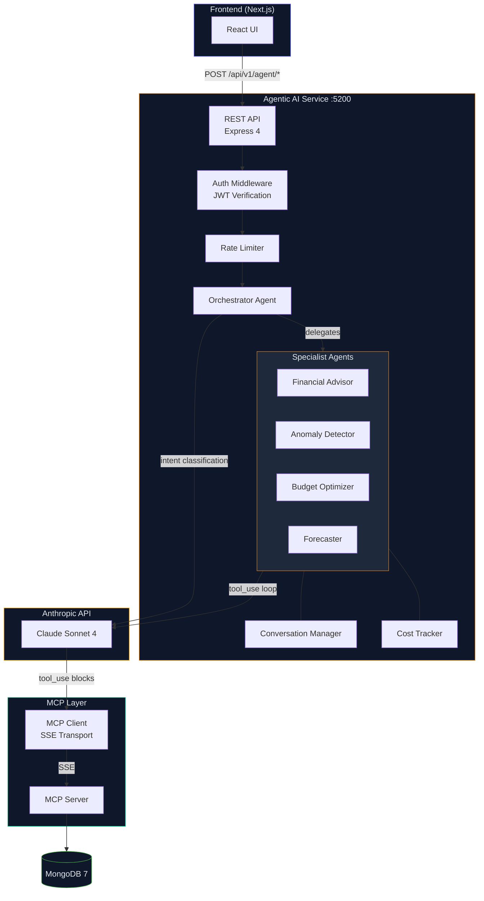
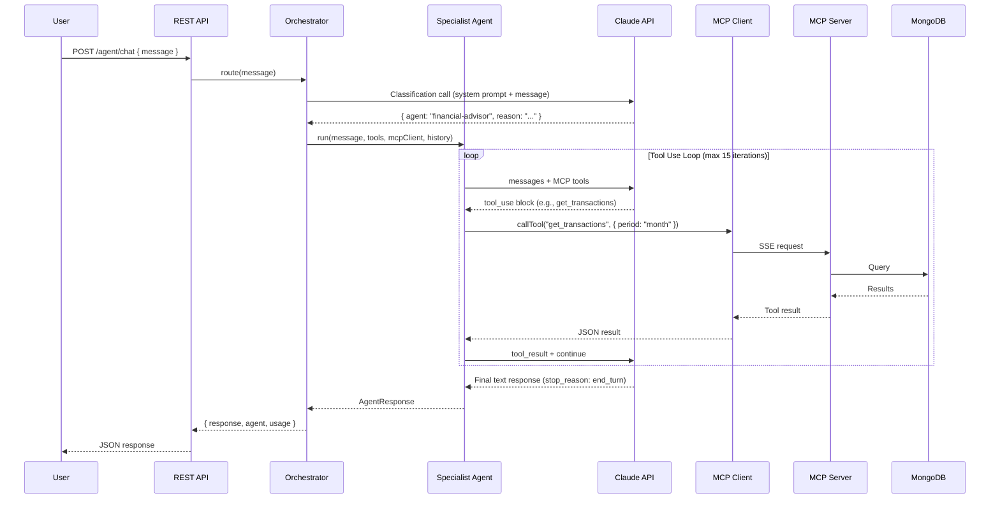

# Agentic AI — WealthWise

[](https://www.anthropic.com/)
[](https://ai.google.dev/gemini)
[](https://modelcontextprotocol.io/)
[](https://www.typescriptlang.org/)
[](https://expressjs.com/)
[](https://vitest.dev/)
[](https://docs.docker.com/compose/)

An **agentic AI service** for WealthWise, powered by Anthropic's Claude. Four specialized financial agents consume MCP tools from the WealthWise MCP server to access real user financial data, analyze it through multi-step tool-use loops, and return actionable insights — all behind the same JWT authentication as the main API.

---

## Table of Contents

- [Architecture](#architecture)
- [Agents](#agents)
- [API Endpoints](#api-endpoints)
- [Request / Response Examples](#request--response-examples)
- [Tool Use Loop](#tool-use-loop)
- [Conversation Management](#conversation-management)
- [Cost Tracking](#cost-tracking)
- [Environment Variables](#environment-variables)
- [Development](#development)
- [Testing](#testing)

---

## Architecture



The service sits between the frontend and Anthropic's Claude API. User queries arrive via REST, pass through JWT authentication and rate limiting, then enter the **orchestrator** which classifies intent and delegates to the appropriate specialist agent. Each specialist executes a multi-step **tool_use loop** — calling MCP tools to fetch financial data, feeding results back to Claude, and iterating until a final text response is produced.

---

## Agents

| Agent | Role | Example Queries |
|-------|------|-----------------|
| **Orchestrator** | Routes incoming messages to the appropriate specialist based on intent classification | _(internal — not called directly)_ |
| **Financial Advisor** | Comprehensive financial health assessment, personalized advice, goal recommendations | "How is my financial health?", "What should I prioritize paying off?" |
| **Anomaly Detector** | Unusual spending pattern detection, duplicate transaction identification, category spending spikes | "Are there any unusual charges this month?", "Do I have duplicate subscriptions?" |
| **Budget Optimizer** | Budget utilization analysis, reallocation suggestions, savings opportunity identification | "Am I on track with my budgets?", "Where can I cut spending?" |
| **Forecaster** | 3/6/12-month financial projections, trend analysis, goal achievement predictions | "Will I hit my savings goal by December?", "Project my spending for the next quarter" |

All specialist agents extend `BaseAgent`, which implements the core tool_use loop. The orchestrator makes a lightweight classification call to Claude, parses the JSON routing decision, and delegates to the chosen specialist with the full conversation context and MCP tool set.

---

## API Endpoints

All endpoints are prefixed with `/api/v1/agent` and require a valid JWT Bearer token.

| Method | Path | Description | Rate Limit |
|--------|------|-------------|------------|
| `POST` | `/agent/chat` | Conversational AI chat with orchestrated routing | 20 req/min |
| `POST` | `/agent/insights` | One-shot insights by type (`financial-health`, `anomalies`, `budget-review`, `forecast`) | 10 req/min |
| `GET` | `/agent/insights/summary` | Quick financial summary from the advisor agent | 10 req/min |
| `DELETE` | `/agent/conversations/:id` | Clear conversation history for the authenticated user | -- |
| `GET` | `/health` | Health check (no auth required) | -- |

---

## Request / Response Examples

### Chat

```json
POST /api/v1/agent/chat
Authorization: Bearer <jwt-token>

{
  "message": "How is my spending this month compared to last month?"
}
```

```json
{
  "success": true,
  "data": {
    "response": "Based on your transaction data, your total spending this month is $3,240 compared to $2,890 last month — a 12% increase. The biggest jump is in the Dining category, which went from $320 to $510. Your Groceries and Housing costs remained stable. I'd recommend keeping an eye on discretionary dining expenses to stay within your monthly budget.",
    "agent": "financial-advisor",
    "conversationId": "a1b2c3d4-e5f6-7890-abcd-ef1234567890",
    "usage": {
      "inputTokens": 1250,
      "outputTokens": 480
    }
  }
}
```

### Insights

```json
POST /api/v1/agent/insights
Authorization: Bearer <jwt-token>

{
  "type": "anomalies"
}
```

```json
{
  "success": true,
  "data": {
    "response": "I found 2 potential anomalies in your recent transactions...",
    "agent": "anomaly-detector",
    "conversationId": null,
    "usage": {
      "inputTokens": 980,
      "outputTokens": 320
    }
  }
}
```

### Error

```json
{
  "success": false,
  "error": {
    "code": "RATE_LIMITED",
    "message": "Too many chat requests. Limit: 20 per minute."
  }
}
```

---

## Tool Use Loop



Each iteration of the loop:

1. The agent sends the full message history (including prior tool results) to Claude with the available MCP tools.
2. Claude returns either a `tool_use` block (requesting data) or a `text` block (final answer).
3. If `tool_use`, the agent executes the tool via the MCP client, appends the result, and loops.
4. If `text` or max iterations (15) reached, the loop exits and the response is returned.

Tool execution errors are caught and fed back to Claude as error results, allowing the model to recover or provide a partial answer.

---

## Conversation Management

- **Per-user state**: Each authenticated user gets a single conversation stored in memory, keyed by `userId`.
- **Multi-turn context**: Message history (user + assistant turns) is passed to the agent on every request, enabling follow-up questions.
- **Auto-expiry**: Conversations are cleaned up after 30 minutes of inactivity (configurable via `ConversationManager` TTL).
- **Cleanup interval**: A background timer runs every 5 minutes to evict expired conversations.
- **Manual clear**: Users can call `DELETE /agent/conversations/:id` to reset their conversation.
- **Graceful shutdown**: The cleanup interval is stopped on `SIGINT`/`SIGTERM`.

---

## Cost Tracking

The service tracks Claude API usage per user:

| Metric | Description |
|--------|-------------|
| `inputTokens` | Cumulative input tokens across all requests |
| `outputTokens` | Cumulative output tokens across all requests |
| `requests` | Total number of agent invocations |
| `lastModel` | Most recently used model (`claude-sonnet-4-20250514`) |
| `lastUpdated` | Timestamp of the last request |

Usage is tracked in-memory and can be queried or reset programmatically. This data supports monitoring dashboards and billing awareness.

---

## Environment Variables

| Variable | Required | Default | Description |
|----------|----------|---------|-------------|
| `ANTHROPIC_API_KEY` | Yes | -- | Anthropic API key for Claude access |
| `MCP_SERVER_URL` | Yes | -- | URL of the WealthWise MCP server (e.g., `http://localhost:5100/sse`) |
| `JWT_SECRET` | Yes | -- | JWT secret (must match the main API, min 32 chars) |
| `AGENT_PORT` | No | `5200` | Port the agentic AI service listens on |
| `NODE_ENV` | No | `development` | `development`, `production`, or `test` |

---

## Development

```bash
# Start in dev mode (requires MCP server running)
npm run dev -w agentic-ai

# Run tests (31 tests)
npx turbo test --filter=@wealthwise/agentic-ai

# Build
npx turbo build --filter=@wealthwise/agentic-ai

# Type check
npx turbo lint --filter=@wealthwise/agentic-ai

# Run with Docker
docker build -f agentic-ai/Dockerfile -t wealthwise-agentic-ai .
docker run -p 5200:5200 --env-file .env wealthwise-agentic-ai
```

> [!NOTE]
> The MCP server must be running and accessible at `MCP_SERVER_URL` before starting the agentic AI service. The MCP server provides the financial data tools that agents use to access MongoDB.

---

## Testing

- **31 tests** using Vitest
- Test files in `agentic-ai/src/__tests__/`

| Test Suite | Coverage |
|------------|----------|
| `agents/orchestrator.test.ts` | Routing logic, fallback to default agent, error handling |
| `agents/financial-advisor.test.ts` | Tool use loop, system prompt loading, response formatting |
| `agents/anomaly-detector.test.ts` | Anomaly detection flow, tool execution |
| `agents/budget-optimizer.test.ts` | Budget analysis flow, tool execution |
| `agents/forecaster.test.ts` | Forecasting flow, tool execution |
| `mcp/client.test.ts` | MCP client creation, tool listing, SSE transport |
| `routes/agent.routes.test.ts` | Endpoint validation, rate limiting, auth, error responses |

The Anthropic SDK and MCP client are fully mocked in tests — no external API calls are made during test execution.

```bash
# Run with coverage
npx turbo test:coverage --filter=@wealthwise/agentic-ai

# Watch mode for development
npm run test:watch -w agentic-ai
```
