# Architecture - WealthWise

[](https://nodejs.org/)
[](https://www.typescriptlang.org/)
[](https://npmjs.com/)
[](https://turbo.build/)
[](https://prettier.io/)
[](https://nextjs.org/)
[](https://react.dev/)
[](https://tailwindcss.com/)
[](https://www.radix-ui.com/)
[](https://tanstack.com/query)
[](https://react-hook-form.com/)
[](https://next-auth.js.org/)
[](https://recharts.org/)
[](https://lucide.dev/)
[](https://expressjs.com/)
[](https://zod.dev/)
[](https://jwt.io/)
[](https://swagger.io/)
[](https://www.mongodb.com/)
[](https://www.mongodb.com/)
[](https://mongoosejs.com/)
[](https://vitest.dev/)
[](https://docs.docker.com/compose/)
[](https://nginx.org/)
[](https://kubernetes.io/)
[](https://helm.sh/)
[](https://kustomize.io/)
[](https://www.terraform.io/)
[](https://aws.amazon.com/)
[](https://aws.amazon.com/fargate/)
[](https://aws.amazon.com/cloudformation/)
[](https://aws.amazon.com/documentdb/)
[](https://azure.microsoft.com/)
[](https://azure.microsoft.com/products/container-apps)
[](https://learn.microsoft.com/azure/azure-resource-manager/bicep/)
[](https://azure.microsoft.com/products/cosmos-db)
[](https://cloud.google.com/)
[](https://cloud.google.com/run)
[](https://cloud.google.com/build)
[](https://www.oracle.com/cloud/)
[](https://www.oracle.com/cloud/cloud-native/container-engine-kubernetes/)
[](https://www.jenkins.io/)
[](https://github.com/)
[](https://about.gitlab.com/stages-devops-lifecycle/continuous-integration/)
[](https://argo-cd.readthedocs.io/)
[](https://argo-rollouts.readthedocs.io/)

---

## Table of Contents

- [System Overview](#system-overview)
- [Monorepo Build Pipeline](#monorepo-build-pipeline)
- [API Architecture](#api-architecture)
  - [Layered Design](#layered-design)
  - [Middleware Pipeline](#middleware-pipeline)
  - [Route Map](#route-map)
  - [Error Handling](#error-handling)
  - [Pagination](#pagination)
- [Database Schema](#database-schema)
  - [Entity Relationship Diagram](#entity-relationship-diagram)
  - [Index Strategy](#index-strategy)
- [Web Architecture](#web-architecture)
  - [Next.js Route Structure](#nextjs-route-structure)
  - [Component Hierarchy](#component-hierarchy)
  - [Client Data Flow](#client-data-flow)
  - [State Management](#state-management)
  - [Styling Architecture](#styling-architecture)
- [Authentication Flow](#authentication-flow)
  - [Full Auth Sequence](#full-auth-sequence)
  - [Token Lifecycle](#token-lifecycle)
- [Analytics Pipeline](#analytics-pipeline)
  - [Budget Summary Flow](#budget-summary-flow)
- [Deployment Architecture](#deployment-architecture)
  - [Production (Docker Compose)](#production-docker-compose)
  - [Nginx Routing](#nginx-routing)
  - [Development vs Production](#development-vs-production)
- [Shared Types Contract](#shared-types-contract)
  - [Schema Coverage](#schema-coverage)
- [Testing Strategy](#testing-strategy)
  - [Test Execution Flow](#test-execution-flow)

---

## System Overview

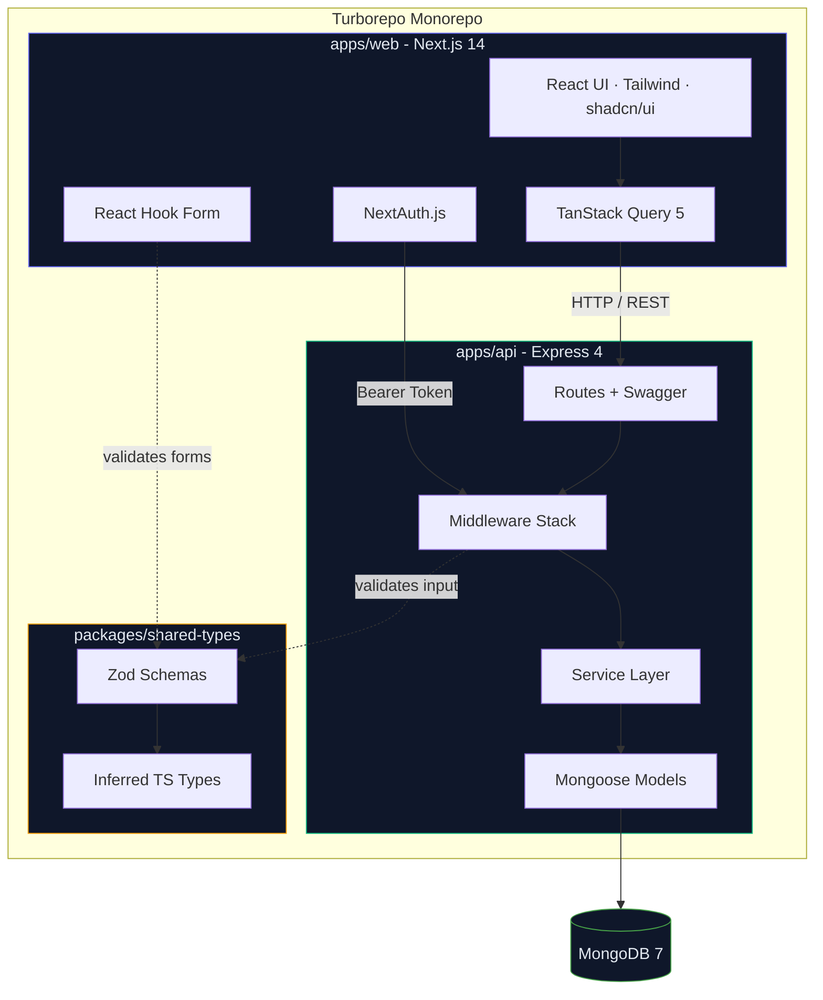
```mermaid
graph TB
    subgraph Monorepo["Turborepo Monorepo"]
        direction TB

        subgraph Frontend["apps/web - Next.js 14"]
            UI["React UI · Tailwind · shadcn/ui"]
            RQ["TanStack Query 5"]
            NA["NextAuth.js"]
            RHF["React Hook Form"]
        end

        subgraph Backend["apps/api - Express 4"]
            Routes["Routes + Swagger"]
            MW["Middleware Stack"]
            SVC["Service Layer"]
            MDL["Mongoose Models"]
        end

        subgraph Shared["packages/shared-types"]
            ZS["Zod Schemas"]
            TS["Inferred TS Types"]
        end
    end

    DB[(MongoDB 7)]

    UI --> RQ
    RQ -- "HTTP / REST" --> Routes
    NA -- "Bearer Token" --> MW
    RHF -. "validates forms" .-> ZS
    Routes --> MW --> SVC --> MDL --> DB
    MW -. "validates input" .-> ZS
    ZS --> TS

    style Frontend fill:#0f172a,stroke:#6366f1,color:#e2e8f0
    style Backend fill:#0f172a,stroke:#10b981,color:#e2e8f0
    style Shared fill:#0f172a,stroke:#f59e0b,color:#e2e8f0
    style DB fill:#0f172a,stroke:#47a248,color:#e2e8f0
```

The application follows a **client-server architecture** inside a **Turborepo monorepo**. The frontend and backend are fully decoupled, communicating over a REST API, with a shared package providing Zod schemas that enforce type safety at both boundaries.

> [!NOTE]
> The frontend is deployed on Vercel at: **[https://wealthwisefinancial.vercel.app/](https://wealthwisefinancial.vercel.app/).** You can register a new account or use the following demo credentials to explore the app:
> ```
> Email: demo@wealthwise.app
> Password: Demo1234!
> ```
> Or, create your own account to test the registration flow and see how the app works with an empty dataset.

> [!TIP]
> The backend is also fully deployed live, accessible at: [https://wealthwise-backend-api.vercel.app/](https://wealthwise-backend-api.vercel.app/). You can explore the API documentation at [https://wealthwise-backend-api.vercel.app/api/docs](https://wealthwise-backend-api.vercel.app/api/docs) and use the demo credentials above to authenticate and test the endpoints.

---

## Monorepo Build Pipeline

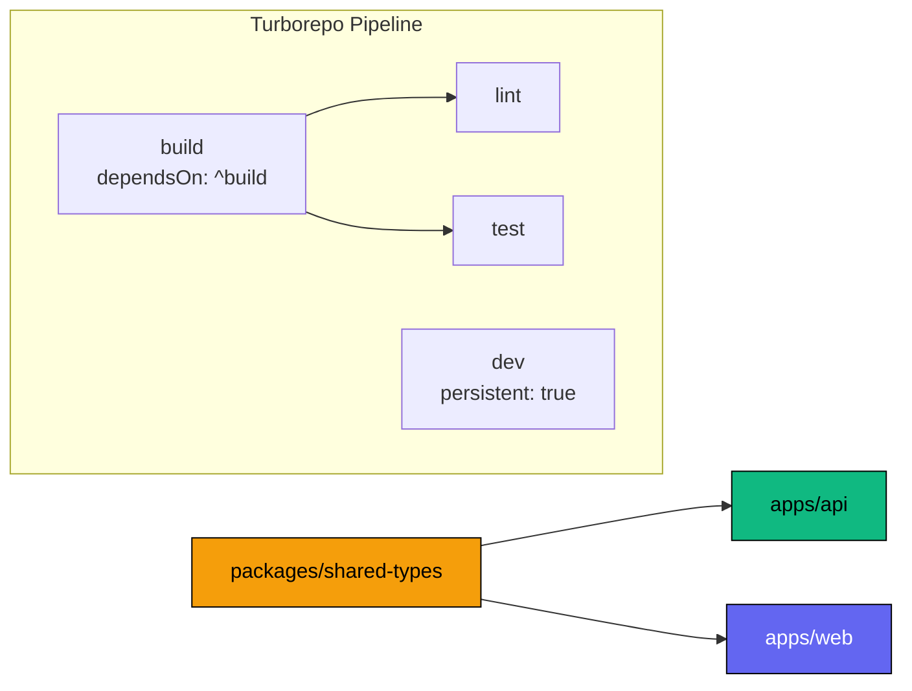
```mermaid
graph LR
    ST["packages/shared-types"] --> API["apps/api"]
    ST --> WEB["apps/web"]

    subgraph Turbo["Turborepo Pipeline"]
        direction LR
        Build["build<br/>dependsOn: ^build"] --> Lint["lint"]
        Build --> Test["test"]
        Dev["dev<br/>persistent: true"]
    end

    style ST fill:#f59e0b,stroke:#000,color:#000
    style API fill:#10b981,stroke:#000,color:#000
    style WEB fill:#6366f1,stroke:#000,color:#fff
```

| Task    | `dependsOn`                    | Outputs                  | Cached |
| ------- | ------------------------------ | ------------------------ | ------ |
| `build` | `^build` (shared-types first)  | `.next/**`, `dist/**`    | Yes    |
| `dev`   | -                              | -                        | No     |
| `lint`  | -                              | -                        | Yes    |
| `test`  | -                              | -                        | Yes    |
| `clean` | -                              | -                        | No     |

`apps/web` and `apps/api` both depend on `packages/shared-types`. Turbo builds shared-types first, then builds both apps in parallel.

---

## API Architecture

### Layered Design

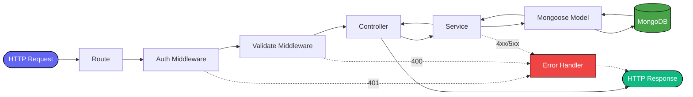
```mermaid
graph LR
    REQ([HTTP Request]) --> R[Route]
    R --> MW1[Auth Middleware]
    MW1 --> MW2[Validate Middleware]
    MW2 --> C[Controller]
    C --> S[Service]
    S --> M[Mongoose Model]
    M --> DB[(MongoDB)]
    DB --> M
    M --> S
    S --> C
    C --> RES([HTTP Response])

    ERR[Error Handler] -.-> RES
    MW1 -. "401" .-> ERR
    MW2 -. "400" .-> ERR
    S -. "4xx/5xx" .-> ERR

    style REQ fill:#6366f1,stroke:#000,color:#fff
    style RES fill:#10b981,stroke:#000,color:#fff
    style ERR fill:#ef4444,stroke:#000,color:#fff
    style DB fill:#47a248,stroke:#000,color:#fff
```

| Layer           | Responsibility                                  | Location           |
| --------------- | ----------------------------------------------- | ------------------ |
| **Routes**      | URL mapping, Swagger JSDoc annotations           | `src/routes/`      |
| **Middleware**   | Auth, validation, CORS, rate limiting, errors   | `src/middleware/`   |
| **Controllers** | Parse request, call service, format response     | `src/controllers/` |
| **Services**    | Business logic, data access, aggregations        | `src/services/`    |
| **Models**      | Mongoose schemas, indexes, virtuals              | `src/models/`      |
| **Utils**       | ApiError class, async handler, pagination        | `src/utils/`       |

### Middleware Pipeline

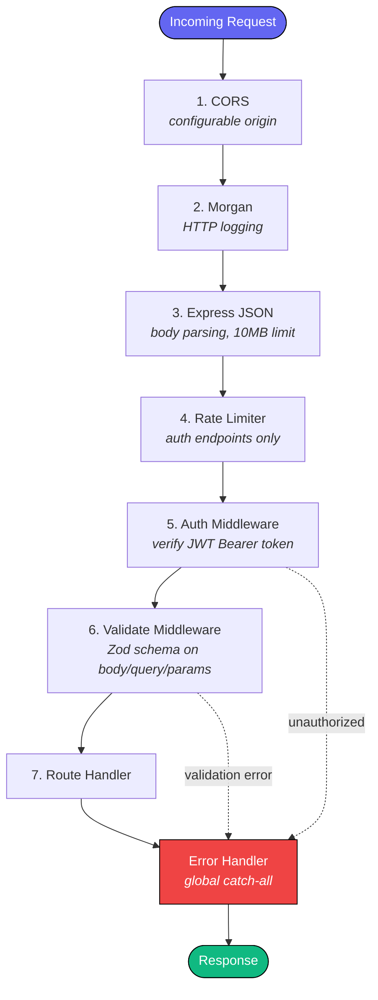
```mermaid
graph TD
    REQ([Incoming Request]) --> CORS["1. CORS<br/><i>configurable origin</i>"]
    CORS --> MORGAN["2. Morgan<br/><i>HTTP logging</i>"]
    MORGAN --> JSON["3. Express JSON<br/><i>body parsing, 10MB limit</i>"]
    JSON --> RATE["4. Rate Limiter<br/><i>auth endpoints only</i>"]
    RATE --> AUTH["5. Auth Middleware<br/><i>verify JWT Bearer token</i>"]
    AUTH --> VAL["6. Validate Middleware<br/><i>Zod schema on body/query/params</i>"]
    VAL --> HANDLER["7. Route Handler"]
    HANDLER --> ERRH["Error Handler<br/><i>global catch-all</i>"]
    ERRH --> RES([Response])

    AUTH -. "unauthorized" .-> ERRH
    VAL -. "validation error" .-> ERRH

    style REQ fill:#6366f1,stroke:#000,color:#fff
    style RES fill:#10b981,stroke:#000,color:#fff
    style ERRH fill:#ef4444,stroke:#000,color:#fff
```

### Route Map

All routes are prefixed with `/api/v1`.

| Resource     | Routes                    | Controller                 | Service                 |
| ------------ | ------------------------- | -------------------------- | ----------------------- |
| Auth         | `auth.routes.ts`          | `auth.controller.ts`       | `auth.service.ts`       |
| Accounts     | `account.routes.ts`       | `account.controller.ts`    | `account.service.ts`    |
| Transactions | `transaction.routes.ts`   | `transaction.controller.ts`| `transaction.service.ts`|
| Categories   | `category.routes.ts`      | `category.controller.ts`   | `category.service.ts`   |
| Budgets      | `budget.routes.ts`        | `budget.controller.ts`     | `budget.service.ts`     |
| Goals        | `goal.routes.ts`          | `goal.controller.ts`       | `goal.service.ts`       |
| Recurring    | `recurring.routes.ts`     | `recurring.controller.ts`  | `recurring.service.ts`  |
| Analytics    | `analytics.routes.ts`     | `analytics.controller.ts`  | `analytics.service.ts`  |

### Error Handling

All errors flow through a single global error handler. The custom `ApiError` class provides factory methods:

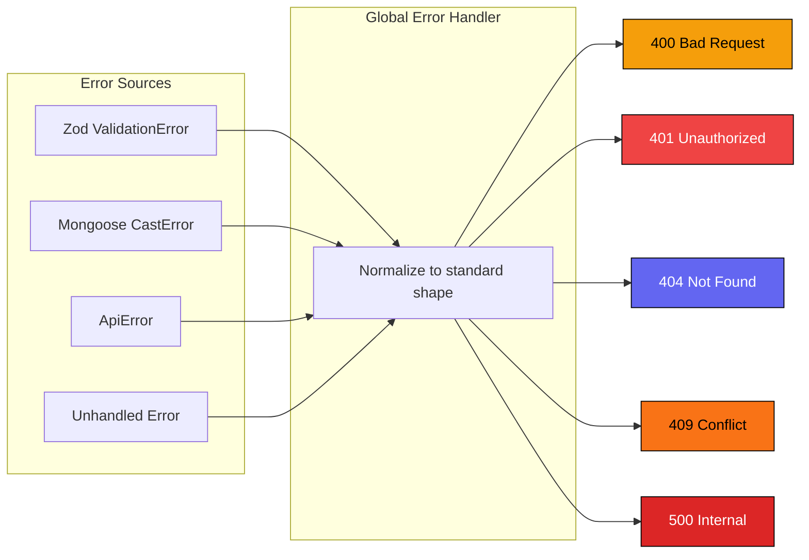
```mermaid
graph LR
    subgraph Sources["Error Sources"]
        ZE["Zod ValidationError"]
        ME["Mongoose CastError"]
        AE["ApiError"]
        UE["Unhandled Error"]
    end

    subgraph Handler["Global Error Handler"]
        NORM["Normalize to standard shape"]
    end

    ZE --> NORM
    ME --> NORM
    AE --> NORM
    UE --> NORM

    NORM --> R400["400 Bad Request"]
    NORM --> R401["401 Unauthorized"]
    NORM --> R404["404 Not Found"]
    NORM --> R409["409 Conflict"]
    NORM --> R500["500 Internal"]

    style R400 fill:#f59e0b,stroke:#000,color:#000
    style R401 fill:#ef4444,stroke:#000,color:#fff
    style R404 fill:#6366f1,stroke:#000,color:#fff
    style R409 fill:#f97316,stroke:#000,color:#000
    style R500 fill:#dc2626,stroke:#000,color:#fff
```

**Response shape:** `{ success: false, error: { code, message, details? } }`

### Pagination

Every list endpoint supports:

| Param   | Default | Max |
| ------- | ------- | --- |
| `page`  | 1       | -   |
| `limit` | 20      | 100 |

Response includes `{ data, pagination: { page, limit, total, totalPages } }`.

---

## Database Schema

### Entity Relationship Diagram

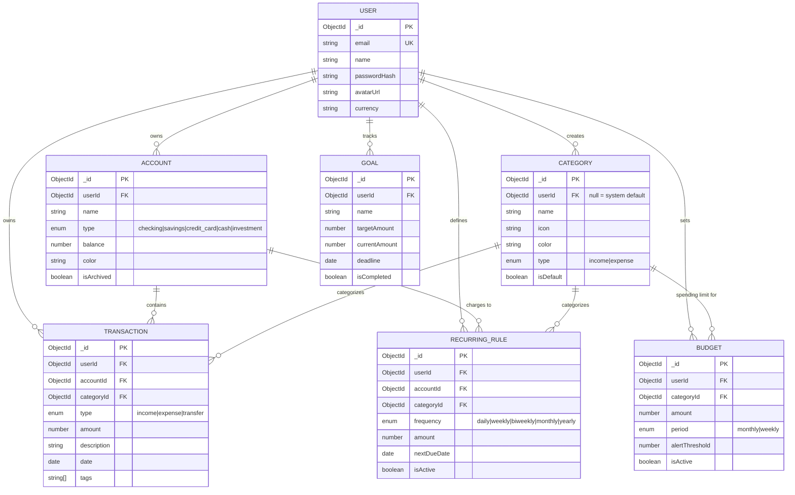
```mermaid
erDiagram
    USER ||--o{ ACCOUNT : owns
    USER ||--o{ TRANSACTION : owns
    USER ||--o{ CATEGORY : creates
    USER ||--o{ BUDGET : sets
    USER ||--o{ GOAL : tracks
    USER ||--o{ RECURRING_RULE : defines

    ACCOUNT ||--o{ TRANSACTION : contains
    CATEGORY ||--o{ TRANSACTION : categorizes
    CATEGORY ||--o{ BUDGET : "spending limit for"
    ACCOUNT ||--o{ RECURRING_RULE : "charges to"
    CATEGORY ||--o{ RECURRING_RULE : categorizes

    USER {
        ObjectId _id PK
        string email UK
        string name
        string passwordHash
        string avatarUrl
        string currency
    }

    ACCOUNT {
        ObjectId _id PK
        ObjectId userId FK
        string name
        enum type "checking|savings|credit_card|cash|investment"
        number balance
        string color
        boolean isArchived
    }

    TRANSACTION {
        ObjectId _id PK
        ObjectId userId FK
        ObjectId accountId FK
        ObjectId categoryId FK
        enum type "income|expense|transfer"
        number amount
        string description
        date date
        string[] tags
    }

    CATEGORY {
        ObjectId _id PK
        ObjectId userId FK "null = system default"
        string name
        string icon
        string color
        enum type "income|expense"
        boolean isDefault
    }

    BUDGET {
        ObjectId _id PK
        ObjectId userId FK
        ObjectId categoryId FK
        number amount
        enum period "monthly|weekly"
        number alertThreshold
        boolean isActive
    }

    GOAL {
        ObjectId _id PK
        ObjectId userId FK
        string name
        number targetAmount
        number currentAmount
        date deadline
        boolean isCompleted
    }

    RECURRING_RULE {
        ObjectId _id PK
        ObjectId userId FK
        ObjectId accountId FK
        ObjectId categoryId FK
        enum frequency "daily|weekly|biweekly|monthly|yearly"
        number amount
        date nextDueDate
        boolean isActive
    }
```

All user-owned entities store a `userId` foreign key. Ownership is enforced at the service layer - every query filters by `userId` from the JWT.

### Index Strategy

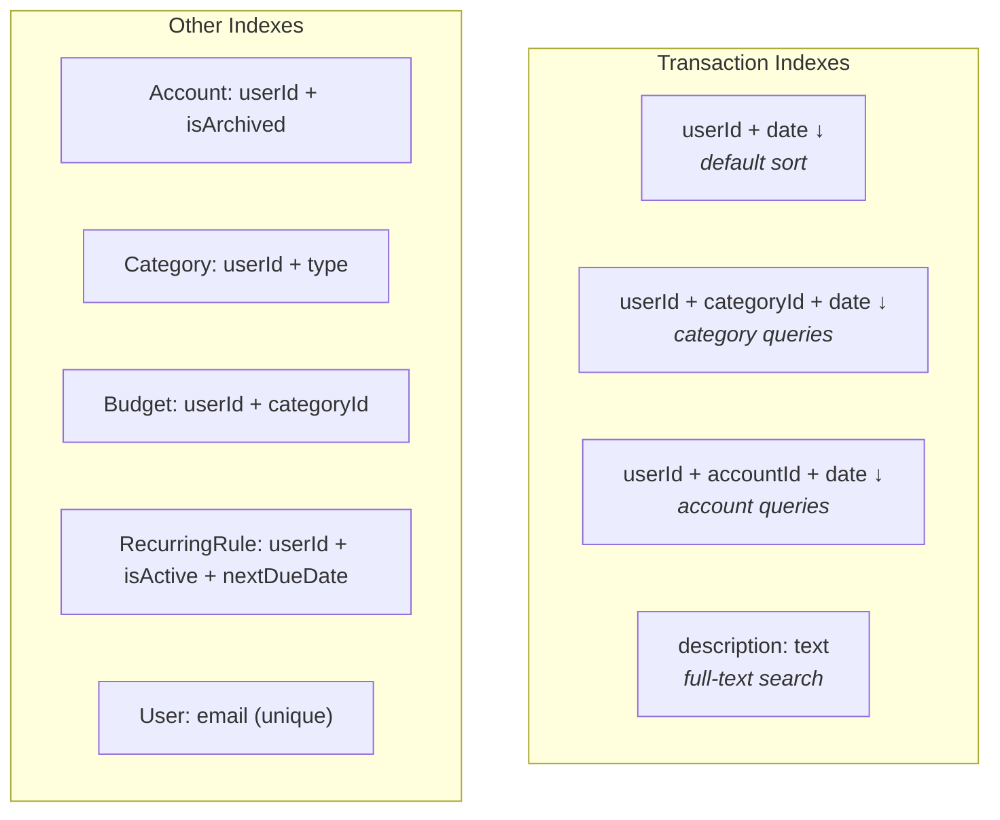
```mermaid
graph TD
    subgraph Transaction Indexes
        TI1["userId + date ↓<br/><i>default sort</i>"]
        TI2["userId + categoryId + date ↓<br/><i>category queries</i>"]
        TI3["userId + accountId + date ↓<br/><i>account queries</i>"]
        TI4["description: text<br/><i>full-text search</i>"]
    end

    subgraph Other Indexes
        AI["Account: userId + isArchived"]
        CI["Category: userId + type"]
        BI["Budget: userId + categoryId"]
        RI["RecurringRule: userId + isActive + nextDueDate"]
        UI["User: email (unique)"]
    end
```

---

## Web Architecture

### Next.js Route Structure

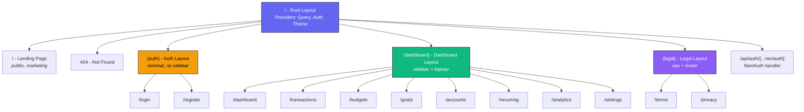
```mermaid
graph TD
    ROOT["/ - Root Layout<br/><i>Providers: Query, Auth, Theme</i>"]

    ROOT --> LANDING["/ - Landing Page<br/><i>public, marketing</i>"]
    ROOT --> NOTFOUND["404 - Not Found"]
    ROOT --> AUTH_GROUP["(auth) - Auth Layout<br/><i>minimal, no sidebar</i>"]
    ROOT --> DASH_GROUP["(dashboard) - Dashboard Layout<br/><i>sidebar + topnav</i>"]
    ROOT --> LEGAL_GROUP["(legal) - Legal Layout<br/><i>nav + footer</i>"]
    ROOT --> NEXTAUTH["/api/auth/[...nextauth]<br/><i>NextAuth handler</i>"]

    AUTH_GROUP --> LOGIN["/login"]
    AUTH_GROUP --> REGISTER["/register"]

    DASH_GROUP --> DASHBOARD["/dashboard"]
    DASH_GROUP --> TRANSACTIONS["/transactions"]
    DASH_GROUP --> BUDGETS["/budgets"]
    DASH_GROUP --> GOALS["/goals"]
    DASH_GROUP --> ACCOUNTS["/accounts"]
    DASH_GROUP --> RECURRING["/recurring"]
    DASH_GROUP --> ANALYTICS["/analytics"]
    DASH_GROUP --> SETTINGS["/settings"]

    LEGAL_GROUP --> TERMS["/terms"]
    LEGAL_GROUP --> PRIVACY["/privacy"]

    style ROOT fill:#6366f1,stroke:#000,color:#fff
    style AUTH_GROUP fill:#f59e0b,stroke:#000,color:#000
    style DASH_GROUP fill:#10b981,stroke:#000,color:#fff
    style LEGAL_GROUP fill:#8b5cf6,stroke:#000,color:#fff
```

**Route groups** (`(auth)`, `(dashboard)`, `(legal)`) share layouts without affecting URL structure.

### Component Hierarchy

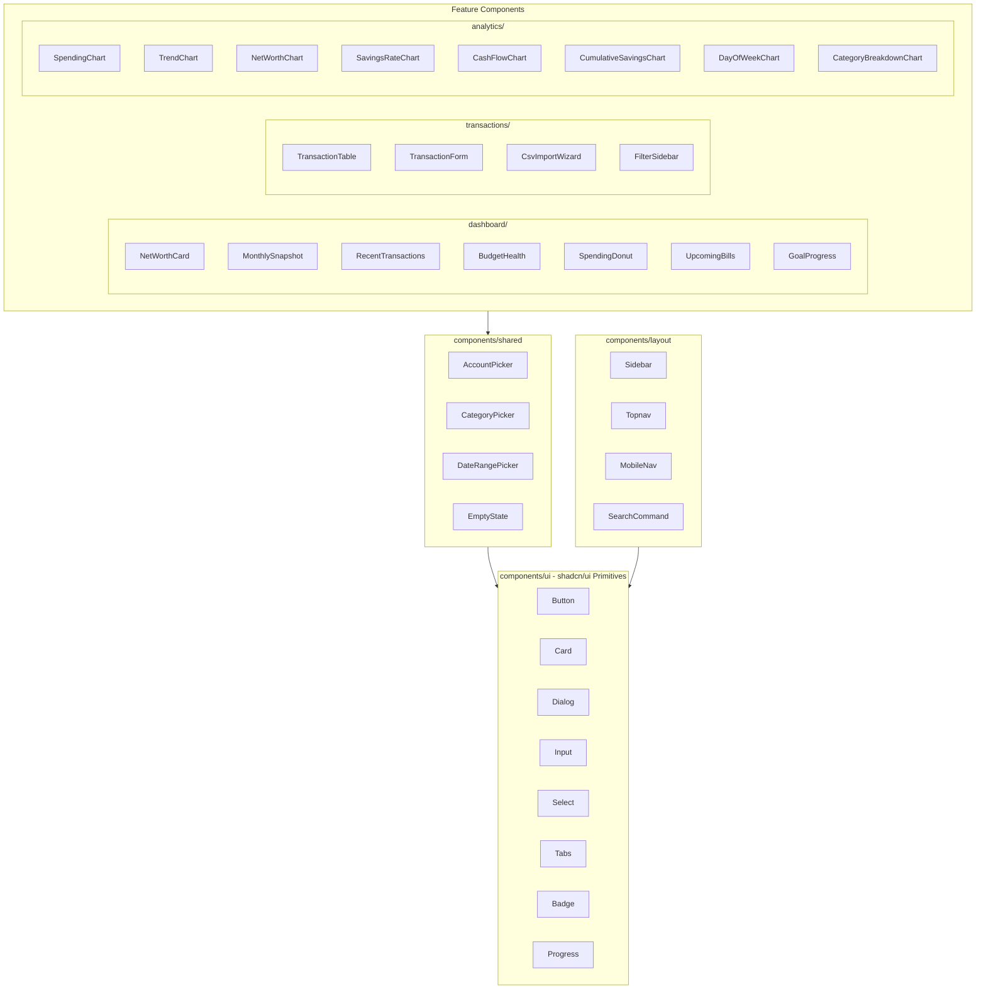
```mermaid
graph TD
    subgraph UI["components/ui - shadcn/ui Primitives"]
        BTN[Button] & CARD[Card] & DLG[Dialog] & INP[Input]
        SEL[Select] & TAB[Tabs] & BADGE[Badge] & PROG[Progress]
    end

    subgraph Layout["components/layout"]
        SIDE[Sidebar] & TOP[Topnav] & MOB[MobileNav] & SEARCH[SearchCommand]
    end

    subgraph Features["Feature Components"]
        subgraph Dash["dashboard/"]
            NW[NetWorthCard] & MS[MonthlySnapshot] & RT[RecentTransactions]
            BH[BudgetHealth] & SD[SpendingDonut] & UB[UpcomingBills] & GP[GoalProgress]
        end
        subgraph Trans["transactions/"]
            TT[TransactionTable] & TF[TransactionForm] & CSV[CsvImportWizard] & FS[FilterSidebar]
        end
        subgraph Charts["analytics/"]
            SC[SpendingChart] & TC[TrendChart] & NWC[NetWorthChart] & SRC[SavingsRateChart]
            CFC[CashFlowChart] & CSC[CumulativeSavingsChart] & DWC[DayOfWeekChart] & CBC[CategoryBreakdownChart]
        end
    end

    subgraph SharedComp["components/shared"]
        AP[AccountPicker] & CP[CategoryPicker] & DRP[DateRangePicker] & ES[EmptyState]
    end

    Features --> SharedComp --> UI
    Layout --> UI
```

### Client Data Flow

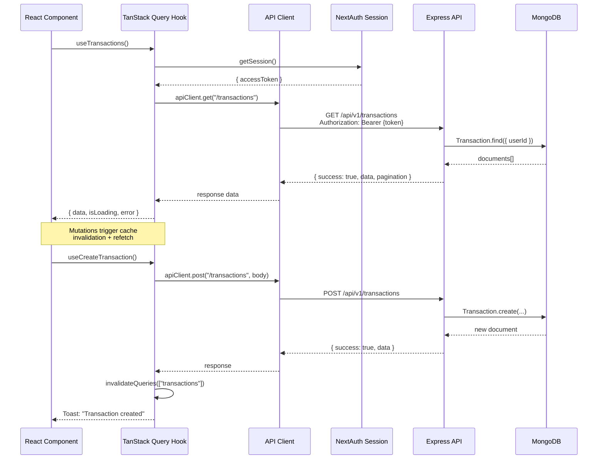
```mermaid
sequenceDiagram
    participant C as React Component
    participant H as TanStack Query Hook
    participant AC as API Client
    participant S as NextAuth Session
    participant API as Express API
    participant DB as MongoDB

    C->>H: useTransactions()
    H->>S: getSession()
    S-->>H: { accessToken }
    H->>AC: apiClient.get("/transactions")
    AC->>API: GET /api/v1/transactions<br/>Authorization: Bearer {token}
    API->>DB: Transaction.find({ userId })
    DB-->>API: documents[]
    API-->>AC: { success: true, data, pagination }
    AC-->>H: response data
    H-->>C: { data, isLoading, error }

    Note over C,H: Mutations trigger cache<br/>invalidation + refetch

    C->>H: useCreateTransaction()
    H->>AC: apiClient.post("/transactions", body)
    AC->>API: POST /api/v1/transactions
    API->>DB: Transaction.create(...)
    DB-->>API: new document
    API-->>AC: { success: true, data }
    AC-->>H: response
    H->>H: invalidateQueries(["transactions"])
    H-->>C: Toast: "Transaction created"
```

### State Management

| Concern      | Solution                                                    |
| ------------ | ----------------------------------------------------------- |
| Server state | TanStack Query 5 (cache, refetch, optimistic updates)       |
| Form state   | React Hook Form + Zod resolver                              |
| Auth session | NextAuth.js (JWT strategy)                                  |
| Theme        | next-themes (class-based, `localStorage`)                   |
| URL state    | Next.js `searchParams` for filters                          |

No global client-side store (Redux, Zustand, etc.) is used. TanStack Query serves as the single source of truth for all server-derived state.

### Styling Architecture

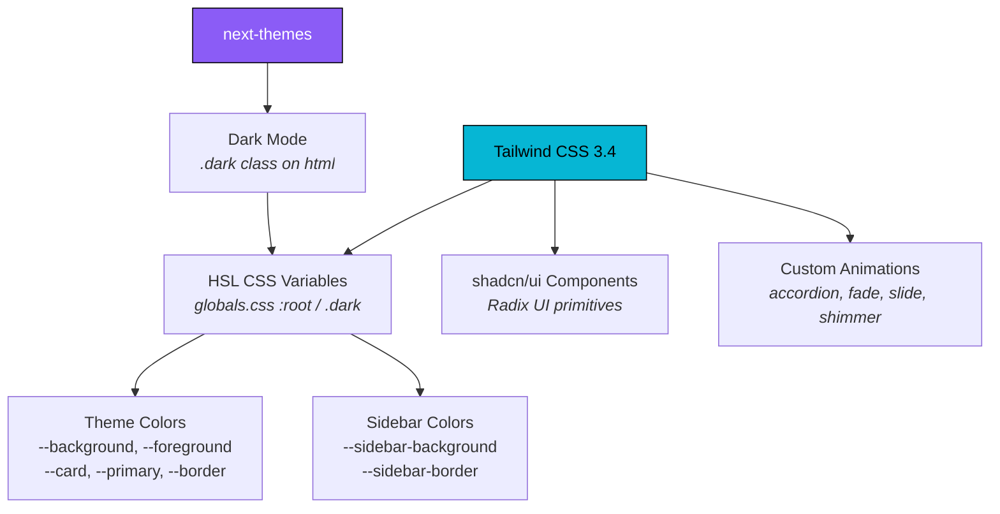
```mermaid
graph TD
    TW["Tailwind CSS 3.4"] --> HSL["HSL CSS Variables<br/><i>globals.css :root / .dark</i>"]
    TW --> SHADCN["shadcn/ui Components<br/><i>Radix UI primitives</i>"]
    TW --> ANIM["Custom Animations<br/><i>accordion, fade, slide, shimmer</i>"]

    NT["next-themes"] --> DARK["Dark Mode<br/><i>.dark class on html</i>"]
    DARK --> HSL

    HSL --> COLORS["Theme Colors<br/>--background, --foreground<br/>--card, --primary, --border"]
    HSL --> SIDEBAR_COLORS["Sidebar Colors<br/>--sidebar-background<br/>--sidebar-border"]

    style TW fill:#06b6d4,stroke:#000,color:#000
    style NT fill:#8b5cf6,stroke:#000,color:#fff
```

---

## Authentication Flow

### Full Auth Sequence

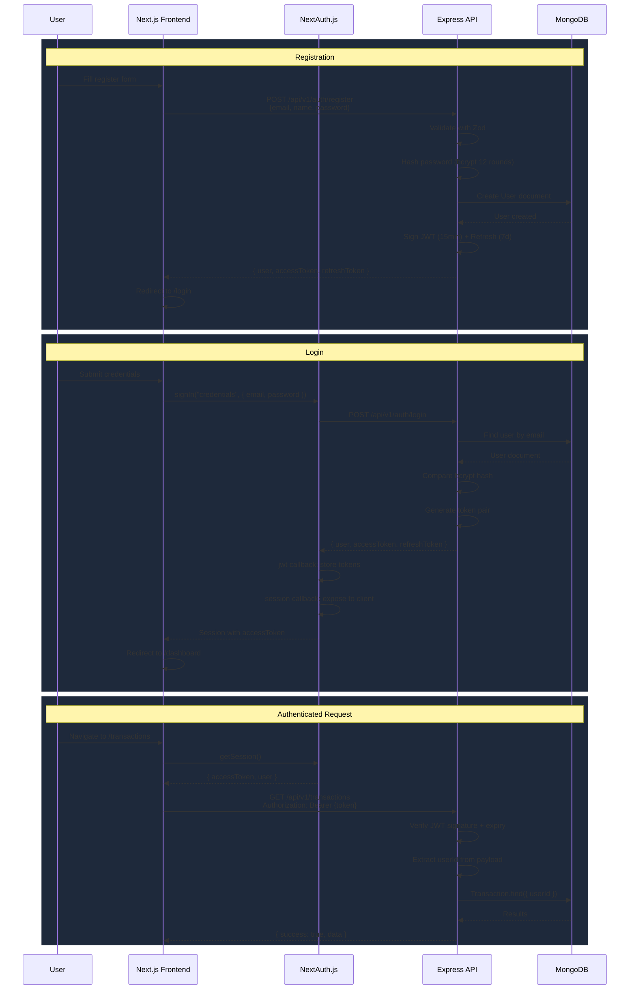
```mermaid
sequenceDiagram
    participant U as User
    participant WEB as Next.js Frontend
    participant NA as NextAuth.js
    participant API as Express API
    participant DB as MongoDB

    rect rgb(30, 41, 59)
        Note over U,DB: Registration
        U->>WEB: Fill register form
        WEB->>API: POST /api/v1/auth/register<br/>{email, name, password}
        API->>API: Validate with Zod
        API->>API: Hash password (bcrypt 12 rounds)
        API->>DB: Create User document
        DB-->>API: User created
        API->>API: Sign JWT (15min) + Refresh (7d)
        API-->>WEB: { user, accessToken, refreshToken }
        WEB->>WEB: Redirect to /login
    end

    rect rgb(30, 41, 59)
        Note over U,DB: Login
        U->>WEB: Submit credentials
        WEB->>NA: signIn("credentials", { email, password })
        NA->>API: POST /api/v1/auth/login
        API->>DB: Find user by email
        DB-->>API: User document
        API->>API: Compare bcrypt hash
        API->>API: Generate token pair
        API-->>NA: { user, accessToken, refreshToken }
        NA->>NA: jwt callback: store tokens
        NA->>NA: session callback: expose to client
        NA-->>WEB: Session with accessToken
        WEB->>WEB: Redirect to /dashboard
    end

    rect rgb(30, 41, 59)
        Note over U,DB: Authenticated Request
        U->>WEB: Navigate to /transactions
        WEB->>NA: getSession()
        NA-->>WEB: { accessToken, user }
        WEB->>API: GET /api/v1/transactions<br/>Authorization: Bearer {token}
        API->>API: Verify JWT signature + expiry
        API->>API: Extract userId from payload
        API->>DB: Transaction.find({ userId })
        DB-->>API: Results
        API-->>WEB: { success: true, data }
    end
```

### Token Lifecycle

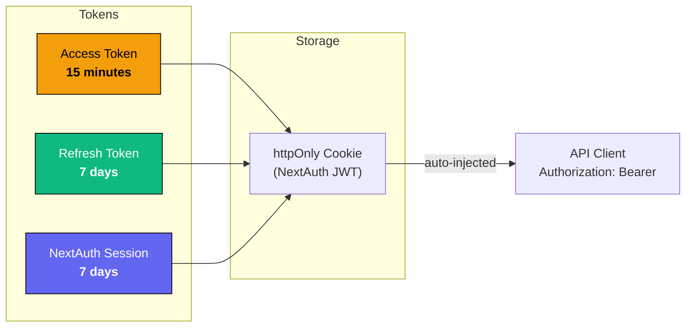
```mermaid
graph LR
    subgraph Tokens
        AT["Access Token<br/><b>15 minutes</b>"]
        RT["Refresh Token<br/><b>7 days</b>"]
        NS["NextAuth Session<br/><b>7 days</b>"]
    end

    subgraph Storage
        JWT["httpOnly Cookie<br/>(NextAuth JWT)"]
    end

    AT --> JWT
    RT --> JWT
    NS --> JWT

    JWT -- "auto-injected" --> API["API Client<br/>Authorization: Bearer"]

    style AT fill:#f59e0b,stroke:#000,color:#000
    style RT fill:#10b981,stroke:#000,color:#fff
    style NS fill:#6366f1,stroke:#000,color:#fff
```

---

## Analytics Pipeline

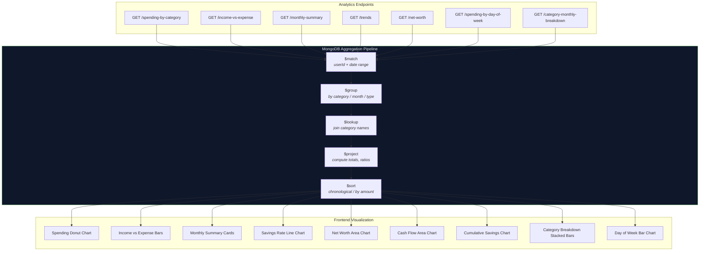
```mermaid
graph TD
    subgraph Endpoints["Analytics Endpoints"]
        E1["GET /spending-by-category"]
        E2["GET /income-vs-expense"]
        E3["GET /monthly-summary"]
        E4["GET /trends"]
        E5["GET /net-worth"]
        E6["GET /spending-by-day-of-week"]
        E7["GET /category-monthly-breakdown"]
    end

    subgraph Pipeline["MongoDB Aggregation Pipeline"]
        MATCH["$match<br/><i>userId + date range</i>"]
        GROUP["$group<br/><i>by category / month / type</i>"]
        LOOKUP["$lookup<br/><i>join category names</i>"]
        PROJECT["$project<br/><i>compute totals, ratios</i>"]
        SORT["$sort<br/><i>chronological / by amount</i>"]
    end

    E1 & E2 & E3 & E4 & E5 & E6 & E7 --> MATCH
    MATCH --> GROUP --> LOOKUP --> PROJECT --> SORT

    subgraph Results["Frontend Visualization"]
        R1["Spending Donut Chart"]
        R2["Income vs Expense Bars"]
        R3["Monthly Summary Cards"]
        R4["Savings Rate Line Chart"]
        R5["Net Worth Area Chart"]
        R6["Cash Flow Area Chart"]
        R7["Cumulative Savings Chart"]
        R8["Category Breakdown Stacked Bars"]
        R9["Day of Week Bar Chart"]
    end

    SORT --> R1 & R2 & R3 & R4 & R5 & R6 & R7 & R8 & R9

    style Pipeline fill:#0f172a,stroke:#47a248,color:#e2e8f0
```

### Budget Summary Flow

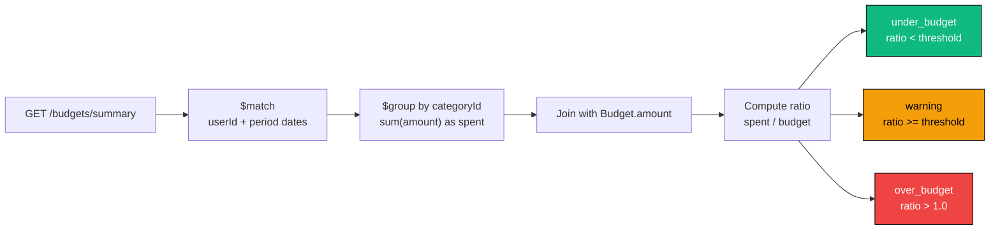
```mermaid
graph LR
    BQ["GET /budgets/summary"] --> M1["$match<br/>userId + period dates"]
    M1 --> G1["$group by categoryId<br/>sum(amount) as spent"]
    G1 --> J1["Join with Budget.amount"]
    J1 --> CALC["Compute ratio<br/>spent / budget"]
    CALC --> S1["under_budget<br/>ratio < threshold"]
    CALC --> S2["warning<br/>ratio >= threshold"]
    CALC --> S3["over_budget<br/>ratio > 1.0"]

    style S1 fill:#10b981,stroke:#000,color:#fff
    style S2 fill:#f59e0b,stroke:#000,color:#000
    style S3 fill:#ef4444,stroke:#000,color:#fff
```

---

## Deployment Architecture

### Production (Docker Compose)

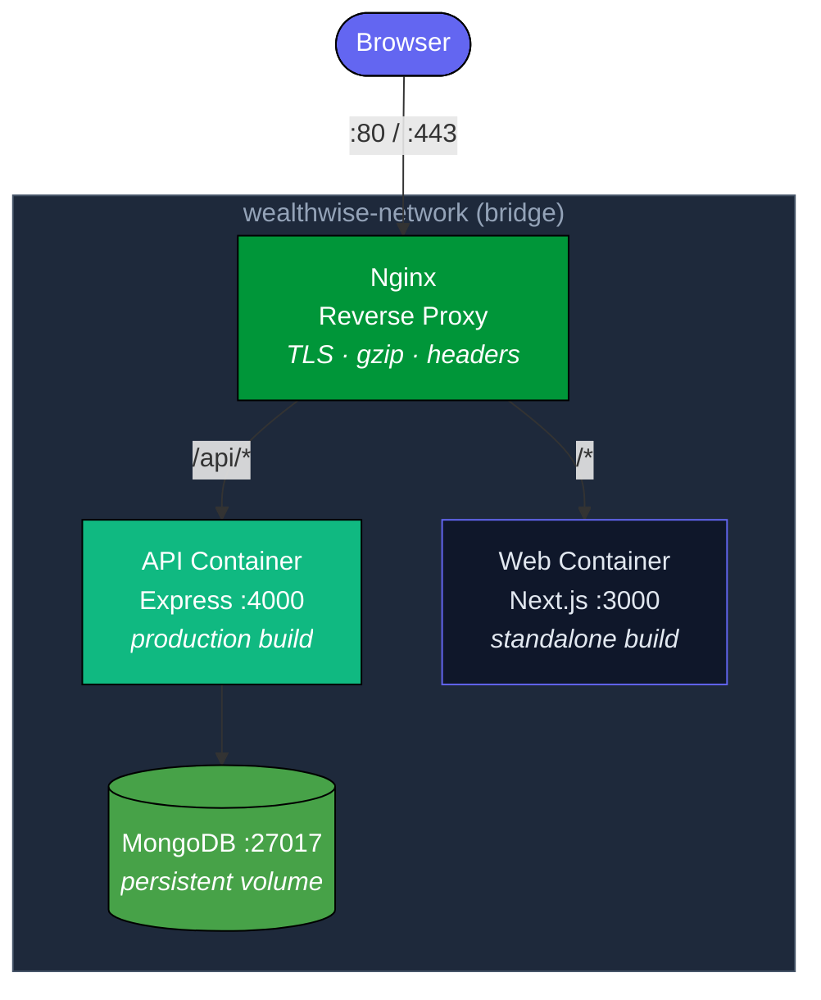
```mermaid
graph TD
    CLIENT([Browser]) -- ":80 / :443" --> NGINX["Nginx<br/>Reverse Proxy<br/><i>TLS · gzip · headers</i>"]

    NGINX -- "/api/*" --> API["API Container<br/>Express :4000<br/><i>production build</i>"]
    NGINX -- "/*" --> WEB["Web Container<br/>Next.js :3000<br/><i>standalone build</i>"]

    API --> DB[(MongoDB :27017<br/><i>persistent volume</i>)]

    subgraph NETWORK["wealthwise-network (bridge)"]
        NGINX
        API
        WEB
        DB
    end

    style CLIENT fill:#6366f1,stroke:#000,color:#fff
    style NGINX fill:#009639,stroke:#000,color:#fff
    style API fill:#10b981,stroke:#000,color:#fff
    style WEB fill:#0f172a,stroke:#6366f1,color:#e2e8f0
    style DB fill:#47a248,stroke:#000,color:#fff
    style NETWORK fill:#1e293b,stroke:#475569,color:#94a3b8
```

### Nginx Routing

- `/api/` → upstream `api:4000`
- `/` → upstream `web:3000`
- Gzip enabled for text, JSON, JS, CSS, SVG
- Client max body size: 10MB (for CSV imports)
- Proxy headers: `X-Real-IP`, `X-Forwarded-For`, `X-Forwarded-Proto`

### Development vs Production

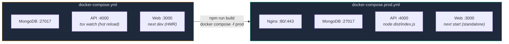
```mermaid
graph LR
    subgraph Dev["docker-compose.yml"]
        D_MONGO["MongoDB :27017"]
        D_API["API :4000<br/><i>tsx watch (hot reload)</i>"]
        D_WEB["Web :3000<br/><i>next dev (HMR)</i>"]
    end

    subgraph Prod["docker-compose.prod.yml"]
        P_NGINX["Nginx :80/:443"]
        P_MONGO["MongoDB :27017"]
        P_API["API :4000<br/><i>node dist/index.js</i>"]
        P_WEB["Web :3000<br/><i>next start (standalone)</i>"]
    end

    Dev -- "npm run build<br/>docker compose -f prod" --> Prod

    style Dev fill:#1e293b,stroke:#f59e0b,color:#e2e8f0
    style Prod fill:#1e293b,stroke:#10b981,color:#e2e8f0
```

---

## Shared Types Contract

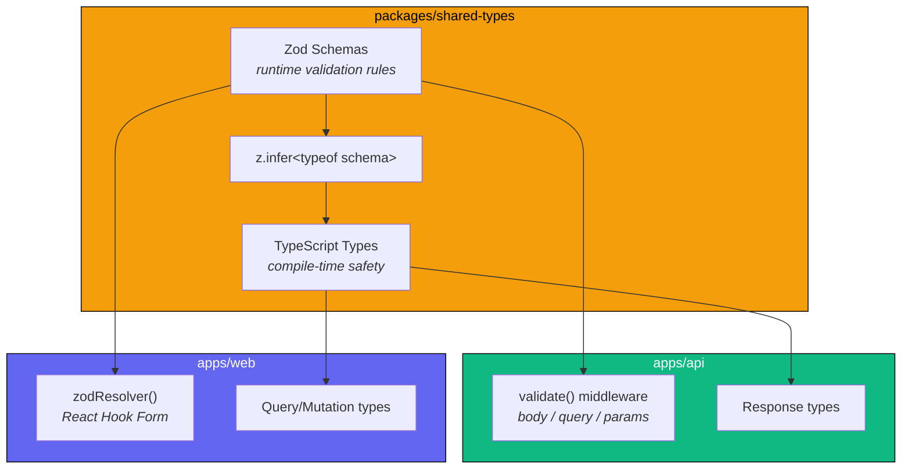
```mermaid
graph TD
    subgraph PKG["packages/shared-types"]
        ZOD["Zod Schemas<br/><i>runtime validation rules</i>"]
        INFER["z.infer&lt;typeof schema&gt;"]
        ZOD --> INFER
        INFER --> TYPES["TypeScript Types<br/><i>compile-time safety</i>"]
    end

    subgraph API_USE["apps/api"]
        VAL["validate() middleware<br/><i>body / query / params</i>"]
        RESP["Response types"]
    end

    subgraph WEB_USE["apps/web"]
        FORM["zodResolver()<br/><i>React Hook Form</i>"]
        HOOKS["Query/Mutation types"]
    end

    ZOD --> VAL
    TYPES --> RESP
    ZOD --> FORM
    TYPES --> HOOKS

    style PKG fill:#f59e0b,stroke:#000,color:#000
    style API_USE fill:#10b981,stroke:#000,color:#fff
    style WEB_USE fill:#6366f1,stroke:#000,color:#fff
```

**Schemas** define runtime validation rules. **Types** are inferred from schemas using `z.infer<>`, ensuring they can never drift.

Enums, constraints (min/max length, email format, positive numbers), and optional fields are all defined once and consumed by both the API validation middleware and the frontend form resolvers.

### Schema Coverage

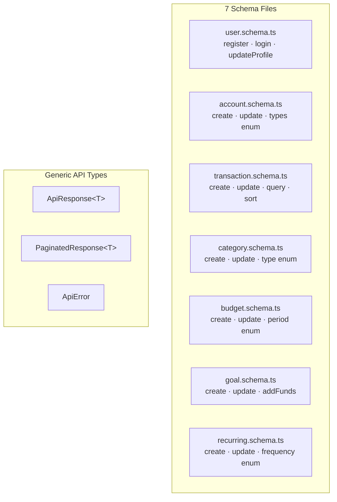
```mermaid
graph TD
    subgraph Schemas["7 Schema Files"]
        US["user.schema.ts<br/>register · login · updateProfile"]
        AS["account.schema.ts<br/>create · update · types enum"]
        TS["transaction.schema.ts<br/>create · update · query · sort"]
        CS["category.schema.ts<br/>create · update · type enum"]
        BS["budget.schema.ts<br/>create · update · period enum"]
        GS["goal.schema.ts<br/>create · update · addFunds"]
        RS["recurring.schema.ts<br/>create · update · frequency enum"]
    end

    subgraph Wrappers["Generic API Types"]
        AR["ApiResponse&lt;T&gt;"]
        PR["PaginatedResponse&lt;T&gt;"]
        AE["ApiError"]
    end
```

---

## Testing Strategy

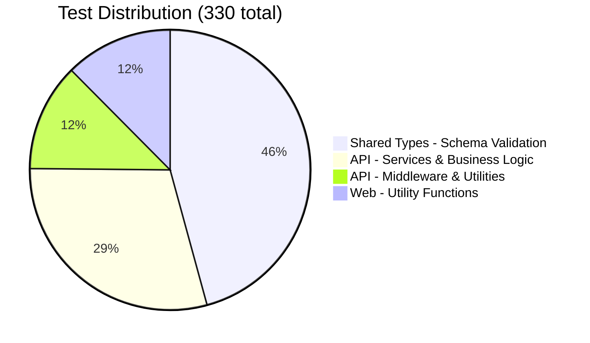
```mermaid
pie title Test Distribution (330 total)
    "Shared Types - Schema Validation" : 151
    "API - Services & Business Logic" : 97
    "API - Middleware & Utilities" : 41
    "Web - Utility Functions" : 41
```

| Layer               | Tool                            | What's Tested                                    |
| ------------------- | ------------------------------- | ------------------------------------------------ |
| **API services**    | Vitest + mongodb-memory-server  | Business logic with real Mongoose operations      |
| **API middleware**   | Vitest                         | Auth token validation, Zod middleware, error shape |
| **API utilities**   | Vitest                          | ApiError factories, pagination helpers            |
| **Shared schemas**  | Vitest                          | Every Zod schema: valid, invalid, edge cases      |
| **Web utilities**   | Vitest + jsdom                  | Formatting, class merging, helpers                |

### Test Execution Flow

```mermaid
graph LR
    CMD["npm run test"] --> TURBO["Turborepo<br/><i>runs in parallel</i>"]

    TURBO --> ST_TEST["shared-types<br/>vitest (node)<br/><b>151 tests</b>"]
    TURBO --> API_TEST["api<br/>vitest (node)<br/><b>138 tests</b>"]
    TURBO --> WEB_TEST["web<br/>vitest (jsdom)<br/><b>41 tests</b>"]

    API_TEST --> MMS["MongoMemoryServer<br/><i>in-memory MongoDB</i>"]
    MMS --> CLEAN["afterEach:<br/>clear collections"]

    style CMD fill:#6366f1,stroke:#000,color:#fff
    style ST_TEST fill:#f59e0b,stroke:#000,color:#000
    style API_TEST fill:#10b981,stroke:#000,color:#fff
    style WEB_TEST fill:#8b5cf6,stroke:#000,color:#fff
```

API tests run against a real MongoDB instance (in-memory) with full Mongoose operations - no mocking the database layer. Each test file gets a clean database via `afterEach` collection clearing.
