# WealthWise — DevOps & Infrastructure Guide

Comprehensive documentation of all DevOps, infrastructure, and operational concerns for the WealthWise personal finance application.

---

## Table of Contents

- [Architecture Overview](#architecture-overview)
- [Repository Structure](#repository-structure)
- [Technology Stack](#technology-stack)
- [Docker Infrastructure](#docker-infrastructure)
  - [Development Environment](#development-environment)
  - [Production Environment](#production-environment)
  - [Dockerfile Strategies](#dockerfile-strategies)
  - [Image Build Pipeline](#image-build-pipeline)
- [Networking & Reverse Proxy](#networking--reverse-proxy)
  - [Network Topology](#network-topology)
  - [Nginx Configuration](#nginx-configuration)
  - [SSL/TLS](#ssltls)
  - [Rate Limiting](#rate-limiting)
- [Environment Configuration](#environment-configuration)
- [Database Operations](#database-operations)
  - [MongoDB Setup](#mongodb-setup)
  - [Seeding](#seeding)
  - [Connection Management](#connection-management)
  - [Backup & Restore](#backup--restore)
- [Build System](#build-system)
  - [Turborepo Pipeline](#turborepo-pipeline)
  - [Build Order & Dependencies](#build-order--dependencies)
  - [Caching Strategy](#caching-strategy)
- [Testing Infrastructure](#testing-infrastructure)
- [Health Checks & Monitoring](#health-checks--monitoring)
- [Security Posture](#security-posture)
- [CI/CD Pipeline](#cicd-pipeline)
  - [GitHub Actions](#github-actions)
  - [GitHub Actions Job Detail](#github-actions-job-detail)
  - [Additional CI/CD Platforms](#additional-cicd-platforms)
  - [GitOps & Progressive Delivery](#gitops--progressive-delivery)
- [Deployment Procedures](#deployment-procedures)
  - [Development Deployment](#development-deployment)
  - [Production Deployment](#production-deployment)
  - [Rollback Procedures](#rollback-procedures)
- [Logging & Observability](#logging--observability)
- [Resource Limits & Scaling](#resource-limits--scaling)
- [Troubleshooting](#troubleshooting)
- [Operational Runbook](#operational-runbook)

---

## Architecture Overview

WealthWise is a full-stack monorepo application built with a decoupled frontend/backend architecture, containerized with Docker and Podman, and reverse-proxied through Nginx in production.

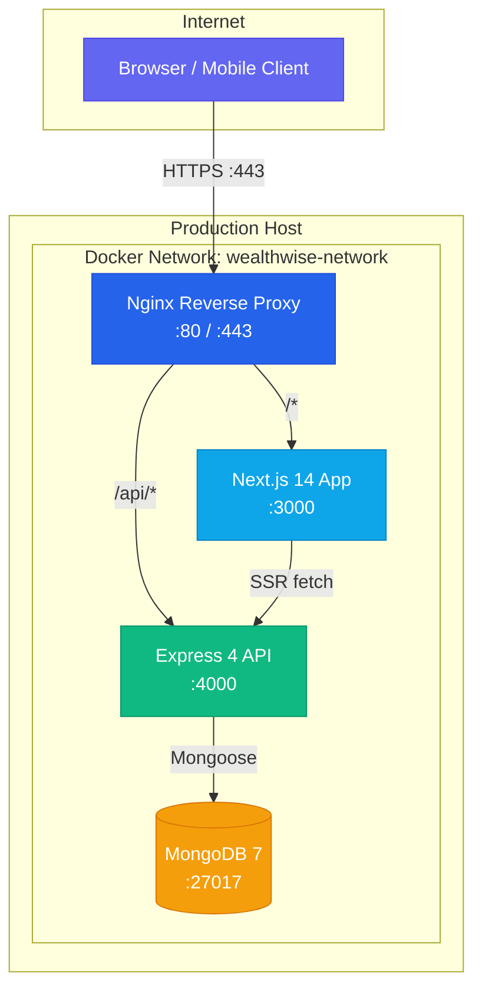

### Request Flow

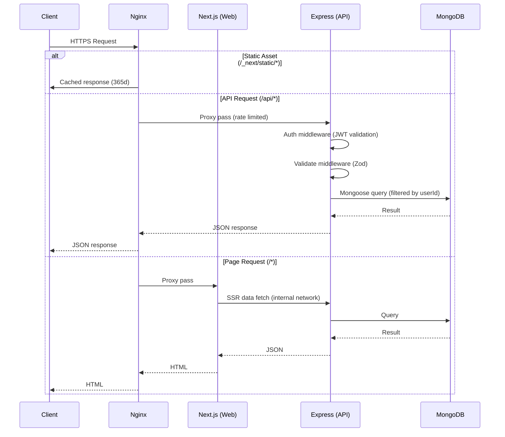

---

## Repository Structure

```
wealthwise/
├── apps/
│   ├── api/                        # Express 4 REST API
│   │   ├── Dockerfile              # Docker dev multi-stage build
│   │   ├── Dockerfile.prod         # Docker hardened production build
│   │   ├── Containerfile           # Podman dev multi-stage build
│   │   ├── Containerfile.prod      # Podman hardened production build
│   │   ├── .dockerignore
│   │   ├── .containerignore        # Podman build context exclusions
│   │   ├── package.json            # @wealthwise/api
│   │   ├── tsconfig.json           # CommonJS output
│   │   ├── vitest.config.ts        # 30s timeout (mongodb-memory-server)
│   │   └── src/
│   │       ├── index.ts            # Entry: connect DB, seed, start server
│   │       ├── dev.ts              # Dev entry: in-memory MongoDB
│   │       ├── app.ts              # Express app + middleware stack
│   │       ├── config/
│   │       │   ├── env.ts          # Zod-validated environment
│   │       │   └── database.ts     # Mongoose connection with retry
│   │       ├── middleware/
│   │       ├── routes/
│   │       ├── controllers/
│   │       ├── services/
│   │       ├── models/
│   │       └── seeds/
│   │           ├── categories.seed.ts
│   │           └── demo.seed.ts
│   │
│   └── web/                        # Next.js 14 App Router
│       ├── Dockerfile              # Docker dev multi-stage build
│       ├── Dockerfile.prod         # Docker hardened production build
│       ├── Containerfile           # Podman dev multi-stage build
│       ├── Containerfile.prod      # Podman hardened production build
│       ├── .dockerignore
│       ├── .containerignore        # Podman build context exclusions
│       ├── package.json            # @wealthwise/web
│       ├── next.config.js          # standalone output, transpilePackages
│       ├── tsconfig.json           # ESNext, bundler resolution
│       └── src/
│
├── packages/
│   └── shared-types/               # Zod schemas + TS types
│       ├── package.json            # @wealthwise/shared-types
│       ├── tsconfig.json
│       └── src/
│
├── nginx/
│   ├── nginx.conf                  # Development config
│   └── nginx.prod.conf             # Production config (SSL, rate limiting)
│
├── docker-compose.yml              # Docker development
├── docker-compose.prod.yml         # Docker basic production
├── docker-compose.production.yml   # Docker hardened production
├── podman-compose.yml              # Podman development
├── podman-compose.prod.yml         # Podman production (hardened)
├── .containerignore                # Podman root build context exclusions
├── turbo.json                      # Turborepo pipeline config
├── Makefile                        # Build & operations automation
├── .env.example                    # Environment template
└── package.json                    # Root workspace config
```

---

## Technology Stack

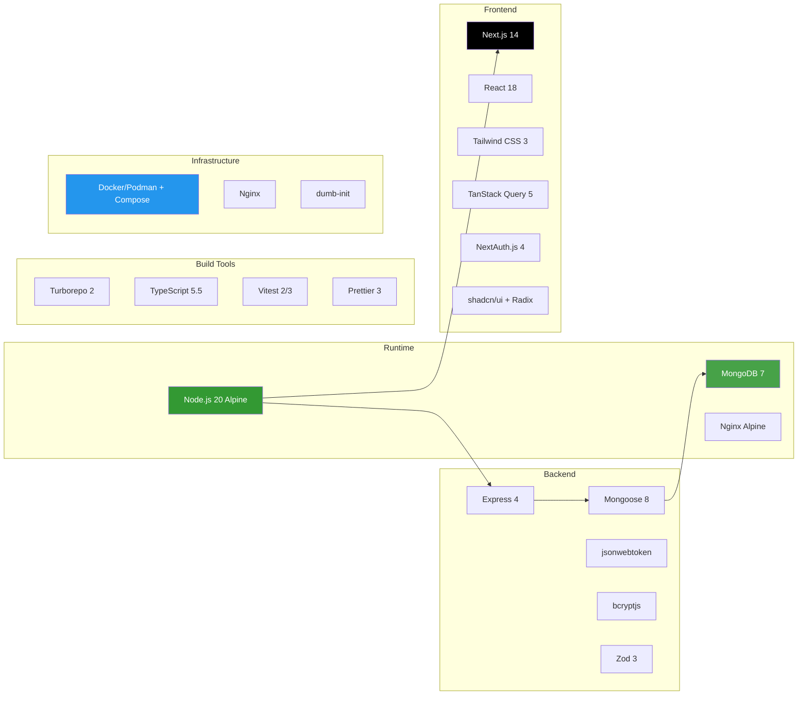

| Component | Version | Purpose |
|-----------|---------|---------|
| Node.js | 20 (Alpine) | Runtime for API and Web |
| MongoDB | 7 | Document database |
| Express | 4.19+ | REST API framework |
| Mongoose | 8.5+ | MongoDB ODM |
| Next.js | 14.2+ | React framework (App Router) |
| React | 18.3+ | UI library |
| Tailwind CSS | 3.4+ | Utility-first CSS |
| TanStack Query | 5.51+ | Server state management |
| NextAuth.js | 4.24+ | Authentication (web) |
| Turborepo | 2.1+ | Monorepo build orchestration |
| TypeScript | 5.5+ | Type system |
| Vitest | 2.0 (api) / 3.2 (web, shared) | Test runner |
| Nginx | Alpine | Reverse proxy (production) |
| dumb-init | Latest | PID 1 init (production API) |
| Zod | 3.23+ | Schema validation (shared) |

---

## Docker Infrastructure

> **Podman users**: Dedicated `podman-compose.yml` and `podman-compose.prod.yml` files are provided alongside Docker Compose files. Containerfiles (Podman's naming convention) mirror Dockerfiles with fully-qualified image references (`docker.io/library/...`). Use `podman-compose` instead of `docker compose` and reference the `podman-compose*.yml` files. The `scripts/podman-build.sh` script builds all production images with Podman.

### Development Environment

The development Docker/Podman setup prioritizes fast iteration with hot-reload support and direct port access.

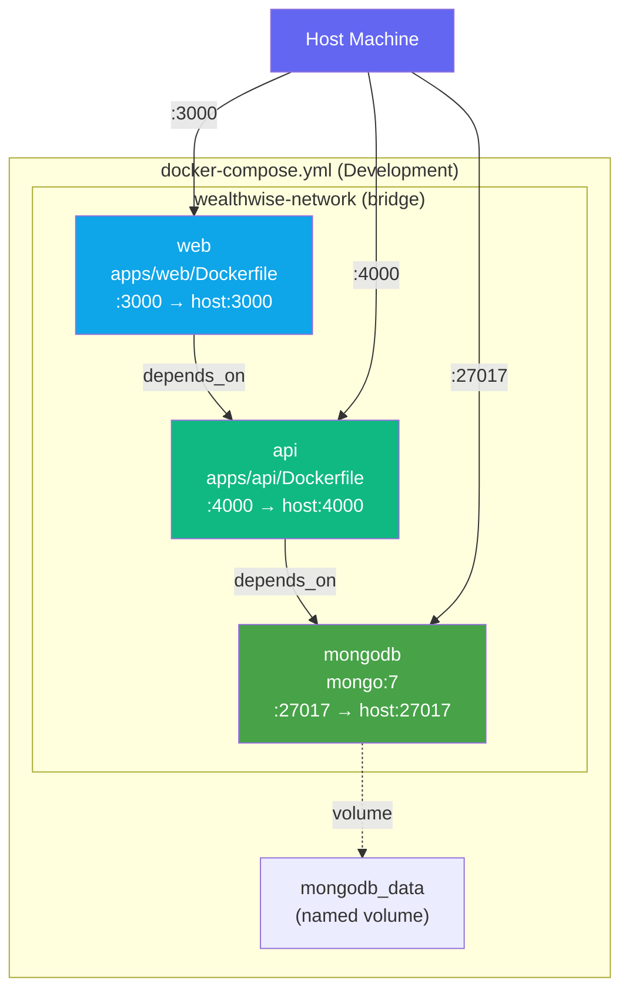

**Characteristics:**
- All ports exposed to host for direct access
- JWT secrets have hardcoded dev fallback values (`${JWT_SECRET:-dev-jwt-secret-...}`)
- MongoDB accessible from host on `:27017` (for GUI tools)
- `restart: unless-stopped` on api and web
- No health checks at compose level
- No resource limits

### Production Environment

Two production compose files exist with different hardening levels.

#### `docker-compose.prod.yml` (Basic)

Uses the dev Dockerfiles with `target: production` stage. Adds Nginx as a reverse proxy. MongoDB not exposed to host. No health checks or resource limits.

#### `docker-compose.production.yml` (Hardened — Recommended)

Uses dedicated `.prod` Dockerfiles. Full production hardening.

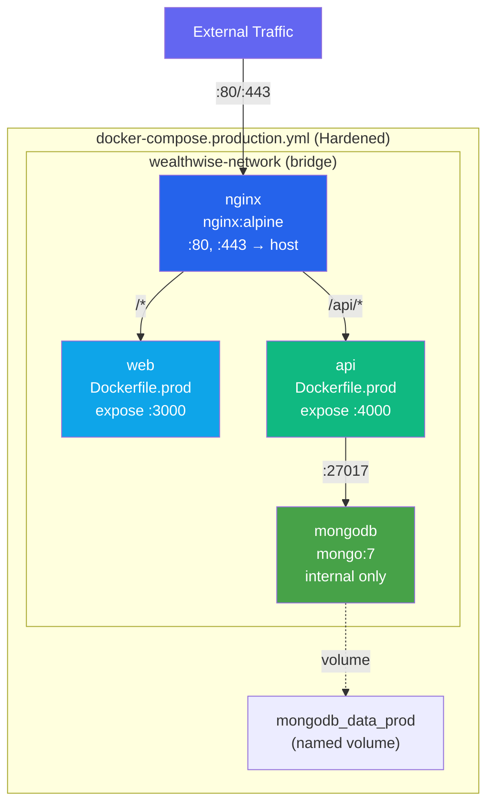

**Hardened Production Features:**

| Feature | Detail |
|---------|--------|
| Dockerfiles | Dedicated `.prod` variants with multi-stage builds |
| Init system | `dumb-init` as PID 1 (API container) |
| Non-root user | `nonroot` (UID/GID 65532) in API and Web |
| Health checks | All 4 services have health checks |
| Resource limits | CPU and memory limits + reservations |
| Security options | `no-new-privileges: true` on API and Web |
| Logging | `json-file` driver, 10MB max, 3 file rotation |
| Dependency chain | `condition: service_healthy` startup ordering |
| Restart policy | `restart: always` |
| SSL | Nginx terminates TLS with cert/key mounts |

**Startup Dependency Chain:**


### Dockerfile Strategies

#### Development Dockerfiles (2-stage)

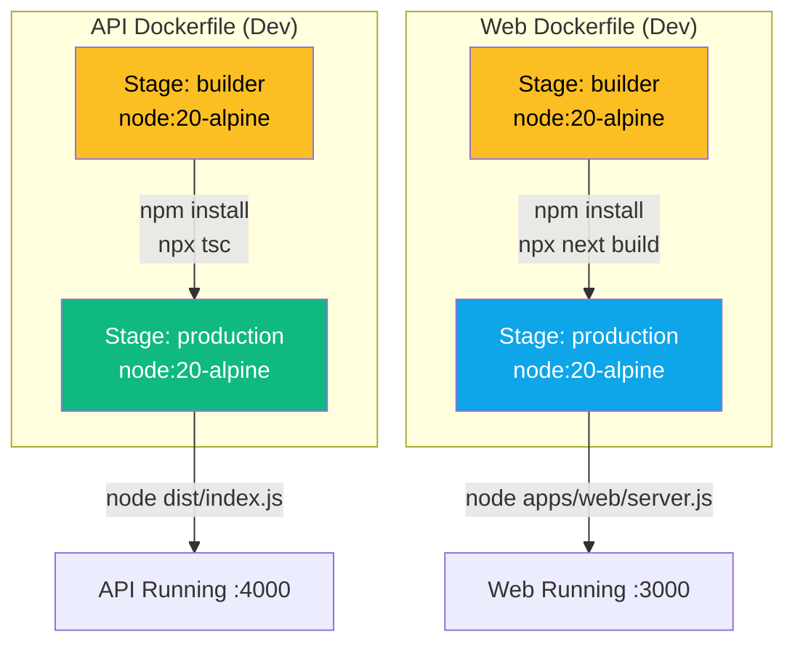

#### Production Dockerfiles (3-stage, hardened)

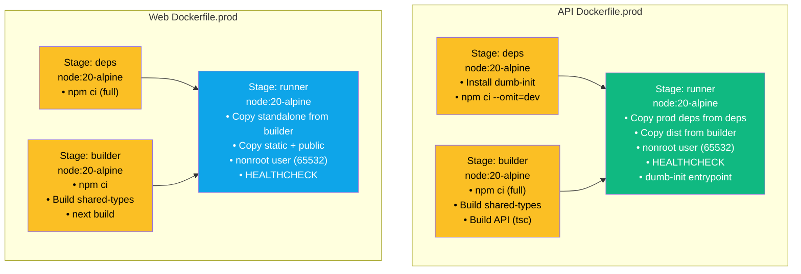

**Key Differences Between Dev and Prod Dockerfiles:**

| Aspect | Dev Dockerfile | Prod Dockerfile |
|--------|---------------|-----------------|
| Stages | 2 (builder, production) | 3 (deps, builder, runner) |
| Dependency install | `npm install` | `npm ci` (deterministic) |
| Init system | None | `dumb-init` (API) |
| User | root | `nonroot` (65532) |
| Health check | None | Built-in `HEALTHCHECK` |
| Signal handling | `STOPSIGNAL` not set | `STOPSIGNAL SIGTERM` (API) |
| Shared-types | Copied, not explicitly built | Explicitly built before app |

### Image Build Pipeline

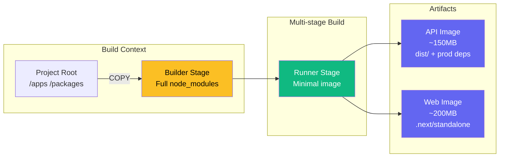

**Build context note**: Both Dockerfiles (and Containerfiles) copy from the project root to access `packages/shared-types`. The `.dockerignore` and `.containerignore` files exclude `node_modules`, `.git`, `.env*`, tests, coverage, and IDE files to keep build context small.

**Build scripts:**
- `scripts/docker-build.sh` — builds API and Web production images with Docker
- `scripts/podman-build.sh` — builds API, Web, MCP, and Agentic AI production images with Podman

---

## Networking & Reverse Proxy

### Network Topology

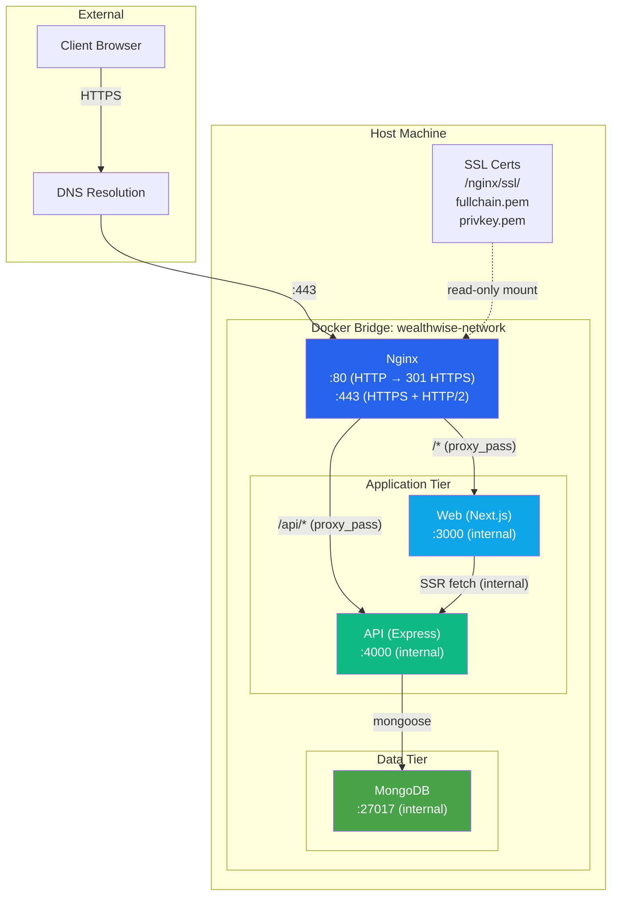

### Port Map

| Service | Internal Port | Dev Host Port | Prod Host Port |
|---------|:------------:|:-------------:|:--------------:|
| MongoDB | 27017 | 27017 | — (internal) |
| API | 4000 | 4000 | — (internal) |
| Web | 3000 | 3000 | — (internal) |
| Nginx | 80, 443 | — (not used in dev) | 80, 443 |

### Nginx Configuration

#### Development (`nginx/nginx.conf`)

Minimal config for local testing behind Nginx (optional in dev):

- HTTP only (port 80)
- Proxy pass to `web:3000` and `api:4000`
- WebSocket upgrade headers for Next.js HMR
- `client_max_body_size: 10M`
- Gzip compression (level 6)
- No rate limiting, no security headers

#### Production (`nginx/nginx.prod.conf`)

Full production-grade reverse proxy:

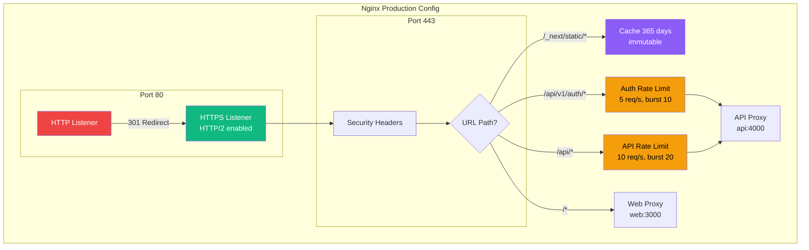

**Security Headers Applied to All Responses:**

| Header | Value | Purpose |
|--------|-------|---------|
| `Strict-Transport-Security` | `max-age=63072000; includeSubDomains; preload` | HSTS (2 years) |
| `X-Frame-Options` | `DENY` | Prevent clickjacking |
| `X-Content-Type-Options` | `nosniff` | Prevent MIME sniffing |
| `X-XSS-Protection` | `1; mode=block` | XSS filter |
| `Referrer-Policy` | `strict-origin-when-cross-origin` | Referrer control |
| `Content-Security-Policy` | `default-src 'self'; script-src 'self' 'unsafe-inline' 'unsafe-eval'; ...` | CSP |
| `Permissions-Policy` | `camera=(), microphone=(), geolocation=()` | Feature policy |

### SSL/TLS

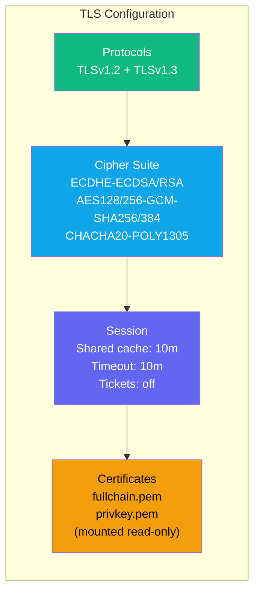

Certificate files must be placed at `./nginx/ssl/fullchain.pem` and `./nginx/ssl/privkey.pem` before starting the production stack. No automated certificate management (certbot/ACME) is configured — this must be handled externally.

### Rate Limiting

Two rate-limiting tiers are implemented at the Nginx level:

| Zone | Memory | Rate | Burst | Applied To |
|------|:------:|:----:|:-----:|-----------|
| `api` | 10MB | 10 req/s per IP | 20 (nodelay) | All `/api/*` routes |
| `auth` | 10MB | 5 req/s per IP | 10 (nodelay) | `/api/v1/auth/*` routes only |

Exceeding the limit returns HTTP **429 Too Many Requests**.

Additionally, Express-level rate limiting is applied:

| Limiter | Window | Max Requests | Applied To |
|---------|:------:|:------------:|-----------|
| `generalLimiter` | 15 min | 500 | All routes |
| `authLimiter` | 15 min | 10 | Auth routes |

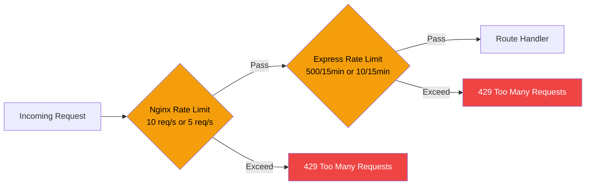

---

## Environment Configuration

### Variable Reference

All environment variables with their sources, defaults, and validation rules:

| Variable | Package | Required | Default | Validation |
|----------|---------|:--------:|---------|-----------|
| `MONGODB_URI` | api | Yes | `mongodb://localhost:27017/wealthwise` | Valid URL |
| `JWT_SECRET` | api | Yes | — | Min 32 characters |
| `JWT_REFRESH_SECRET` | api | Yes | — | Min 32 characters |
| `API_PORT` | api | No | `4000` | Integer |
| `CORS_ORIGIN` | api | No | `http://localhost:3000` | String |
| `NODE_ENV` | api | No | `development` | `development` \| `production` \| `test` |
| `NEXTAUTH_SECRET` | web | Yes | — | Min 32 characters |
| `NEXTAUTH_URL` | web | Yes | `http://localhost:3000` | URL |
| `NEXT_PUBLIC_API_URL` | web | Yes | `http://localhost:4000/api/v1` | URL (client-side) |
| `API_URL` | web | No | `http://localhost:4000` | URL (SSR internal) |
| `GOOGLE_CLIENT_ID` | web | No | — | OAuth (optional) |
| `GOOGLE_CLIENT_SECRET` | web | No | — | OAuth (optional) |

### Validation Flow

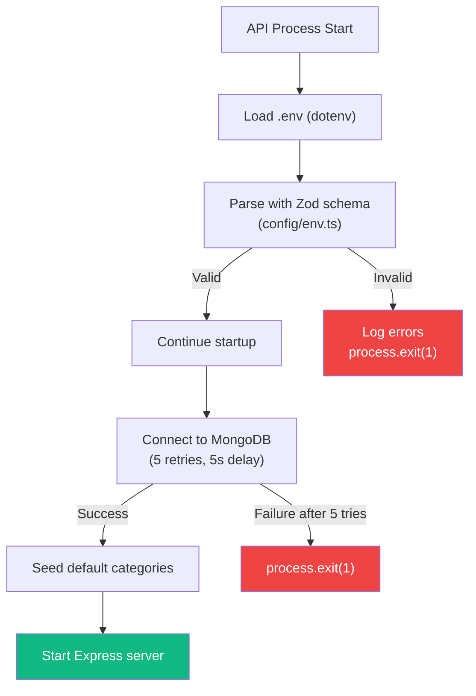

### Docker Compose Environment Handling

| Environment | Secret Strategy |
|-------------|----------------|
| **Development** (`docker-compose.yml`) | Hardcoded fallback defaults in compose file (`${VAR:-fallback}`) |
| **Production** (`docker-compose.production.yml`) | No defaults — must be supplied via host env vars or `.env` file |

**Production secrets must be set before starting the stack.** Options:
1. Export in shell: `export JWT_SECRET=...`
2. Create `.env` file in project root (not committed)
3. Use Docker secrets (not currently configured)
4. Use a secrets manager (e.g., Vault, AWS Secrets Manager) and inject at deploy time

---

## Database Operations

### MongoDB Setup

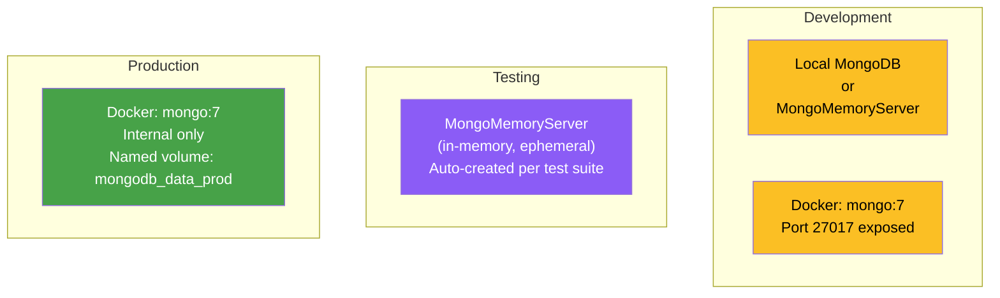

| Environment | MongoDB Source | Data Persistence | Authentication |
|-------------|--------------|:----------------:|:--------------:|
| Dev (native) | `npm run dev` → MongoMemoryServer | Ephemeral (in-memory) | None |
| Dev (Docker) | `docker-compose.yml` → mongo:7 | Named volume `mongodb_data` | None |
| Test | Vitest setup → MongoMemoryServer | Ephemeral (cleared per test) | None |
| Production | `docker-compose.production.yml` → mongo:7 | Named volume `mongodb_data_prod` | **None** (see warning) |

> **Warning**: MongoDB has no authentication configured in any environment. The production compose files do not set `MONGO_INITDB_ROOT_USERNAME` or `MONGO_INITDB_ROOT_PASSWORD`. In production, MongoDB is only accessible within the Docker network, but this is still a security concern for defense-in-depth.

### Seeding

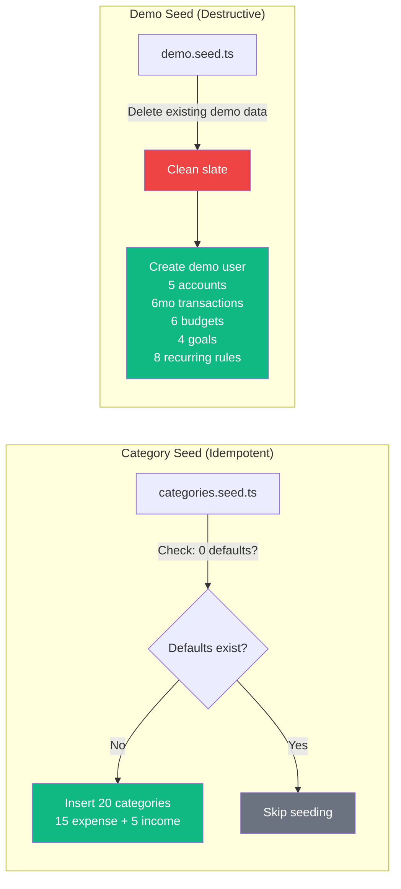

| Seed | Command | Behavior | Runs On Startup |
|------|---------|----------|:---------------:|
| Categories | `npm run db:seed` | Idempotent — only inserts if none exist | Yes (auto) |
| Demo | `npm run db:seed -- demo` | Destructive — deletes and recreates | No (manual) |

### Connection Management

The database connection (`config/database.ts`) implements retry logic:

| Parameter | Value |
|-----------|-------|
| Max retries | 5 |
| Retry delay | 5,000 ms |
| Auto-index | Enabled |
| Failure behavior | `process.exit(1)` after max retries |

Mongoose event handlers log: `connected`, `error`, `disconnected`.

### Backup & Restore

> **Note**: No automated backup strategy is currently configured. The following are recommended manual procedures.

```bash
# Backup (from host)
docker compose -f docker-compose.production.yml exec mongodb \
  mongodump --db wealthwise --archive=/tmp/backup.archive --gzip

docker compose -f docker-compose.production.yml cp \
  mongodb:/tmp/backup.archive ./backups/$(date +%Y%m%d).archive

# Restore
docker compose -f docker-compose.production.yml cp \
  ./backups/20260303.archive mongodb:/tmp/restore.archive

docker compose -f docker-compose.production.yml exec mongodb \
  mongorestore --archive=/tmp/restore.archive --gzip --drop
```

---

## Build System

### Turborepo Pipeline

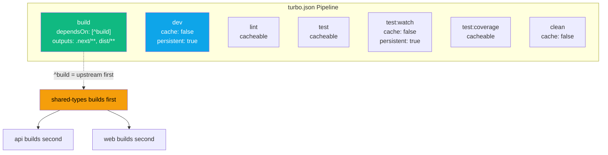

### Build Order & Dependencies

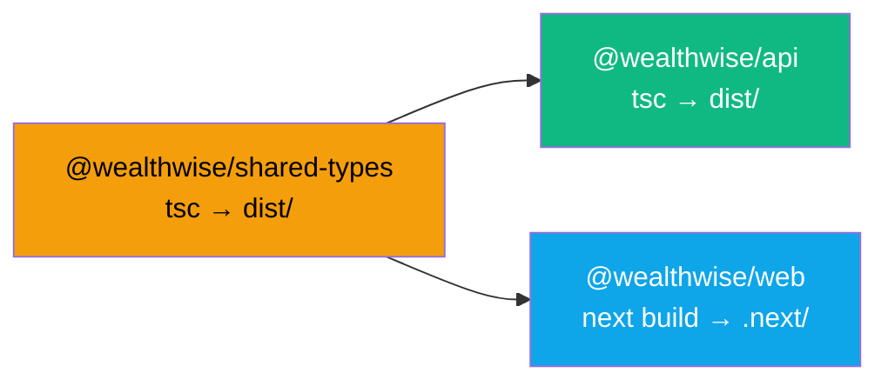

The `^build` dependency in `turbo.json` ensures:
1. `@wealthwise/shared-types` builds first (both api and web depend on it)
2. `@wealthwise/api` and `@wealthwise/web` build in parallel after shared-types

**Development note**: In development (`npm run dev`), shared-types is consumed directly from source (`main: "./src/index.ts"` in its `package.json`). It only needs a build step for Docker production images and type checking.

### Caching Strategy

| Task | Cached | Outputs | Cache Key Includes |
|------|:------:|---------|-------------------|
| `build` | Yes | `.next/**`, `dist/**` (excludes `.next/cache/**`) | Source files + deps |
| `dev` | No | — | — |
| `lint` | Yes | — | Source files |
| `test` | Yes | — | Source + test files |
| `test:watch` | No | — | — |
| `test:coverage` | Yes | — | Source + test files |
| `clean` | No | — | — |

Global dependency: `.env.*local` files — any change to these invalidates all caches.

---

## Testing Infrastructure

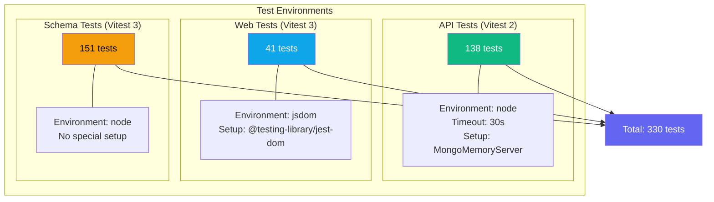

### Test Commands

| Command | Scope | Description |
|---------|-------|-------------|
| `npm run test` | All | Run all tests across all packages |
| `npx turbo test --filter=@wealthwise/api` | API | Run API tests only |
| `npx turbo test --filter=@wealthwise/web` | Web | Run web tests only |
| `npx turbo test --filter=@wealthwise/shared-types` | Schemas | Run schema tests only |
| `npm run test:watch` | All | Watch mode for all packages |
| `npm run test:coverage` | All | Coverage report for all packages |

### Test Architecture

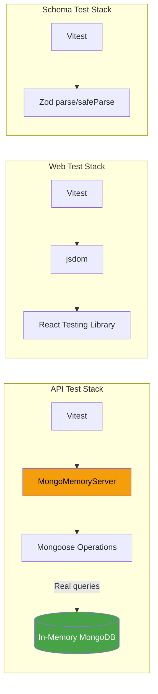

**Key testing conventions:**
- API service tests use **real Mongoose operations** against MongoMemoryServer — no mocking the database
- Collections are cleared between tests via `afterEach`
- API middleware tests mock `req`/`res`/`next` Express objects
- Web tests currently cover utility functions only (no component tests)
- Schema tests validate Zod parse/safeParse for all schemas

---

## Health Checks & Monitoring

### Health Check Matrix

```mermaid
graph TB
    subgraph "Docker Health Checks (Production)"
        HC_Mongo["MongoDB<br/>mongosh ping<br/>interval: 30s<br/>timeout: 10s<br/>retries: 5<br/>start-period: 30s"]
        HC_API["API<br/>wget :4000/api/health<br/>interval: 30s<br/>timeout: 5s<br/>retries: 3<br/>start-period: 10s"]
        HC_Web["Web<br/>wget :3000/<br/>interval: 30s<br/>timeout: 5s<br/>retries: 3<br/>start-period: 10s"]
        HC_Nginx["Nginx<br/>wget :80/<br/>interval: 30s<br/>timeout: 5s<br/>retries: 3<br/>start-period: 10s"]
    end

    HC_Mongo -->|healthy| HC_API
    HC_API -->|healthy| HC_Web
    HC_Web -->|healthy| HC_Nginx

    style HC_Mongo fill:#47a248,color:#fff
    style HC_API fill:#10b981,color:#fff
    style HC_Web fill:#0ea5e9,color:#fff
    style HC_Nginx fill:#2563eb,color:#fff
```

### API Health Endpoint

```
GET /api/health
```

Response:
```json
{
  "success": true,
  "data": {
    "status": "ok",
    "timestamp": "2026-03-03T12:00:00.000Z"
  }
}
```

**Limitation**: The health check only confirms the Express process is running. It does **not** verify MongoDB connectivity. A database failure after startup would not be detected by the health check.

### Monitoring Gaps

The following observability capabilities are **not currently implemented**:

| Capability | Status | Recommendation |
|------------|:------:|----------------|
| Structured logging | Not implemented | Replace Morgan with Pino or Winston (JSON output) |
| Metrics (Prometheus) | Not implemented | Add `prom-client` with `/metrics` endpoint |
| Distributed tracing | Not implemented | Add OpenTelemetry SDK |
| Error tracking | Not implemented | Integrate Sentry or similar |
| Alerting | Not implemented | Configure with monitoring stack |
| Log aggregation | Not implemented | ELK stack or Loki + Grafana |
| Uptime monitoring | Not implemented | External health check service |

---

## Security Posture

### Authentication Flow

```mermaid
sequenceDiagram
    participant C as Client
    participant NA as NextAuth.js
    participant API as Express API
    participant DB as MongoDB

    C->>NA: POST /api/auth/signin (credentials)
    NA->>API: POST /api/v1/auth/login
    API->>DB: Find user by email
    DB-->>API: User document
    API->>API: bcrypt.compare (12 rounds)
    API->>API: Sign JWT (access: 15min, refresh: 7d)
    API-->>NA: { accessToken, refreshToken, user }
    NA->>NA: Store tokens in JWT cookie
    NA-->>C: Set-Cookie (httpOnly, secure)

    Note over C,DB: Subsequent API Requests

    C->>NA: Page request
    NA->>NA: Read JWT from cookie
    NA->>API: GET /api/v1/... + Bearer token
    API->>API: Verify JWT, extract userId
    API->>DB: Query filtered by userId
    DB-->>API: Results
    API-->>NA: JSON response
    NA-->>C: Rendered page
```

### Security Layers

```mermaid
graph TB
    subgraph "Layer 1: Network"
        TLS["TLS 1.2/1.3 termination at Nginx"]
        HSTS["HSTS with preload (2yr)"]
        RateNginx["Nginx rate limiting"]
    end

    subgraph "Layer 2: HTTP"
        SecHeaders["Security headers (CSP, X-Frame, etc.)"]
        CORS["CORS whitelist (CORS_ORIGIN)"]
        BodyLimit["Body size limit (10MB)"]
    end

    subgraph "Layer 3: Application"
        RateExpress["Express rate limiting (500/15min)"]
        AuthRateExpress["Auth rate limiting (10/15min)"]
        JWT2["JWT validation (15min expiry)"]
        ZodVal["Zod input validation"]
        Bcrypt["bcrypt password hashing (12 rounds)"]
    end

    subgraph "Layer 4: Data"
        UserFilter["All queries filter by userId"]
        EnvVal["Env validation at startup (min 32-char secrets)"]
    end

    subgraph "Layer 5: Container"
        NonRoot["Non-root user (65532)"]
        NoNewPriv["no-new-privileges"]
        DumbInit["dumb-init (PID 1)"]
        ReadOnly["Nginx config: read-only mount"]
    end

    TLS --> SecHeaders --> RateExpress --> UserFilter --> NonRoot

    style TLS fill:#10b981,color:#fff
    style SecHeaders fill:#0ea5e9,color:#fff
    style RateExpress fill:#f59e0b,color:#000
    style UserFilter fill:#8b5cf6,color:#fff
    style NonRoot fill:#ef4444,color:#fff
```

### Known Security Gaps

| Gap | Severity | Mitigation |
|-----|:--------:|-----------|
| MongoDB has no authentication | High | Only accessible within Docker network; add auth for defense-in-depth |
| Health check doesn't verify DB | Medium | Add `mongoose.connection.readyState` check |
| No CSRF protection | Medium | NextAuth handles CSRF for its routes; API relies on Bearer tokens |
| `unsafe-inline`/`unsafe-eval` in CSP | Medium | Required by Next.js; consider nonce-based CSP |
| No automated cert renewal | Medium | Add certbot sidecar or external ACME |
| No secrets management | Medium | Use Docker secrets or external vault |

---

## CI/CD Pipeline

WealthWise provides a variety of CI/CD pipeline configurations to support different organizational needs. The current setup uses GitHub Actions for both CI and CD, but the structure is designed to be portable to other platforms like Jenkins or GitLab CI if desired.

### GitHub Actions

The following is the project's GitHub Actions pipeline structure:

```mermaid
graph TD
    subgraph "CI Pipeline (on PR)"
        Trigger[PR opened / push to branch]
        Trigger --> Install[Install dependencies]
        Install --> Parallel1

        subgraph Parallel1[Parallel Jobs]
            Lint[Type Check<br/>npm run lint]
            Format[Format Check<br/>npm run format:check]
            TestShared[Test shared-types<br/>151 tests]
            TestAPI[Test API<br/>138 tests]
            TestWeb[Test Web<br/>41 tests]
            BuildShared[Build shared-types]
        end

        BuildShared --> BuildAPI[Build API]
        BuildShared --> BuildWeb[Build Web]

        Parallel1 --> Gate{All pass?}
        BuildAPI --> Gate
        BuildWeb --> Gate
        Gate -->|Yes| DockerPR[Build Docker images<br/>no registry push on PR]
        DockerPR --> Ready[Ready for review]
        Gate -->|No| Fail[Block merge]
    end

    subgraph "CD Pipeline (on merge to main)"
        Merge[Merge to main] --> BuildImages[Build Docker images]
        BuildImages --> Push[Push to registry]
        Push --> DeployStage[Deploy to staging]
        DeployStage --> Smoke[Smoke tests]
        Smoke -->|Pass| DeployProd[Deploy to production]
        Smoke -->|Fail| Rollback[Alert + rollback]
    end

    style Trigger fill:#6366f1,color:#fff
    style Ready fill:#10b981,color:#fff
    style Fail fill:#ef4444,color:#fff
    style Merge fill:#6366f1,color:#fff
    style DeployProd fill:#10b981,color:#fff
    style Rollback fill:#ef4444,color:#fff
```

<p align="center">
    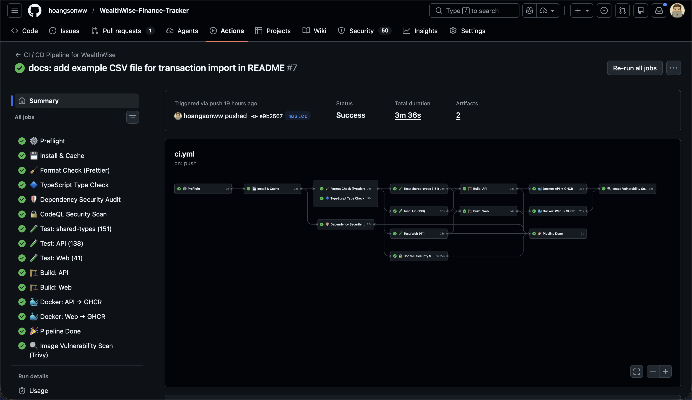
</p>

**Current behavior:**
- `pull_request` to `main` or `master`: run install, formatting, type-checking, tests, package builds, and Docker image builds for `apps/api` and `apps/web`.
- `push` to `main` or `master`: run the full validation pipeline, build Docker images, push images to GHCR, and run image scanning.
- `workflow_dispatch`: allow manual execution for operational checks or release validation.

### GitHub Actions Job Detail

The workflow in `.github/workflows/ci.yml` is stage-gated and intentionally conservative:

| Stage | Purpose | Notes |
|------|---------|-------|
| `preflight` | Collect run metadata | Exposes short SHA and logs runner context |
| `install` | Prime dependency and Turbo caches | Uses `actions/setup-node` npm caching |
| `format-check` | Enforce Prettier formatting | Fails fast on unformatted files |
| `type-check` | Run `tsc --noEmit` through Turbo | Guards all packages before build |
| `security-audit` | Dependency vulnerability check | Advisory security gate |
| `test-shared-types` | Validate schema package | Protects cross-package contract changes |
| `test-api` | Run API Vitest suite | Uses real in-memory MongoDB |
| `test-web` | Run web Vitest suite | Covers client hooks and components |
| `build-api` | Build API and dependent packages | Confirms production compile path |
| `build-web` | Build Next.js app and shared types | Confirms standalone output path |
| `docker-api` | Build API production image | PRs build only, non-PR runs also push |
| `docker-web` | Build Web production image | PRs build only, non-PR runs also push |
| `image-scan` | Scan pushed images with Trivy | Runs only when images are published |
| summary/report jobs | Aggregate results | Keeps failure reporting visible even on partial failures |

**Why the GitHub Actions setup matters operationally:**
- Dockerfiles are validated in CI, not just the Node build, so container regressions surface before merge.
- Docker Buildx cache (`type=gha`) reduces repeated image build time across runs.
- PR builds avoid registry publication while still exercising the exact container build path used for releases.
- GHCR tags are derived from the commit SHA and default branch state, which supports traceability and rollback.
- The workflow is compatible with monorepo change patterns because `shared-types` is built ahead of dependent packages.

### Additional CI/CD Platforms

GitHub Actions is the active pipeline today, but the project structure is compatible with other orchestrators when an organization needs different controls or hosting models.

#### Jenkins

Jenkins is a practical fit when the team needs self-hosted runners, custom network access, or centralized enterprise credential management. In a Jenkins deployment, the same pipeline stages should be preserved:

- checkout
- `npm ci`
- `npx turbo lint`
- `npx turbo test`
- `npx turbo build`
- `docker buildx build` for `apps/api/Dockerfile.prod` and `apps/web/Dockerfile.prod`
- push versioned images to GHCR, ECR, GCR, or another registry

The clean mapping is one multibranch pipeline with separate stages for validation, container build, and deploy approval gates.

#### GitLab CI

GitLab CI is also a strong fit for this repo because the monorepo already uses deterministic package commands and Docker-based release artifacts. A typical GitLab pipeline would map to:

- `lint` stage for formatting and TypeScript validation
- `test` stage for API, web, and shared-types suites
- `build` stage for Turborepo package builds
- `containerize` stage for Docker Buildx image creation
- `deploy` stage for environment promotion

If GitLab CI is adopted, `rules:` should mirror the current GitHub Actions behavior:
- merge request pipelines should build both Docker images without pushing production tags
- default branch pipelines should push immutable SHA tags and promote deployment artifacts

### GitOps & Progressive Delivery

This repository does not currently include committed Argo manifests, but the release model is well-suited to GitOps controllers once Kubernetes deployment becomes a requirement.

#### Argo CD

Argo CD is the natural CD layer if the team wants deployments to be driven from Kubernetes manifests or Helm charts stored in Git. In that setup:

- GitHub Actions, Jenkins, or GitLab CI builds and publishes `wealthwise-api` and `wealthwise-web` images
- a deployment repository, Helm values file, or Kubernetes overlay is updated with the new image tag
- Argo CD detects the Git change and syncs the cluster to the declared state

This keeps CI responsible for producing artifacts and GitOps responsible for reconciling runtime state.

#### Argo Rollouts

Argo Rollouts complements Argo CD when production deployment needs safer traffic shifting than a basic rolling update. For WealthWise, it would be a good fit for:

- canary releases of the API before full promotion
- blue/green rollout of the Next.js web container
- automated aborts if health checks, smoke tests, or metric analysis degrade after release

The practical pattern is:
- CI publishes a new image tag
- Argo CD syncs the rollout manifest change
- Argo Rollouts gradually shifts traffic
- rollback is handled by rollout strategy rather than manual image reversion alone

---

## Deployment Procedures

### Development Deployment

```mermaid
graph TD
    subgraph "Option A: Native (Recommended)"
        A1["npm install"] --> A2["npm run dev"]
        A2 --> A3["MongoMemoryServer starts<br/>API on :4000<br/>Web on :3000"]
    end

    subgraph "Option B: Docker"
        B1["docker compose up --build"] --> B2["MongoDB on :27017<br/>API on :4000<br/>Web on :3000"]
    end

    subgraph "Option C: Podman"
        C1["podman-compose -f podman-compose.yml up --build"] --> C2["MongoDB on :27017<br/>API on :4000<br/>Web on :3000"]
    end

    style A3 fill:#10b981,color:#fff
    style B2 fill:#10b981,color:#fff
```

**Native development** (`npm run dev`):
1. Turborepo starts all packages concurrently
2. API uses `tsx watch src/dev.ts` — spins up MongoMemoryServer automatically
3. Web uses `next dev --port 3000`
4. No external MongoDB needed
5. Hot reload on file changes

**Docker development** (`docker compose up --build`):
1. Builds API and Web images
2. Starts MongoDB (persistent volume)
3. All services restart on failure
4. Useful for testing Docker-specific behavior

**Podman development** (`podman-compose -f podman-compose.yml up --build`):
1. Same behavior as Docker but uses Containerfiles with fully-qualified image refs
2. Uses `podman-compose` (install via `pip install podman-compose`)
3. Rootless by default for improved security

### Production Deployment

```mermaid
graph TD
    Pre["Pre-deployment Checklist"]
    Pre --> Env["1. Set all env vars<br/>(JWT_SECRET, etc.)"]
    Env --> SSL["2. Place SSL certs<br/>nginx/ssl/fullchain.pem<br/>nginx/ssl/privkey.pem"]
    SSL --> Build["3. Build images<br/>docker compose -f docker-compose.production.yml build"]
    Build --> Up["4. Start stack<br/>docker compose -f docker-compose.production.yml up -d"]
    Up --> Verify["5. Verify health<br/>curl https://your-domain/api/health"]
    Verify --> Seed["6. Seed categories (first deploy)<br/>docker compose exec api node dist/seeds/categories.seed.js"]

    style Pre fill:#6366f1,color:#fff
    style Verify fill:#10b981,color:#fff
```

**Step-by-step production deployment:**

```bash
# 1. Set environment variables
export MONGODB_URI=mongodb://mongodb:27017/wealthwise
export JWT_SECRET=$(openssl rand -base64 48)
export JWT_REFRESH_SECRET=$(openssl rand -base64 48)
export NEXTAUTH_SECRET=$(openssl rand -base64 48)
export NEXTAUTH_URL=https://your-domain.com
export NEXT_PUBLIC_API_URL=https://your-domain.com/api/v1
export NODE_ENV=production

# 2. Place SSL certificates
cp /path/to/fullchain.pem nginx/ssl/fullchain.pem
cp /path/to/privkey.pem nginx/ssl/privkey.pem

# 3. Build and start
docker compose -f docker-compose.production.yml build
docker compose -f docker-compose.production.yml up -d

# 4. Verify
docker compose -f docker-compose.production.yml ps
curl -k https://localhost/api/health
```

### Rollback Procedures

```mermaid
graph TD
    Issue["Issue Detected"] --> Assess{Severity?}
    Assess -->|Critical| Immediate["Immediate rollback"]
    Assess -->|Non-critical| Investigate["Investigate first"]

    Immediate --> Stop["docker compose down"]
    Stop --> Restore["Restore previous images<br/>or git checkout previous tag"]
    Restore --> Rebuild["docker compose build"]
    Rebuild --> Restart["docker compose up -d"]
    Restart --> VerifyRB["Verify health"]

    Investigate --> Fix{Fixable quickly?}
    Fix -->|Yes| Hotfix["Apply fix + redeploy"]
    Fix -->|No| Immediate

    style Issue fill:#ef4444,color:#fff
    style VerifyRB fill:#10b981,color:#fff
```

**Quick rollback (no image registry):**
```bash
# Stop current stack
docker compose -f docker-compose.production.yml down

# Checkout previous known-good version
git checkout <previous-tag>

# Rebuild and restart
docker compose -f docker-compose.production.yml build
docker compose -f docker-compose.production.yml up -d
```

> **Note**: Without a container registry, rollbacks require rebuilding images from source. Adding a registry with tagged images would enable instant rollbacks.

---

## Logging & Observability

### Current Logging Setup

```mermaid
graph LR
    subgraph "API Logging"
        Morgan["Morgan HTTP Logger"]
        Morgan -->|development| DevFormat["'dev' format<br/>:method :url :status :response-time"]
        Morgan -->|production| CombinedFormat["'combined' format<br/>Apache-style access log"]
    end

    subgraph "Nginx Logging"
        NginxLog["Custom 'main' format"]
        NginxLog --> AccessLog["access_log<br/>with request_time"]
        NginxLog --> ErrorLog["error_log"]
    end

    subgraph "Docker Logging (Production)"
        JsonFile["json-file driver"]
        JsonFile --> MaxSize["max-size: 10m"]
        MaxSize --> MaxFiles["max-file: 3"]
    end

    style Morgan fill:#10b981,color:#fff
    style NginxLog fill:#2563eb,color:#fff
    style JsonFile fill:#6366f1,color:#fff
```

### Viewing Logs

```bash
# All services
docker compose -f docker-compose.production.yml logs -f

# Specific service
docker compose -f docker-compose.production.yml logs -f api
docker compose -f docker-compose.production.yml logs -f web
docker compose -f docker-compose.production.yml logs -f nginx
docker compose -f docker-compose.production.yml logs -f mongodb

# Last N lines
docker compose -f docker-compose.production.yml logs --tail 100 api
```

---

## Resource Limits & Scaling

### Production Resource Allocation

```mermaid
graph TB
    subgraph "Resource Limits (docker-compose.production.yml)"
        subgraph "MongoDB"
            MCL["CPU: 1.0 core<br/>Memory: 512MB"]
            MCR["Reserved:<br/>CPU: 0.25<br/>Memory: 256MB"]
        end
        subgraph "API"
            ACL["CPU: 0.5 core<br/>Memory: 256MB"]
            ACR["Reserved:<br/>CPU: 0.25<br/>Memory: 128MB"]
        end
        subgraph "Web"
            WCL["CPU: 0.5 core<br/>Memory: 256MB"]
            WCR["Reserved:<br/>CPU: 0.25<br/>Memory: 128MB"]
        end
        subgraph "Nginx"
            NCL["CPU: 0.5 core<br/>Memory: 128MB"]
            NCR["Reserved:<br/>CPU: 0.1<br/>Memory: 64MB"]
        end
    end

    Total["Total Limits:<br/>CPU: 2.5 cores<br/>Memory: 1,152MB"]

    style MCL fill:#47a248,color:#fff
    style ACL fill:#10b981,color:#fff
    style WCL fill:#0ea5e9,color:#fff
    style NCL fill:#2563eb,color:#fff
    style Total fill:#6366f1,color:#fff
```

| Service | CPU Limit | Memory Limit | CPU Reserved | Memory Reserved |
|---------|:---------:|:------------:|:------------:|:---------------:|
| MongoDB | 1.0 | 512 MB | 0.25 | 256 MB |
| API | 0.5 | 256 MB | 0.25 | 128 MB |
| Web | 0.5 | 256 MB | 0.25 | 128 MB |
| Nginx | 0.5 | 128 MB | 0.10 | 64 MB |
| **Total** | **2.5** | **1,152 MB** | **0.85** | **576 MB** |

### Scaling Considerations

The current architecture is a single-host deployment with no horizontal scaling. For scaling:

```mermaid
graph TB
    subgraph "Current: Single Host"
        S1[1x Nginx]
        S2[1x API]
        S3[1x Web]
        S4[1x MongoDB]
    end

    subgraph "Future: Scaled"
        LB2[Load Balancer<br/>Nginx / Traefik]
        LB2 --> API1[API Instance 1]
        LB2 --> API2[API Instance 2]
        LB2 --> API3[API Instance N]
        LB2 --> WEB1[Web Instance 1]
        LB2 --> WEB2[Web Instance N]
        API1 --> RS[(MongoDB<br/>Replica Set)]
        API2 --> RS
        API3 --> RS
    end

    style LB2 fill:#2563eb,color:#fff
    style RS fill:#47a248,color:#fff
```

**Prerequisites for horizontal scaling:**
1. Externalize session state (JWT is already stateless — good)
2. MongoDB replica set for read scaling
3. Container orchestration (Docker Swarm / Kubernetes)
4. Shared file storage for uploads (if applicable)
5. Health check improvements (database connectivity)

---

## Troubleshooting

### Common Issues

```mermaid
graph TD
    Problem{Issue?}

    Problem -->|"API won't start"| API_Debug
    Problem -->|"Web build fails"| Web_Debug
    Problem -->|"MongoDB connection refused"| DB_Debug
    Problem -->|"Nginx 502 Bad Gateway"| Nginx_Debug
    Problem -->|"Tests timing out"| Test_Debug

    subgraph API_Debug["API Won't Start"]
        A1["Check env validation:<br/>docker compose logs api"]
        A1 --> A2["Verify MONGODB_URI is set"]
        A2 --> A3["Verify JWT_SECRET ≥ 32 chars"]
        A3 --> A4["Check MongoDB is healthy first"]
    end

    subgraph Web_Debug["Web Build Fails"]
        W1["Check shared-types built first:<br/>npx turbo build --filter=@wealthwise/shared-types"]
        W1 --> W2["Verify NEXT_PUBLIC_API_URL is set"]
        W2 --> W3["Check node_modules exists"]
    end

    subgraph DB_Debug["MongoDB Connection"]
        D1["Check container status:<br/>docker compose ps mongodb"]
        D1 --> D2["Check health:<br/>docker compose exec mongodb mongosh --eval 'db.ping()'"]
        D2 --> D3["Check volume exists:<br/>docker volume ls"]
    end

    subgraph Nginx_Debug["Nginx 502"]
        N1["Backend not ready yet?<br/>Check startup order"]
        N1 --> N2["Check upstream health:<br/>curl http://localhost:4000/api/health"]
        N2 --> N3["Check nginx config:<br/>docker compose exec nginx nginx -t"]
    end

    subgraph Test_Debug["Test Timeouts"]
        T1["API tests: 30s timeout is normal<br/>(MongoMemoryServer startup)"]
        T1 --> T2["Check available memory<br/>(MongoMemoryServer needs ~500MB)"]
        T2 --> T3["Run single package:<br/>npx turbo test --filter=@wealthwise/api"]
    end

    style Problem fill:#f59e0b,color:#000
```

### Diagnostic Commands

```bash
# Check all container statuses
docker compose -f docker-compose.production.yml ps

# Check health of specific container
docker inspect --format='{{.State.Health.Status}}' wealthwise-api-1

# Check resource usage
docker stats --no-stream

# Check network connectivity between containers
docker compose -f docker-compose.production.yml exec api \
  wget -qO- http://mongodb:27017 || echo "MongoDB unreachable"

# Check MongoDB connectivity from API container
docker compose -f docker-compose.production.yml exec api \
  node -e "require('mongoose').connect(process.env.MONGODB_URI).then(() => console.log('OK'))"

# Validate nginx config
docker compose -f docker-compose.production.yml exec nginx nginx -t

# Check SSL certificate expiry
openssl x509 -enddate -noout -in nginx/ssl/fullchain.pem
```

---

## Operational Runbook

### Daily Operations

| Task | Command | Frequency |
|------|---------|:---------:|
| Check health | `curl https://your-domain/api/health` | Hourly / automated |
| Check container status | `docker compose ps` | Daily |
| Check resource usage | `docker stats --no-stream` | Daily |
| Review error logs | `docker compose logs --tail 200 api \| grep ERROR` | Daily |

### Weekly Operations

| Task | Command | Frequency |
|------|---------|:---------:|
| Check disk usage | `docker system df` | Weekly |
| Review all logs | `docker compose logs --since 168h` | Weekly |
| Check for image updates | `docker compose pull` | Weekly |

### Monthly Operations

| Task | Command | Frequency |
|------|---------|:---------:|
| Database backup | See [Backup & Restore](#backup--restore) | Monthly (minimum) |
| Prune unused Docker resources | `docker system prune -f` | Monthly |
| Check SSL cert expiry | `openssl x509 -enddate -noout -in nginx/ssl/fullchain.pem` | Monthly |
| Review and rotate secrets | Manual process | Quarterly |
| Dependency audit | `npm audit` in each package | Monthly |

### Emergency Procedures

```mermaid
graph TD
    Alert[Alert: Service Down] --> Check["Check: docker compose ps"]
    Check --> Status{Container status?}

    Status -->|Exited| Logs["Read logs:<br/>docker compose logs --tail 50 SERVICE"]
    Status -->|Restarting| Health["Check health:<br/>docker inspect --format health"]
    Status -->|Running| Perf["Check resources:<br/>docker stats"]

    Logs --> RootCause{Root cause?}
    Health --> RootCause
    Perf --> RootCause

    RootCause -->|Config error| FixConfig["Fix config<br/>Restart service"]
    RootCause -->|OOM killed| IncreaseMemory["Increase memory limits<br/>Restart"]
    RootCause -->|DB down| RestartDB["Restart MongoDB<br/>Check volume"]
    RootCause -->|Unknown| FullRestart["docker compose down<br/>docker compose up -d"]
    RootCause -->|Bad deploy| Rollback["Rollback to previous version"]

    style Alert fill:#ef4444,color:#fff
    style FullRestart fill:#f59e0b,color:#000
    style Rollback fill:#ef4444,color:#fff
```

---

## Appendix

### Docker Compose File Comparison

| Feature | `docker-compose.yml` | `docker-compose.prod.yml` | `docker-compose.production.yml` |
|---------|:--------------------:|:-------------------------:|:-------------------------------:|
| **Purpose** | Development | Basic production | Hardened production |
| **Dockerfiles** | Dev | Dev (with target) | `.prod` variants |
| **Nginx** | No | Yes | Yes |
| **SSL** | No | Yes (config mounted) | Yes (config mounted) |
| **Health checks** | No | No | All services |
| **Resource limits** | No | No | Yes |
| **Security options** | No | No | `no-new-privileges` |
| **Logging config** | Default | Default | `json-file` with rotation |
| **Startup order** | Basic `depends_on` | Basic `depends_on` | `condition: service_healthy` |
| **Secret defaults** | Hardcoded fallbacks | No defaults | No defaults |
| **MongoDB exposed** | Host `:27017` | Internal only | Internal only |
| **Restart policy** | `unless-stopped` | `always` | `always` |
| **Recommended for** | Local development | Quick staging | Production |

### Podman Compose File Comparison

| Feature | `podman-compose.yml` | `podman-compose.prod.yml` |
|---------|:--------------------:|:-------------------------:|
| **Purpose** | Development | Hardened production |
| **Container files** | `Containerfile` | `Containerfile.prod` |
| **Image references** | Fully-qualified (`docker.io/library/...`) | Fully-qualified |
| **Nginx** | No | Yes |
| **Health checks** | No | All services |
| **Resource limits** | No | Yes |
| **Security options** | No | `no-new-privileges` |
| **Startup order** | Basic `depends_on` | `condition: service_healthy` |
| **Rootless** | Yes (Podman default) | Yes |
| **Build script** | — | `scripts/podman-build.sh` |

### Complete Environment Variable Flow

```mermaid
graph LR
    subgraph "Sources"
        DotEnv[".env file<br/>(not committed)"]
        Shell["Shell exports"]
        Compose["docker-compose.yml<br/>environment: section"]
    end

    subgraph "API Process"
        Dotenv2["dotenv loads .env"]
        Dotenv2 --> ZodParse["Zod schema validation<br/>(config/env.ts)"]
        ZodParse -->|Valid| EnvObj["Typed env object"]
        ZodParse -->|Invalid| Exit2["process.exit(1)"]
    end

    subgraph "Web Process"
        NextEnv["Next.js env loading"]
        NextEnv --> ServerVars["Server vars:<br/>NEXTAUTH_SECRET<br/>API_URL"]
        NextEnv --> PublicVars["Public vars (NEXT_PUBLIC_*):<br/>NEXT_PUBLIC_API_URL"]
    end

    DotEnv --> Dotenv2
    Shell --> Compose
    Compose --> Dotenv2
    DotEnv --> NextEnv
    Compose --> NextEnv

    style Exit2 fill:#ef4444,color:#fff
    style EnvObj fill:#10b981,color:#fff
```
