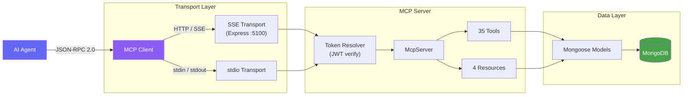

# MCP Server — WealthWise

[](https://modelcontextprotocol.io/)
[](https://www.typescriptlang.org/)
[](https://expressjs.com/)
[](https://www.mongodb.com/)
[](https://mongoosejs.com/)
[](https://vitest.dev/)
[](https://docs.docker.com/build/building/multi-stage/)
[](https://podman.io/)

A **Model Context Protocol (MCP)** server that exposes WealthWise's financial data as structured tools and resources for AI agents. It implements the [MCP specification](https://modelcontextprotocol.io/) (JSON-RPC 2.0) with SSE and stdio transports, connects directly to MongoDB using the same Mongoose schemas as the REST API, and scopes every operation to the authenticated user via JWT.

---

## Table of Contents

- [Architecture](#architecture)
- [Tools (35)](#tools-35)
- [Resources (4)](#resources-4)
- [Transports](#transports)
- [Authentication](#authentication)
- [Environment Variables](#environment-variables)
- [Development](#development)
- [Testing](#testing)
- [Docker](#docker)

---

## Architecture



The MCP server operates as a standalone process with its own MongoDB connection. It mirrors the API's Mongoose schemas exactly (same collection names, same indexes) so both the REST API and MCP server can read and write the same data. JWT tokens issued by the API are accepted by the MCP server for authentication.

---

## Tools (35)

### Accounts (6)

| Tool | Description |
|------|-------------|
| `list_accounts` | List all non-archived accounts for the user, sorted by creation date descending |
| `get_account` | Get a single account by ID, verifying ownership |
| `create_account` | Create a new financial account |
| `update_account` | Update an existing account, verifying ownership |
| `archive_account` | Soft-delete (archive) an account, verifying ownership |
| `get_balance_history` | Get monthly balance snapshots for an account from transaction aggregation |

### Transactions (6)

| Tool | Description |
|------|-------------|
| `list_transactions` | List transactions with filtering, sorting, and pagination |
| `search_transactions` | Search transactions by description using regex matching |
| `create_transaction` | Create a new transaction and adjust the account balance |
| `get_transaction` | Get a transaction by ID, verifying ownership |
| `update_transaction` | Update a transaction and adjust account balance for amount/type changes |
| `delete_transaction` | Delete a transaction and reverse its effect on the account balance |

### Budgets (4)

| Tool | Description |
|------|-------------|
| `list_budgets` | List all budgets for the user |
| `create_budget` | Create a new budget for a spending category |
| `update_budget` | Update an existing budget, verifying ownership |
| `get_budget_summary` | Get active budgets with spent amount, remaining, and status for the current period |

### Goals (5)

| Tool | Description |
|------|-------------|
| `list_goals` | List all savings goals for the user |
| `create_goal` | Create a new savings goal |
| `update_goal` | Update a savings goal, verifying ownership |
| `delete_goal` | Delete a savings goal, verifying ownership |
| `add_goal_funds` | Add funds to a savings goal, auto-completing if target is reached |

### Categories (2)

| Tool | Description |
|------|-------------|
| `list_categories` | List user categories and system default categories |
| `create_category` | Create a custom spending or income category |

### Recurring (5)

| Tool | Description |
|------|-------------|
| `list_recurring` | List all recurring rules for the user |
| `create_recurring` | Create a new recurring transaction rule |
| `get_upcoming_bills` | Get recurring payments due within the next 30 days |
| `mark_recurring_paid` | Mark a recurring rule as paid: creates a transaction and advances the due date |
| `delete_recurring` | Delete a recurring rule, verifying ownership |

### Analytics (7)

| Tool | Description |
|------|-------------|
| `spending_by_category` | Get spending breakdown by category for a date range, with percentages |
| `income_vs_expense` | Get monthly income vs expense comparison for the last N months |
| `monthly_summary` | Get total income, expenses, savings, and savings rate for a specific month |
| `get_trends` | Get monthly income, expense, and savings rate trends over N months |
| `spending_by_day_of_week` | Get average spending patterns by day of the week |
| `category_monthly_breakdown` | Get expense breakdown by top categories per month over N months |
| `get_net_worth` | Get net worth progression over time from all transaction history |

---

## Resources (4)

Resources provide read-only, pre-aggregated views of the user's financial data. AI agents can read these to get context without making multiple tool calls.

| Resource URI | Description |
|-------------|-------------|
| `wealthwise://summary` | Current month income, expenses, savings rate, and account balances |
| `wealthwise://budget-status` | Active budgets with spent and remaining amounts |
| `wealthwise://goal-progress` | All savings goals with percentage complete |
| `wealthwise://upcoming-bills` | Recurring payments due within the next 30 days |

---

## Transports

### SSE (Server-Sent Events)

For network access over HTTP. An Express server listens on a configurable port (default `5100`) and exposes:

| Endpoint | Method | Description |
|----------|--------|-------------|
| `/sse` | `GET` | Establish SSE connection. Pass JWT via `Authorization: Bearer <token>` header. |
| `/messages` | `POST` | Send JSON-RPC messages to the server over the active SSE session. |
| `/health` | `GET` | Health check. Returns `{ "status": "ok", "transport": "sse" }`. |

CORS is enabled for all origins. The server authenticates the user on SSE connection establishment and scopes all subsequent tool/resource calls to that user.

### stdio

For local process communication when the MCP server runs as a subprocess of an AI agent. Reads user identity from the `MCP_USER_ID` environment variable. No HTTP server is started.

```bash
MCP_TRANSPORT=stdio MCP_USER_ID=<userId> MONGODB_URI=<uri> JWT_SECRET=<secret> node dist/index.js
```

---

## Authentication

The MCP server uses the same JWT tokens as the WealthWise REST API.

| Transport | How the token is provided |
|-----------|--------------------------|
| **SSE** | `Authorization: Bearer <token>` header on the `GET /sse` request |
| **stdio** | `MCP_USER_ID` environment variable set before process start |

The token is verified against `JWT_SECRET` using `jsonwebtoken`. The decoded `userId` is extracted and attached to the server context, scoping every database query to that user. Invalid or expired tokens result in a `401 Unauthorized` response (SSE) or an `McpToolError` (stdio).

---

## Environment Variables

| Variable | Required | Default | Description |
|----------|----------|---------|-------------|
| `MONGODB_URI` | Yes | -- | MongoDB connection string |
| `JWT_SECRET` | Yes | -- | JWT signing secret (min 32 characters) |
| `MCP_PORT` | No | `5100` | Port for the SSE transport |
| `MCP_TRANSPORT` | No | `sse` | Transport type: `sse` or `stdio` |
| `MCP_USER_ID` | stdio only | -- | User ID for stdio transport authentication |
| `NODE_ENV` | No | `development` | `development`, `production`, or `test` |

All environment variables are validated at startup using a Zod schema. The server exits immediately with a descriptive error if required variables are missing or invalid.

---

## Development

```bash
# Start in dev mode (SSE transport, hot-reload via tsx)
npm run dev -w mcp

# Build (esbuild, outputs to mcp/dist/)
npx turbo build --filter=@wealthwise/mcp

# Type-check
npm run lint -w mcp

# Run tests
npx turbo test --filter=@wealthwise/mcp
```

The dev server uses `tsx watch` for automatic restarts on file changes. The production build uses `esbuild` targeting Node 20 with CommonJS output and sourcemaps.

---

## Testing

- **62 tests** across 8 test files using Vitest + `mongodb-memory-server`
- Tests cover all 7 tool modules and the auth/token-resolver
- Same in-memory MongoDB pattern as the REST API: a `MongoMemoryServer` instance is started before the suite, and collections are cleared between tests
- 30-second timeout per test to account for `mongodb-memory-server` startup

```bash
# Run all MCP tests
npx turbo test --filter=@wealthwise/mcp

# Run in watch mode
npm run test:watch -w mcp

# Run with coverage
npm run test:coverage -w mcp
```

### Test structure

```
src/__tests__/
├── setup.ts                          # MongoMemoryServer lifecycle
├── auth/
│   └── token-resolver.test.ts        # JWT verification (7 tests)
└── tools/
    ├── accounts.tool.test.ts         # Account CRUD (10 tests)
    ├── transactions.tool.test.ts     # Transaction CRUD + search (11 tests)
    ├── budgets.tool.test.ts          # Budget CRUD + summary (8 tests)
    ├── goals.tool.test.ts            # Goal CRUD + fund addition (9 tests)
    ├── categories.tool.test.ts       # Category listing + creation (3 tests)
    ├── recurring.tool.test.ts        # Recurring rules + mark paid (6 tests)
    └── analytics.tool.test.ts        # All analytics aggregations (8 tests)
```

---

## Docker

The MCP server ships with a multi-stage `Dockerfile`:

```dockerfile
# Build stage: compile TypeScript
FROM node:20-alpine AS builder

# Production stage: lean runtime image
FROM node:20-alpine AS production
EXPOSE 5100
CMD ["node", "dist/index.js"]
```

```bash
# Build the image (Docker)
docker build -t wealthwise-mcp ./mcp

# Build the image (Podman)
podman build -f mcp/Containerfile -t wealthwise-mcp ./mcp

# Run with SSE transport
docker run -p 5100:5100 \
  -e MONGODB_URI=mongodb://host.docker.internal:27017/wealthwise \
  -e JWT_SECRET=your-secret-here-minimum-32-chars \
  -e MCP_TRANSPORT=sse \
  -e NODE_ENV=production \
  wealthwise-mcp

# Or with Podman (use host.containers.internal instead of host.docker.internal)
podman run -p 5100:5100 \
  -e MONGODB_URI=mongodb://host.containers.internal:27017/wealthwise \
  -e JWT_SECRET=your-secret-here-minimum-32-chars \
  -e MCP_TRANSPORT=sse \
  -e NODE_ENV=production \
  wealthwise-mcp
```

The container exposes port `5100` and defaults to SSE transport in production mode.

---

## Further Reading

- [MCP Specification](https://modelcontextprotocol.io/) -- The protocol this server implements
- [`mcp/README.md`](./mcp/README.md) -- Package-level developer guide with conventions and contribution patterns
- [`ARCHITECTURE.md`](./ARCHITECTURE.md) -- Full system architecture including the REST API and web frontend
