# WealthWise - Personal Finance Manager

[](https://nodejs.org/)
[](https://www.typescriptlang.org/)
[](https://npmjs.com/)
[](https://turbo.build/)
[](https://prettier.io/)
[](https://nextjs.org/)
[](https://react.dev/)
[](https://tailwindcss.com/)
[](https://www.radix-ui.com/)
[](https://tanstack.com/query)
[](https://react-hook-form.com/)
[](https://next-auth.js.org/)
[](https://recharts.org/)
[](https://lucide.dev/)
[](https://expressjs.com/)
[](https://zod.dev/)
[](https://jwt.io/)
[](https://swagger.io/)
[](https://www.mongodb.com/)
[](https://www.mongodb.com/)
[](https://mongoosejs.com/)
[](https://vitest.dev/)
[](https://docs.docker.com/compose/)
[](https://nginx.org/)
[](https://kubernetes.io/)
[](https://helm.sh/)
[](https://kustomize.io/)
[](https://www.terraform.io/)
[](https://aws.amazon.com/)
[](https://aws.amazon.com/fargate/)
[](https://aws.amazon.com/cloudformation/)
[](https://aws.amazon.com/documentdb/)
[](https://azure.microsoft.com/)
[](https://azure.microsoft.com/products/container-apps)
[](https://learn.microsoft.com/azure/azure-resource-manager/bicep/)
[](https://azure.microsoft.com/products/cosmos-db)
[](https://cloud.google.com/)
[](https://cloud.google.com/run)
[](https://cloud.google.com/build)
[](https://www.oracle.com/cloud/)
[](https://www.oracle.com/cloud/cloud-native/container-engine-kubernetes/)

A full-stack personal finance application built with a **Turborepo monorepo**, featuring an **Express REST API**, a **Next.js 14** frontend, and **shared Zod schemas** for end-to-end type safety. Track accounts, transactions, budgets, goals, recurring bills, and analytics - all with dark mode, CSV import, and a responsive design.

---

## Table of Contents

- [High-Level Architecture](#high-level-architecture)
- [Features](#features)
- [User Interface](#user-interface)
- [Project Structure](#project-structure)
- [Getting Started](#getting-started)
  - [Prerequisites](#prerequisites)
  - [1. Clone and install](#1-clone-and-install)
  - [2. Configure environment](#2-configure-environment)
  - [3. Start MongoDB](#3-start-mongodb)
  - [4.  default data](#4--default-data)
  - [5. Start development](#5-start-development)
- [Scripts](#scripts)
- [Testing](#testing)
- [API Documentation](#api-documentation)
  - [Endpoints](#endpoints)
  - [Request Lifecycle](#request-lifecycle)
- [Database Schema](#database-schema)
- [Authentication Flow](#authentication-flow)
- [Docker Deployment](#docker-deployment)
  - [Development](#development)
  - [Production](#production)
- [Cloud Deployment & Infrastructure](#cloud-deployment--infrastructure)
  - [Hardened Production Docker](#hardened-production-docker)
  - [Kubernetes](#kubernetes)
  - [Helm Chart](#helm-chart)
  - [Terraform Modules](#terraform-modules)
  - [Cloud Providers](#cloud-providers)
  - [Production Nginx](#production-nginx)
  - [Utility Scripts](#utility-scripts)
- [Test Coverage](#test-coverage)
- [Tech Stack](#tech-stack)
- [License](#license)

---

## High-Level Architecture

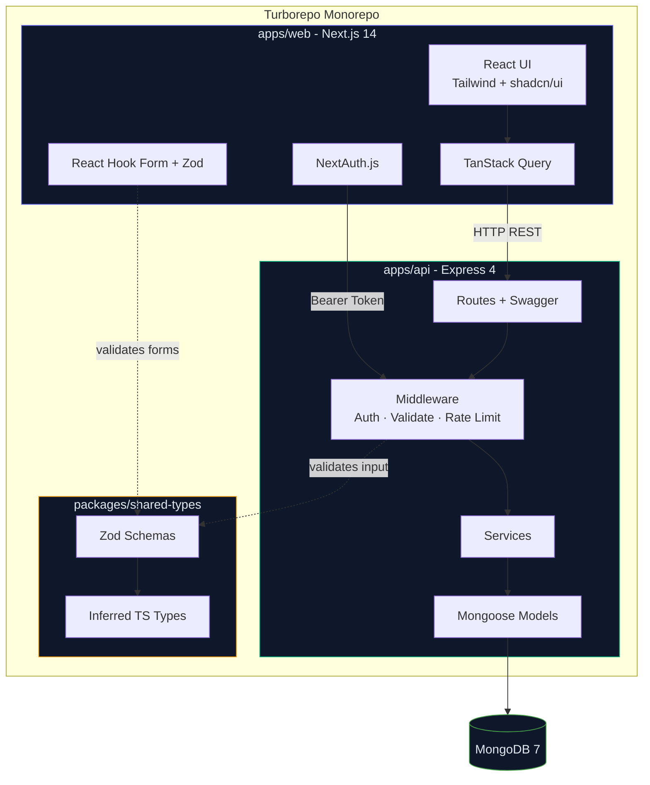

---

## Features

- **Multi-account tracking** - checking, savings, credit cards, cash, investments
- **Transaction management** - CRUD, filtering, sorting, text search, CSV import with duplicate detection
- **Budget alerts** - per-category budgets with configurable thresholds and spending progress
- **Financial goals** - target amounts, deadlines, fund contributions, completion tracking
- **Recurring rules** - daily, weekly, biweekly, monthly, yearly schedules with upcoming bills view
- **Analytics dashboard** - 8 charts: spending by category, income vs. expense, cash flow, savings rate, net worth, cumulative savings, category breakdown over time, spending by day of week
- **7 dashboard widgets** - net worth, monthly snapshot, recent transactions, budget health, spending donut, upcoming bills, goal progress
- **Dark mode** - class-based theme switching via `next-themes`
- **Responsive** - mobile sidebar, adaptive layouts, touch-friendly
- **Type-safe contracts** - Zod schemas shared between frontend and backend
- **Interactive API docs** - Swagger UI at `/api/docs`

> [!NOTE]
> The frontend is deployed on Vercel at: **[https://wealthwisefinancial.vercel.app/](https://wealthwisefinancial.vercel.app/).** You can register a new account or use the following demo credentials to explore the app:
> ```
> Email: demo@wealthwise.app
> Password: Demo1234!
> ```
> Or, create your own account to test the registration flow and see how the app works with an empty dataset.

> [!TIP]
> The backend is also fully deployed live, accessible at: [https://wealthwise-backend-api.vercel.app/](https://wealthwise-backend-api.vercel.app/). You can explore the API documentation at [https://wealthwise-backend-api.vercel.app/api/docs](https://wealthwise-backend-api.vercel.app/api/docs) and use the demo credentials above to authenticate and test the endpoints.

---

## User Interface

### 1. Landing Page

<p align="center">
    
</p>

### 2. Dashboard

<p align="center">
    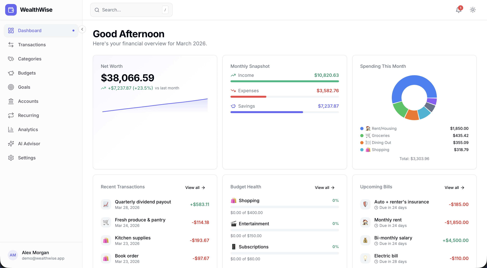
</p>

### 3. Transactions

<p align="center">
    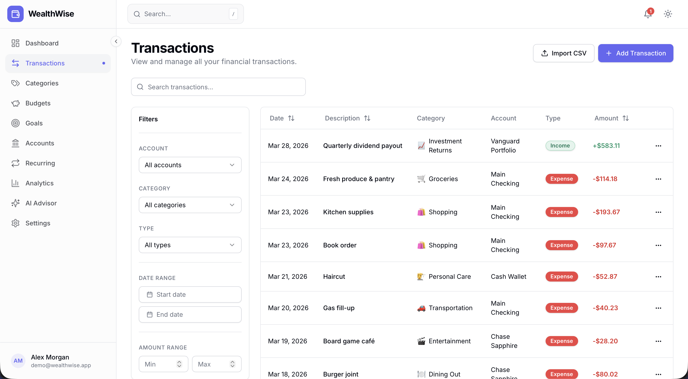
</p>

### 4. Budgets

<p align="center">
    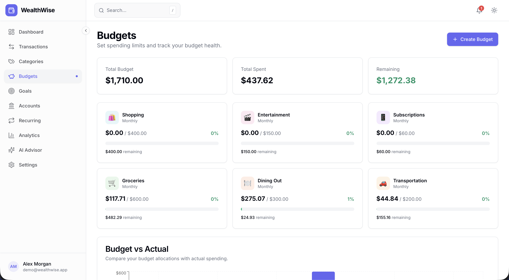
</p>

### 5. Goals

<p align="center">
    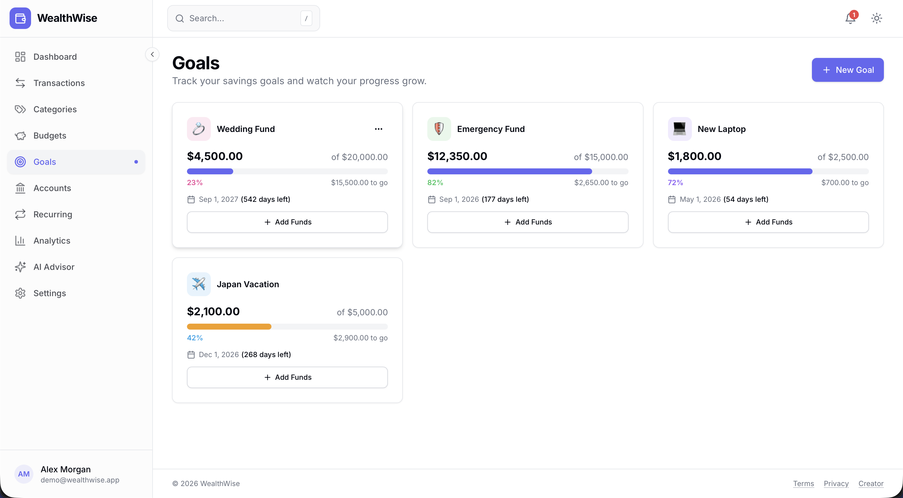
</p>

### 6. Accounts

<p align="center">
    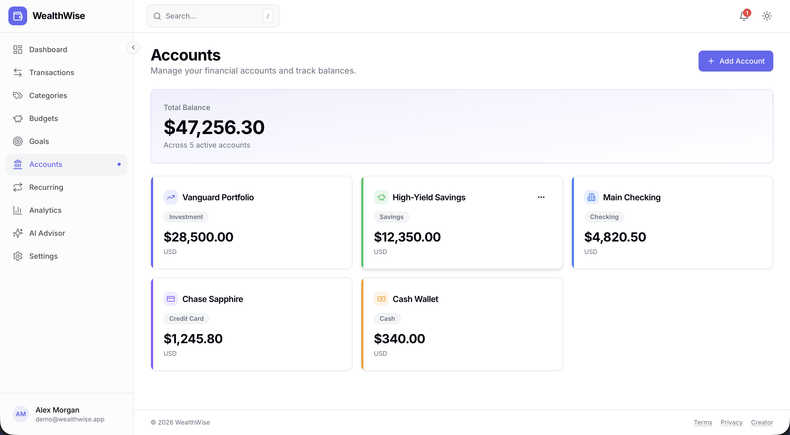
</p>

### 7. Recurring

<p align="center">
    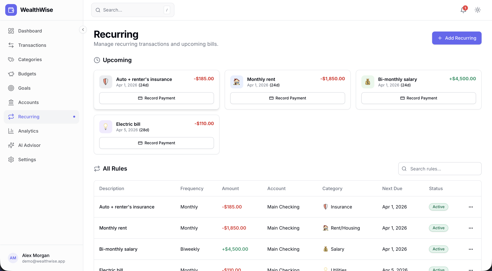
</p>

### 8. Analytics

<p align="center">
    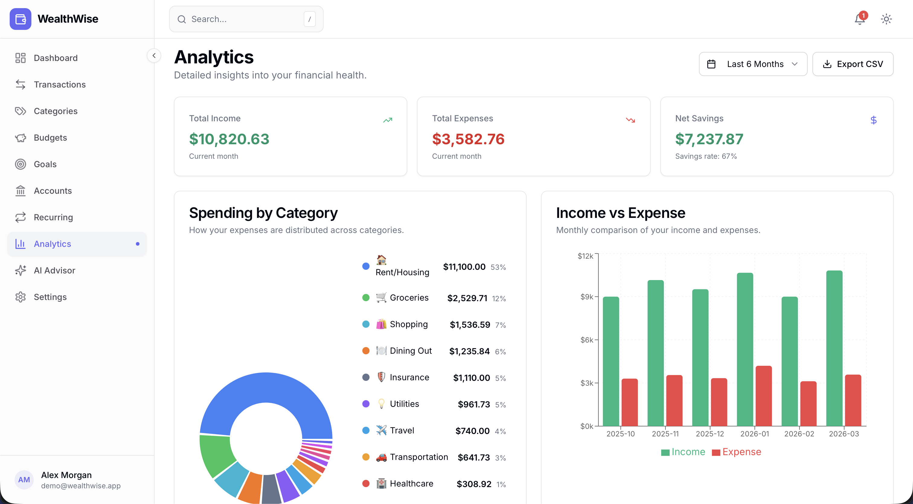
</p>

### 9. Settings

<p align="center">
    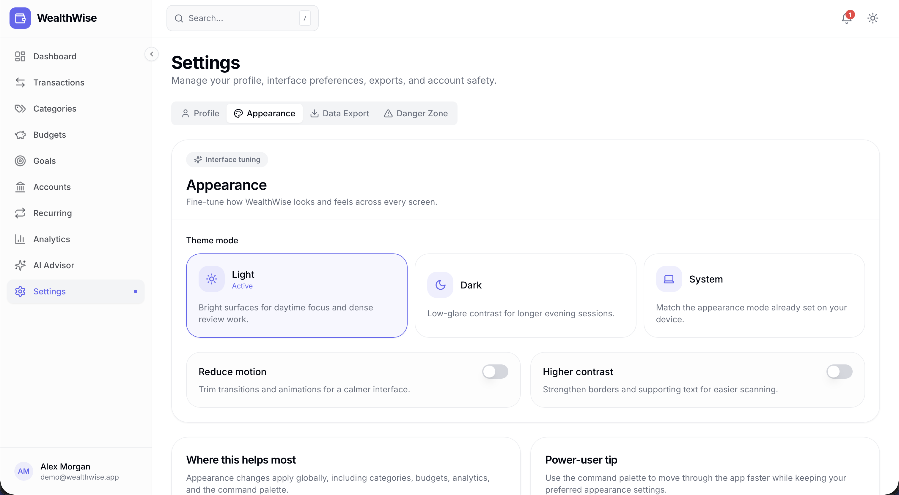
</p>

---

## Project Structure

```
wealthwise/
├── apps/
│   ├── api/                    # Express REST API
│   │   ├── src/
│   │   │   ├── config/         # Database, env validation, Swagger
│   │   │   ├── controllers/    # Route handlers
│   │   │   ├── middleware/     # Auth, CORS, validation, error handling, rate limiting
│   │   │   ├── models/         # Mongoose schemas (7 models)
│   │   │   ├── routes/         # Express routers with Swagger JSDoc
│   │   │   ├── s/          # Default categories + demo data
│   │   │   ├── services/       # Business logic layer
│   │   │   ├── utils/          # ApiError, async handler, pagination
│   │   │   └── __tests__/      # Vitest + mongodb-memory-server
│   │   └── package.json
│   │
│   └── web/                    # Next.js 14 frontend
│       ├── src/
│       │   ├── app/            # App Router pages
│       │   │   ├── (auth)/     # Login, Register
│       │   │   ├── (dashboard)/ # All authenticated pages
│       │   │   ├── (legal)/    # Terms, Privacy
│       │   │   └── api/auth/   # NextAuth route handler
│       │   ├── components/
│       │   │   ├── analytics/  # 8 chart components (Recharts)
│       │   │   ├── budgets/    # Budget cards and forms
│       │   │   ├── dashboard/  # 7 dashboard widgets
│       │   │   ├── goals/      # Goal cards and forms
│       │   │   ├── layout/     # Sidebar, topnav, mobile nav, search
│       │   │   ├── shared/     # Pickers, currency display, empty state
│       │   │   ├── transactions/ # Table, forms, CSV wizard, filters
│       │   │   └── ui/         # shadcn/ui primitives (20+ components)
│       │   ├── hooks/          # TanStack Query hooks per entity
│       │   ├── lib/            # Auth config, API client, utils, constants
│       │   ├── providers/      # Query, Auth, Theme providers
│       │   └── __tests__/      # Vitest + jsdom
│       └── package.json
│
├── packages/
│   └── shared-types/           # Zod schemas + inferred TypeScript types
│       ├── src/
│       │   ├── schemas/        # 7 schema files (user, account, transaction, etc.)
│       │   ├── types/          # Inferred TS types + API wrappers
│       │   └── __tests__/      # Schema validation tests
│       └── package.json
│
├── nginx/                      # Production reverse proxy config
├── helm/                      # Helm chart (alternative to Kustomize)
│   └── wealthwise/            # Umbrella chart with per-env values files
├── k8s/                       # Kubernetes manifests (Kustomize overlays)
│   ├── base/                  # Base resources (deployments, services, ingress, etc.)
│   └── overlays/              # dev, staging, production overrides
├── terraform/                 # Terraform modules and environments
│   ├── modules/               # Reusable modules (networking, compute, db, etc.)
│   └── environments/          # dev, staging, production compositions
├── aws/                       # AWS deployment (ECS, CloudFormation, scripts)
├── azure/                     # Azure deployment (Bicep, Container Apps, scripts)
├── gcp/                       # GCP deployment (Cloud Run, Terraform, Cloud Build)
├── oci/                       # OCI deployment (OKE, Terraform, scripts)
├── scripts/                   # Utility scripts (secrets, health check, build)
├── docker-compose.yml          # Development: MongoDB + API + Web (hot-reload)
├── docker-compose.prod.yml     # Production: multi-stage Dockerfiles + Nginx
├── docker-compose.production.yml # Production: hardened Dockerfile.prod + health checks
├── turbo.json                  # Turborepo pipeline configuration
├── .prettierrc                 # Prettier + Tailwind plugin config
└── package.json                # Root workspace config
```

---

## Getting Started

### Prerequisites

- **Node.js** >= 18.0.0
- **npm** >= 10.0.0
- **MongoDB** 7+ (local or Docker)

### 1. Clone and install

```bash
git clone https://github.com/hoangsonww/WealthWise-Finance-Tracker.git
cd WealthWise-Finance-Tracker
npm install
```

### 2. Configure environment

```bash
cp .env.example .env
```

Edit `.env` with your values:

```env
# Database
MONGODB_URI=mongodb://localhost:27017/wealthwise

# Auth - generate with: openssl rand -base64 32
JWT_SECRET=your-jwt-secret-min-32-chars
JWT_REFRESH_SECRET=your-refresh-secret-min-32-chars
NEXTAUTH_SECRET=your-nextauth-secret-min-32-chars
NEXTAUTH_URL=http://localhost:3000

# API
API_PORT=4000
API_URL=http://localhost:4000
NEXT_PUBLIC_API_URL=http://localhost:4000/api/v1

# Optional: Google OAuth
GOOGLE_CLIENT_ID=
GOOGLE_CLIENT_SECRET=
```

### 3. Start MongoDB

**Option A - Docker:**
```bash
docker compose up mongodb -d
```

**Option B - Local install:**
```bash
mongod --dbpath /data/db
```

### 4.  default data

```bash
npm run db:          # Default categories only
npm run db:seed -- demo  # Full demo dataset
```

Or, if you are running the in-memory MongoDB version, run this command **AFTER starting the backend server**: 

```bash
# On Mac/Linux:
curl -X POST http://localhost:4000/api/v1/dev/seed       # adjust the endpoint as needed

# On Windows:
curl.exe -X POST http://localhost:4000/api/v1/dev/seed   # adjust the endpoint as needed
```

> [!IMPORTANT]
> If you use the in-memory MongoDB version, all data in the DB will be lost after server restart.

### 5. Start development

```bash
npm run dev
```

This starts both apps in parallel via Turborepo:
- **Web** → http://localhost:3000
- **API** → http://localhost:4000
- **Swagger** → http://localhost:4000/api/docs

---

## Scripts

| Command | Description |
|---------|-------------|
| `npm run dev` | Start all apps in development mode |
| `npm run build` | Build all packages |
| `npm run test` | Run all test suites (330 tests) |
| `npm run lint` | Type-check all packages |
| `npm run format` | Format all files with Prettier |
| `npm run format:check` | Check formatting without writing |
| `npm run db:seed` | Seed default categories |
| `npm run clean` | Remove build artifacts and caches |

---

## Testing

The project has **330 tests** across all packages:

| Package | Tests | Framework | Environment |
|---------|-------|-----------|-------------|
| `apps/api` | 138 | Vitest + mongodb-memory-server | Node |
| `apps/web` | 41 | Vitest | jsdom |
| `packages/shared-types` | 151 | Vitest | Node |

```bash
# Run all tests
npm run test

# Run tests for a specific package
npx turbo test --filter=@wealthwise/api
npx turbo test --filter=@wealthwise/web
npx turbo test --filter=@wealthwise/shared-types
```

**API tests** use an in-memory MongoDB instance - no external database required. They cover all services, middleware, utility classes, and validation logic.

**Shared-types tests** validate every Zod schema against valid inputs, invalid inputs, edge cases, enum boundaries, and optional field behavior.

**Web tests** cover utility functions: currency formatting, date formatting, class merging, initials extraction, percentage calculations.

---

## API Documentation

Interactive Swagger UI is available at **http://localhost:4000/api/docs** when the API is running.

**Base URL:** `/api/v1`

<p align="center">
    
</p>

### Endpoints

| Group | Endpoints | Auth |
|-------|-----------|------|
| Auth | `POST /auth/register`, `/login`, `/refresh`, `GET/PATCH/DELETE /auth/me` | Public (register, login, refresh) |
| Accounts | `GET/POST /accounts`, `GET/PATCH/DELETE /accounts/:id` | Bearer |
| Transactions | `GET/POST /transactions`, `GET/PATCH/DELETE /transactions/:id`, `POST /import`, `GET /search` | Bearer |
| Categories | `GET/POST /categories`, `PATCH/DELETE /categories/:id` | Bearer |
| Budgets | `GET/POST /budgets`, `PATCH/DELETE /budgets/:id`, `GET /summary` | Bearer |
| Goals | `GET/POST /goals`, `PATCH/DELETE /goals/:id`, `POST /goals/:id/add-funds` | Bearer |
| Recurring | `GET/POST /recurring`, `PATCH/DELETE /recurring/:id`, `GET /upcoming` | Bearer |
| Analytics | `GET /spending-by-category`, `/income-vs-expense`, `/monthly-summary`, `/trends`, `/net-worth`, `/spending-by-day-of-week`, `/category-monthly-breakdown` | Bearer |

**Error response shape:**

```json
{
  "success": false,
  "error": {
    "code": "VALIDATION_ERROR",
    "message": "Invalid input",
    "details": { "email": ["Invalid email format"] }
  }
}
```

### Request Lifecycle

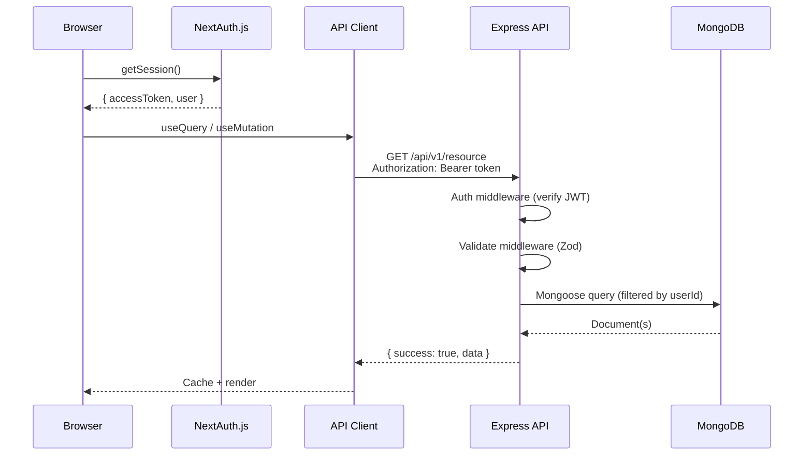

### Example CSV File for Transaction Import

We also provide a CSV import endpoint for transactions. Refer to the [test-transactions.csv](test-transactions.csv) file for the expected format. You can also use it directly on the UI import wizard to test the feature.

---

## Database Schema

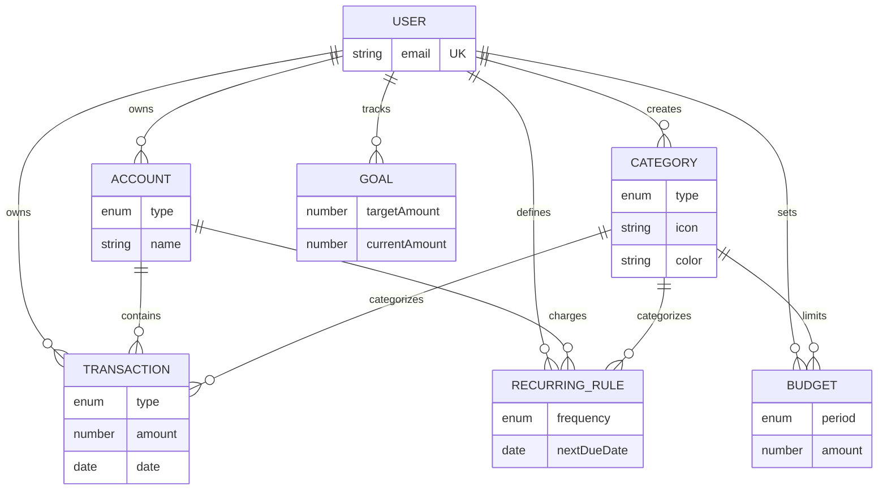

---

## Authentication Flow

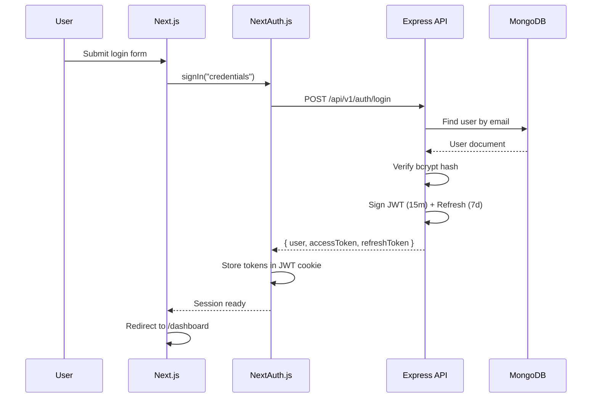

---

## Docker Deployment

### Development

```bash
docker compose up
```

Starts MongoDB, API, and Web with hot-reload and volume mounts.

### Production

Two production compose files are available:

```bash
# Standard production (multi-stage Dockerfiles, Nginx reverse proxy)
docker compose -f docker-compose.prod.yml up -d

# Hardened production (Dockerfile.prod with dumb-init, health checks, resource limits)
docker compose -f docker-compose.production.yml up -d
```

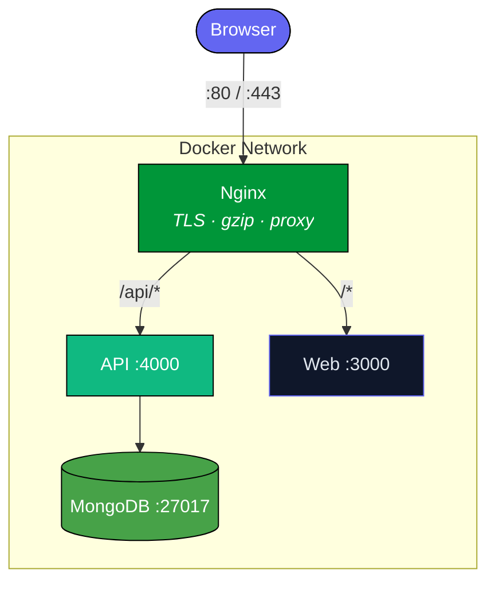

---

## Cloud Deployment & Infrastructure

WealthWise includes production-grade infrastructure-as-code for four major cloud providers, plus cloud-agnostic Kubernetes manifests and Terraform modules.

### Hardened Production Docker

Production Dockerfiles (`Dockerfile.prod`) include:
- **dumb-init** as PID 1 for proper signal handling
- Non-root user (`nonroot`) for security
- `HEALTHCHECK` directives for container orchestrators
- Multi-stage builds with `--omit=dev` for minimal images
- `STOPSIGNAL SIGTERM` for graceful shutdown

```bash
# Build production images
./scripts/docker-build.sh

# Run production stack
docker compose -f docker-compose.production.yml up -d
```

### Kubernetes

Cloud-agnostic manifests using Kustomize overlays:

```bash
# Development (1 replica, lower resources)
kubectl kustomize k8s/overlays/dev | kubectl apply -f -

# Staging (2 replicas)
kubectl kustomize k8s/overlays/staging | kubectl apply -f -

# Production (3 replicas, higher limits)
kubectl kustomize k8s/overlays/production | kubectl apply -f -
```

Includes: Deployments, Services, Ingress, HPA (autoscaling), PDB (disruption budgets), NetworkPolicies (default-deny + allow rules).

### Helm Chart

An alternative to Kustomize for teams that standardize on Helm:

```bash
# Dev (single replica, relaxed policies)
helm install wealthwise ./helm/wealthwise \
  -f ./helm/wealthwise/values-dev.yaml \
  --set secrets.jwtSecret=changeme \
  --set secrets.jwtRefreshSecret=changeme \
  --set secrets.nextauthSecret=changeme \
  --set secrets.mongodbUri=mongodb://localhost:27017/wealthwise

# Production (3 replicas, full security)
helm install wealthwise ./helm/wealthwise \
  -f ./helm/wealthwise/values-production.yaml \
  --set existingSecret=my-sealed-secret
```

Single umbrella chart with inline templates for both API and web workloads. Supports `existingSecret` for Sealed Secrets / External Secrets Operator, conditional HPA/PDB/NetworkPolicies, and per-environment values files (dev, staging, production). See `helm/wealthwise/README.md` for full values reference.

### Terraform Modules

Reusable modules in `terraform/modules/`:

| Module | Resources |
|--------|-----------|
| `networking` | VPC, subnets, NAT gateway, route tables |
| `compute` | ECS Fargate cluster, task definitions, autoscaling |
| `database` | DocumentDB cluster, security groups, encryption |
| `monitoring` | CloudWatch dashboards, alarms, SNS notifications |
| `dns` | Route53 hosted zone, ACM certificate, DNS records |
| `container-registry` | ECR repositories, lifecycle policies, scanning |

Environments: `terraform/environments/{dev,staging,production}/`

### Cloud Providers

| Provider | Directory | Architecture |
|----------|-----------|-------------|
| **AWS** | `aws/` | ALB → ECS Fargate → DocumentDB |
| **Azure** | `azure/` | Front Door → Container Apps → Cosmos DB |
| **GCP** | `gcp/` | Cloud LB → Cloud Run → MongoDB Atlas |
| **OCI** | `oci/` | OCI LB → OKE (Kubernetes) → MongoDB Atlas |

Each provider directory includes IaC templates, deployment scripts, and secret management setup. See the README in each directory for provider-specific instructions.

### Production Nginx

`nginx/nginx.prod.conf` provides:
- TLS 1.2/1.3 with modern cipher suites
- Security headers (HSTS, CSP, X-Frame-Options, X-Content-Type-Options)
- Rate limiting (10 req/s API, 5 req/s auth endpoints)
- Static asset caching (`/_next/static/` with immutable Cache-Control)
- HTTP → HTTPS redirect

### Utility Scripts

| Script | Purpose |
|--------|---------|
| `scripts/generate-secrets.sh` | Generate cryptographic secrets for all env vars |
| `scripts/health-check.sh` | Validate API health endpoint response |
| `scripts/docker-build.sh` | Build production images tagged with git SHA |

---

## Test Coverage

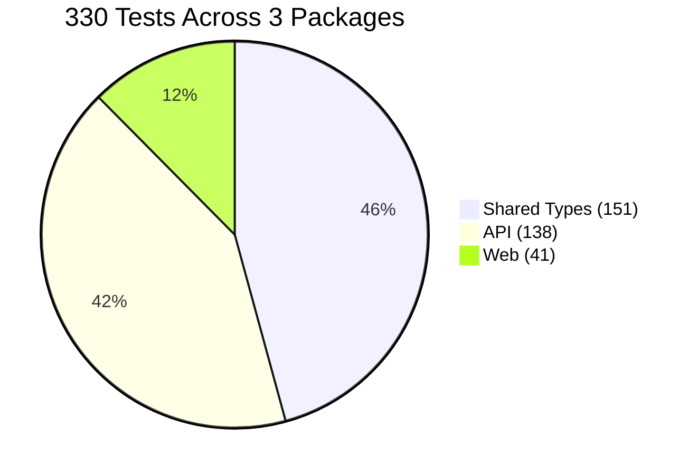

---

## Tech Stack

| Layer              | Technology                                          |
| ------------------ | --------------------------------------------------- |
| **Monorepo**       | Turborepo, npm workspaces                           |
| **Frontend**       | Next.js 14 (App Router), React 18, Tailwind CSS 3.4 |
| **UI Components**  | shadcn/ui (Radix UI primitives), Lucide icons       |
| **Charts**         | Recharts                                            |
| **Client State**   | TanStack Query 5, React Hook Form, Zod              |
| **Auth (Client)**  | NextAuth.js 4 (JWT strategy, CredentialsProvider)   |
| **Backend**        | Express 4, TypeScript                               |
| **Auth (Server)**  | JWT (access + refresh tokens), bcryptjs              |
| **Database**       | MongoDB 7, Mongoose 8                               |
| **Validation**     | Zod (shared between frontend and backend)            |
| **API Docs**       | Swagger UI + swagger-jsdoc (OpenAPI 3)              |
| **Testing**        | Vitest, mongodb-memory-server, Testing Library       |
| **Formatting**     | Prettier + prettier-plugin-tailwindcss               |
| **Deployment**     | Docker Compose, Nginx reverse proxy                  |

---

## License

This project is licensed under [MIT License](LICENSE).
