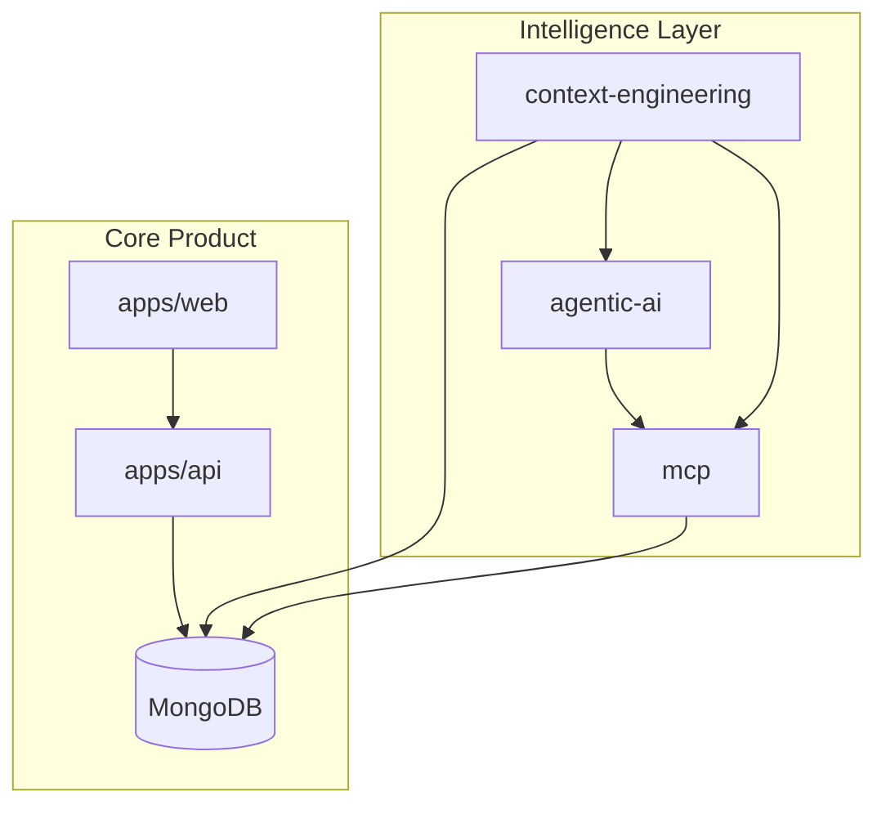
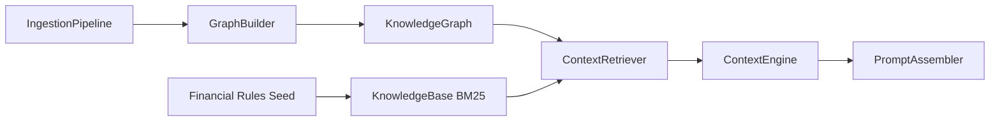
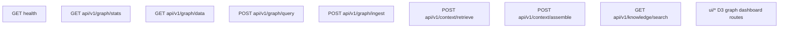
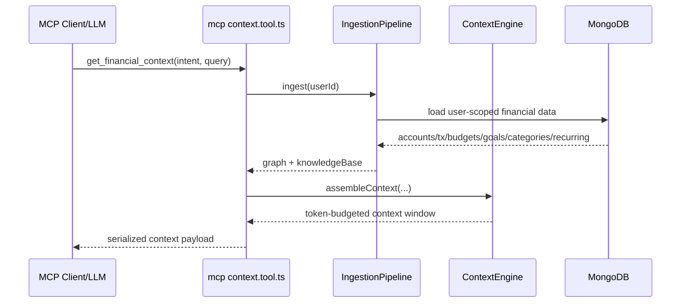
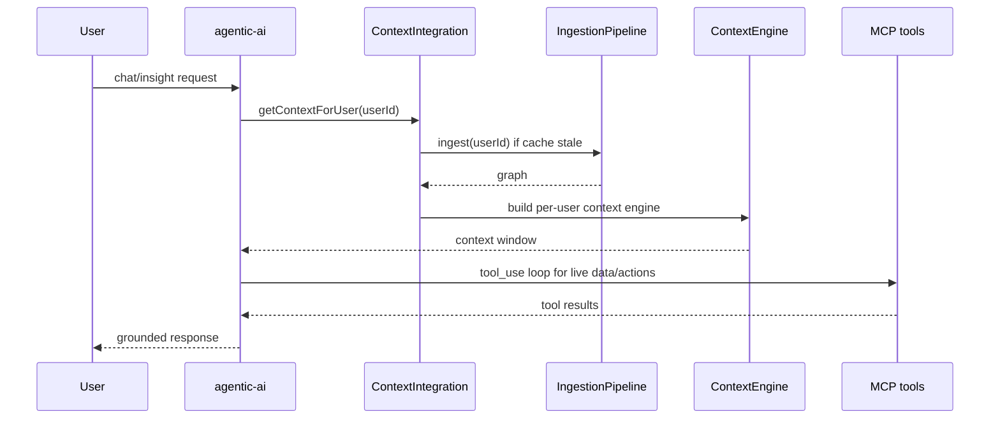
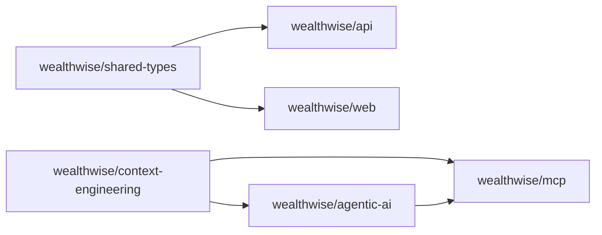

# WealthWise Technical Docs (Latest)

This technical reference captures the latest platform-level updates, with emphasis on the `context-engineering` layer and how it integrates with `mcp` and `agentic-ai`.

---

## 1) Cross-service context architecture

Key point: `context-engineering` is both a standalone service (`:5300`) and a reusable package consumed by MCP context tools/resources and agentic-ai context integration.

---

## 2) Context-engineering internals

Implementation highlights:

- Graph layer supports BFS/DFS/weighted traversal, shortest path, k-hop neighborhoods, relevance expansion, clustering, and graph stats.
- Knowledge base uses BM25 scoring, inverted/category/tag indexes, and query filtering.
- Context engine merges `system`, `user`, `graph`, `knowledge`, and `conversation` components and fits them within token budgets by priority.

---

## 3) Context API and UI route map

The `/ui` surface includes additional graph exploration endpoints (`/data`, `/stats`, `/query`, `/node/:id`, `/path/:start/:end`, `/clusters`) and knowledge search endpoints.

---

## 4) MCP + context-engineering integration

Context toolset currently includes graph build/query/path/related-entities APIs, financial knowledge search, graph stats, and clustering.

---

## 5) Agentic AI + context-engineering integration

`ContextIntegration` maintains per-user cache entries (`graph`, `engine`, `lastRefresh`) with configurable refresh intervals.

---

## 6) Latest package/runtime snapshot

Current command references:

- `npx turbo test --filter=@wealthwise/context-engineering`
- `npm run seed --workspace=context-engineering`
- `npx turbo build --filter=@wealthwise/context-engineering`

---

## 7) Documentation map

- Product overview and setup: `README.md`
- End-to-end architecture: `ARCHITECTURE.md`
- Context engineering package details: `context-engineering/README.md`
- MCP protocol implementation details: `MCP.md`
- Agentic AI details: `AGENTIC_AI.md`
- DevOps and runtime operations: `DEVOPS.md`

