# WealthWise Technical Documentation

This document is the implementation-focused reference for WealthWise, designed for engineers working across API, web, MCP, agentic AI, and context engineering layers.

It complements:

- `README.md` (product/quick start)
- `ARCHITECTURE.md` (system architecture overview)
- `DEVOPS.md` (deployment/operations)
- `MCP.md` and `AGENTIC_AI.md` (service-specific deep dives)
- `context-engineering/README.md` (package-focused details)

---

## Table of Contents

- [1. System topology](#1-system-topology)
- [2. Monorepo package graph](#2-monorepo-package-graph)
- [3. Runtime service map](#3-runtime-service-map)
- [4. Context engineering architecture](#4-context-engineering-architecture)
- [5. Knowledge graph model and semantics](#5-knowledge-graph-model-and-semantics)
- [6. Ingestion lifecycle](#6-ingestion-lifecycle)
- [7. Context retrieval and token budgeting](#7-context-retrieval-and-token-budgeting)
- [8. Context service API contract](#8-context-service-api-contract)
- [9. MCP integration contracts](#9-mcp-integration-contracts)
- [10. Agentic AI integration contracts](#10-agentic-ai-integration-contracts)
- [11. Performance and scaling considerations](#11-performance-and-scaling-considerations)
- [12. Security and isolation model](#12-security-and-isolation-model)
- [13. Observability and diagnostics](#13-observability-and-diagnostics)
- [14. Testing matrix](#14-testing-matrix)
- [15. Command reference](#15-command-reference)
- [16. Agentic Coding Flywheel infrastructure](#16-agentic-coding-flywheel-infrastructure)

---

## 1. System topology

```mermaid
graph TB
    subgraph UX["Product UX"]
        WEB[apps/web]
    end

    subgraph APIPlane["Application APIs"]
        API[apps/api]
        MCP[mcp]
        CEAPI[context-engineering service]
        AGENT[agentic-ai]
    end

    subgraph Intelligence["Context + Agent Intelligence"]
        CE[@wealthwise/context-engineering package]
        CLAUDE[Anthropic Claude]
        GEMINI[Gemini]
    end

    DB[(MongoDB)]

    WEB --> API
    WEB --> AGENT
    API --> DB
    MCP --> DB
    CEAPI --> DB
    CE --> DB
    CE --> MCP
    CE --> AGENT
    AGENT --> MCP
    AGENT --> CLAUDE
    API --> GEMINI
```

---

## 2. Monorepo package graph

```mermaid
graph LR
    ST[@wealthwise/shared-types]
    API[@wealthwise/api]
    WEB[@wealthwise/web]
    MCP[@wealthwise/mcp]
    AI[@wealthwise/agentic-ai]
    CE[@wealthwise/context-engineering]

    ST --> API
    ST --> WEB
    CE --> MCP
    CE --> AI
    AI --> MCP
```

**Key dependencies**

- `@wealthwise/shared-types` is the contract layer for API and web.
- `@wealthwise/context-engineering` is consumed by MCP and agentic-ai.
- agentic-ai depends on MCP at runtime for tool execution.

---

## 3. Runtime service map

| Service | Default port | Primary responsibility | Data dependency |
| --- | --- | --- | --- |
| `apps/web` | `3000` | UI, auth session, query/mutation UX | Calls API/agentic endpoints |
| `apps/api` | `4000` | Core REST business API + in-app advisor | MongoDB |
| `mcp` | `5100` | MCP tools/resources for LLM tool-use | MongoDB + context-engineering package |
| `agentic-ai` | `5200` | Orchestrator + specialist agent chat/insights | MCP + context-engineering package |
| `context-engineering` | `5300` | Graph/knowledge/context retrieval service + D3 UI | MongoDB |

---

## 4. Context engineering architecture

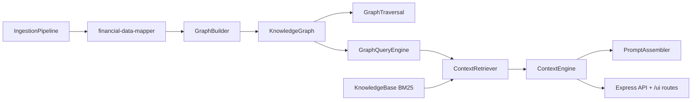

### Major classes and purpose

| Class | Purpose |
| --- | --- |
| `KnowledgeGraph` | In-memory typed graph store + query/traversal helpers + stats |
| `GraphBuilder` | Transforms finance entities into graph nodes/edges and derived insights |
| `GraphTraversal` | BFS/DFS/weighted traversal, shortest path, k-hop, clusters, relevance expansion |
| `GraphQueryEngine` | Structured and fluent query patterns + financial-context helper queries |
| `KnowledgeBase` | Financial knowledge corpus with BM25 ranking |
| `ContextRetriever` | Combines graph query and knowledge search into model-ready context |
| `ContextEngine` | Builds token-budgeted context windows by component priority |
| `PromptAssembler` | Converts context windows into consistent prompt structures |
| `IngestionPipeline` | Loads user financial records from MongoDB, runs graph build, loads KB |

---

## 5. Knowledge graph model and semantics

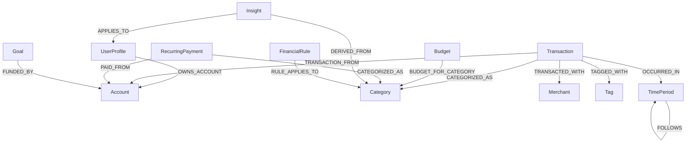

**Node metadata guarantees**

- Every node tracks `source`, `userId`, `version`, timestamps, and access counters.
- Every edge tracks `type`, `weight`, optional labels/context, and user metadata.

---

## 6. Ingestion lifecycle

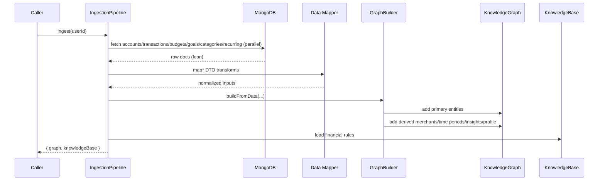

### Ingestion behavior notes

- Transactions ingestion currently caps at latest `500` records per run.
- Categories include user-specific and system-default categories.
- Graph build includes derived insight generation (budget warnings, spending pattern, goal risk hints).

---

## 7. Context retrieval and token budgeting

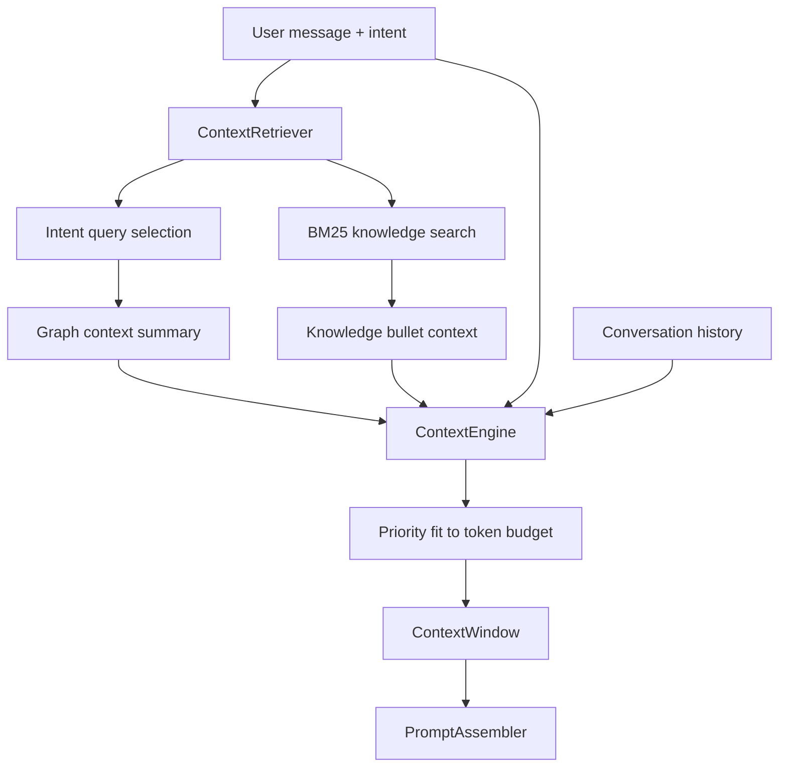

### Context window composition

| Component | Source | Priority intent |
| --- | --- | --- |
| `system` | Agent-type system prompt | highest |
| `user` | user message + optional extra context | high |
| `graph` | retrieved graph summary | high |
| `conversation` | prior turns | medium |
| `knowledge` | matched financial rules | medium |

Default max budget is `8000` tokens with per-component budgets defined in `ContextEngine`.

---

## 8. Context service API contract

### Core endpoints

| Method | Endpoint | Purpose |
| --- | --- | --- |
| `GET` | `/health` | health + active in-memory user contexts |
| `GET` | `/api/v1/graph/stats` | graph statistics |
| `GET` | `/api/v1/graph/data` | full nodes/edges snapshot |
| `GET` | `/api/v1/graph/nodes/:type` | type-filtered nodes |
| `POST` | `/api/v1/graph/query` | structured graph query |
| `POST` | `/api/v1/graph/ingest` | graph build from payload datasets |
| `DELETE` | `/api/v1/graph` | clear user graph |
| `POST` | `/api/v1/context/retrieve` | graph+knowledge retrieval output |
| `POST` | `/api/v1/context/assemble` | full `ContextWindow` assembly |
| `GET` | `/api/v1/knowledge/search` | BM25 rule search |
| `GET` | `/api/v1/knowledge/stats` | KB stats |

### UI endpoints (`/ui`)

Graph visualization and diagnostics:

- `/ui/` (dashboard)
- `/ui/data`
- `/ui/stats`
- `/ui/query`
- `/ui/node/:id`
- `/ui/node/:id/neighbors`
- `/ui/path/:startId/:endId`
- `/ui/clusters`
- `/ui/knowledge`, `/ui/knowledge/stats`, `/ui/knowledge/:id`

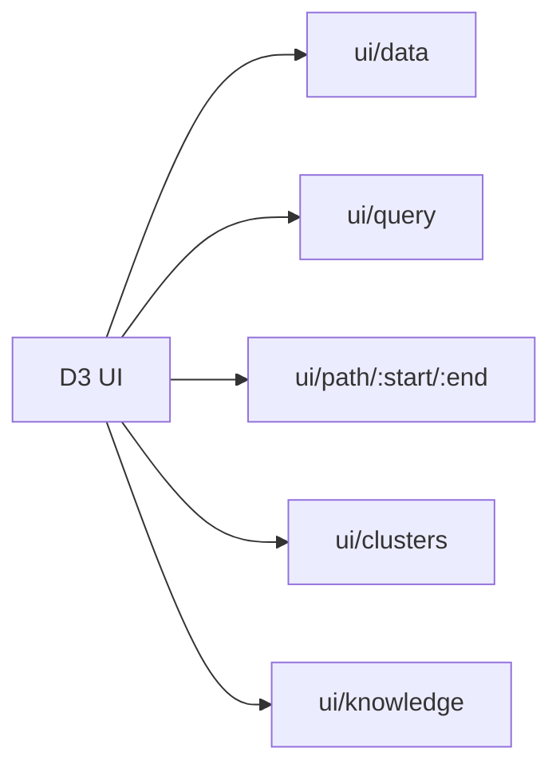

---

## 9. MCP integration contracts

`mcp/src/tools/context.tool.ts` introduces context-aware MCP tools, backed by `@wealthwise/context-engineering`.

### MCP context capabilities

- Build/refresh graph cache
- Query graph by filters or relationships
- Find shortest entity paths
- Search financial knowledge corpus
- Retrieve token-budgeted AI context windows
- Compute graph statistics and clusters

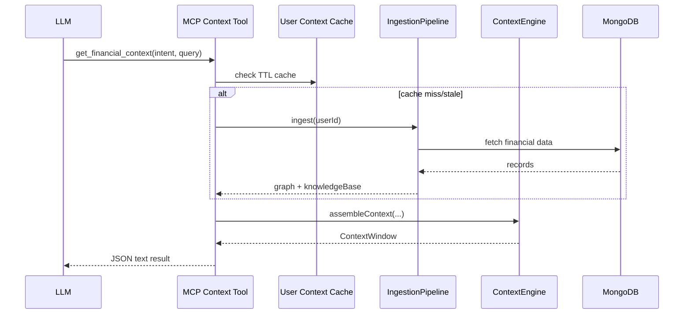

---

## 10. Agentic AI integration contracts

`agentic-ai/src/context/context-integration.ts` uses context-engineering to maintain per-user context engines.

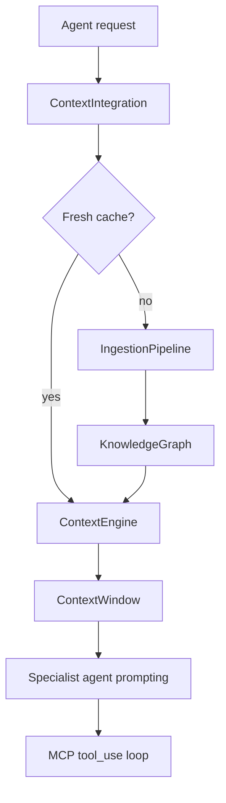

### Contract summary

- Context cache key: `userId`
- Cache payload: `{ graph, engine, lastRefresh }`
- Refresh policy: configurable TTL (`refreshIntervalMs`, default 5 minutes)
- Invalidation hook: explicit `invalidateUser(userId)`

---

## 11. Performance and scaling considerations

### Hot paths

- Ingestion (`fetch*` + graph build)
- Graph query + traversal operations
- BM25 scoring over KB candidates
- Context assembly with token fitting

### Current optimization levers

- User-level context caching in MCP and agentic-ai integrations
- Bounded transaction fetch during ingestion (`limit(500)`)
- Intent-guided graph retrieval (avoids full-graph scans on common prompts)
- Priority-based component trimming to stay within model budgets

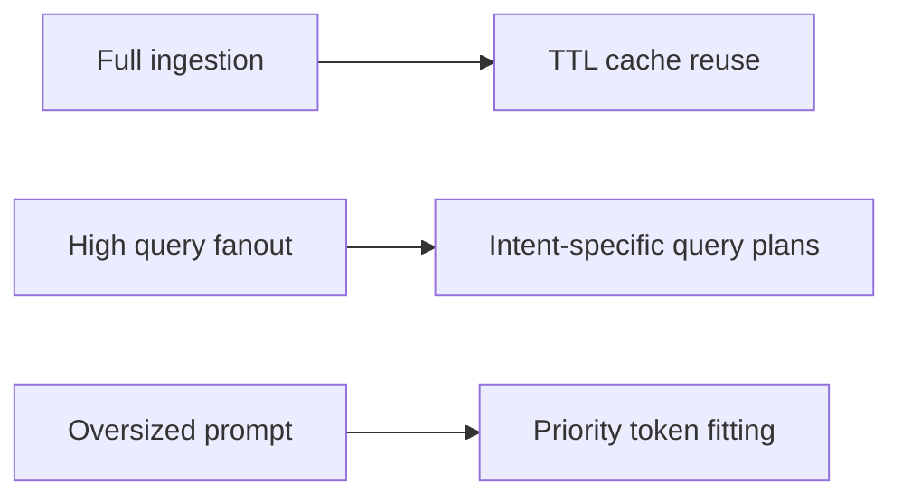

---

## 12. Security and isolation model

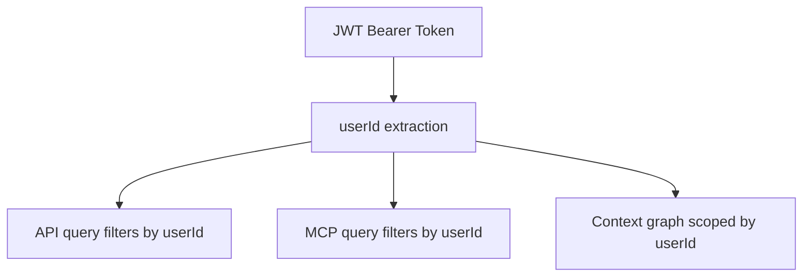

### Principles

- User-level data isolation is mandatory across API, MCP, and context-engineering.
- JWT validation gates identity for context-aware operations.
- Context caches are keyed per user and not shared across identities.
- Error payloads use structured `{ success:false, error:{ code, message } }` style at service boundaries.

---

## 13. Observability and diagnostics

Current diagnostics surfaces:

- `/health` endpoints on services
- Graph stats endpoints (`/api/v1/graph/stats`, `/ui/stats`, MCP graph stats tool)
- Knowledge-base stats endpoints (`/api/v1/knowledge/stats`, `/ui/knowledge/stats`)
- Structured logging via `pino` loggers in service packages

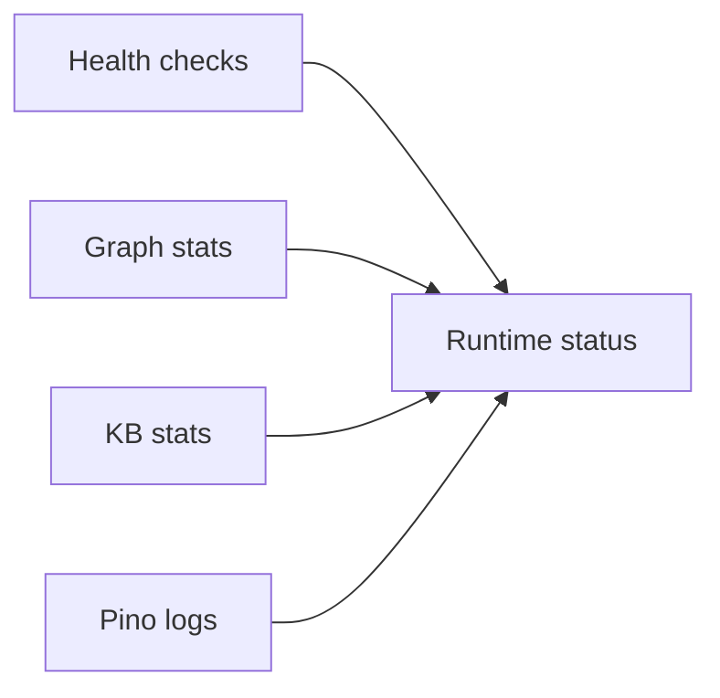

---

## 14. Testing matrix

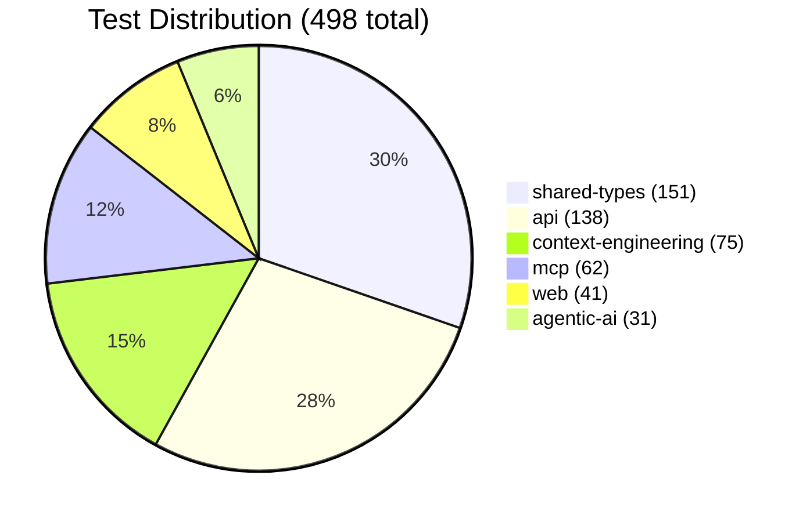

| Package | Focus |
| --- | --- |
| `@wealthwise/context-engineering` | graph correctness, traversal behavior, BM25 retrieval quality, context assembly/token fitting |
| `@wealthwise/mcp` | tool/resource behavior, auth scoping, Mongo-backed operations |
| `@wealthwise/agentic-ai` | orchestration, route behavior, MCP client usage, prompt/tool loop scaffolding |

---

## 15. Command reference

### Context engineering

```bash
npm run dev --workspace=context-engineering
npm run build --workspace=context-engineering
npm run test --workspace=context-engineering
npx turbo test --filter=@wealthwise/context-engineering
npm run seed --workspace=context-engineering
```

### Cross-package validation

```bash
npm run lint
npm run test
npm run build
```

### Service URLs (local defaults)

- Web: `http://localhost:3000`
- API: `http://localhost:4000`
- MCP: `http://localhost:5100`
- Agentic AI: `http://localhost:5200`
- Context Engineering API: `http://localhost:5300`
- Context Engineering UI: `http://localhost:5300/ui`

---

## 16. Agentic Coding Flywheel infrastructure

WealthWise uses the [Agentic Coding Flywheel](https://agent-flywheel.com/) for multi-agent development coordination. This section covers the technical infrastructure that enables concurrent AI agent workflows.

### Storage format

All Flywheel data uses **JSONL** (JSON Lines) for git-friendly diffs and append-only writes:

| File | Format | Records | Purpose |
|------|--------|---------|---------|
| `.beads/issues.jsonl` | JSONL | 131 | Bead definitions (title, body, priority, type, labels, status) |
| `.beads/deps.jsonl` | JSONL | 152 | Dependency edges (`from_id` blocks `to_id`) |
| `.beads/comments.jsonl` | JSONL | 23 | Threaded comments on beads |
| `.beads/labels.jsonl` | JSONL | 12 | Label definitions (name, color, description) |
| `.beads/config.json` | JSON | 1 | Repository-level bead configuration |
| `.agent-sessions/mail/messages.jsonl` | JSONL | 10 | Inter-agent messages |
| `.agent-sessions/mail/threads.jsonl` | JSONL | 4 | Bead-anchored conversation threads |
| `.agent-sessions/mail/reservations.jsonl` | JSONL | 3 | Advisory file reservations |
| `.agent-sessions/sessions/*.jsonl` | JSONL | 33 events | Per-agent session event logs |
| `.agent-sessions/registry.json` | JSON | 4 agents | Agent registry with capabilities |
| `.agent-sessions/metrics/summary.json` | JSON | 1 | Aggregated coordination metrics |

### Bead schema

Each bead in `issues.jsonl` follows this structure:

```jsonc
{
  "id": "br-021",
  "title": "Analytics endpoint implementation",
  "body": "Context: ...\nWhat to Do: ...\nAcceptance Criteria: ...\nFiles to Modify: ...",
  "status": "open",           // open | in_progress | closed
  "priority": 1,              // 0=critical, 1=high, 2=medium, 3=low, 4=backlog
  "type": "task",             // task | bug | feature | epic | question | docs
  "labels": ["backend"],
  "created": "2026-03-28T14:30:00Z",
  "closed_reason": null
}
```

### Dependency schema

Each edge in `deps.jsonl`:

```jsonc
{
  "from_id": "br-011",        // This bead blocks...
  "to_id": "br-021",          // ...this bead
  "reason": "Analytics endpoints need pagination schemas"
}
```

### Agent registry schema

Each agent in `registry.json`:

```jsonc
{
  "name": "ScarletCave",
  "model": "claude-opus-4-6",
  "status": "active",          // active | idle | offline
  "session_id": "session-001",
  "capabilities": ["backend", "frontend", "schema", "mcp", "ai", "context", "infra", "testing"],
  "beads_completed": 0,
  "current_bead": null
}
```

### File reservation schema

Each reservation in `reservations.jsonl`:

```jsonc
{
  "reservation_id": "res-001",
  "agent_name": "ScarletCave",
  "paths": ["packages/shared-types/src/schemas/pagination.schema.ts"],
  "ttl_seconds": 3600,
  "exclusive": true,
  "reason": "br-011: pagination schemas",
  "status": "active",          // active | released
  "created": "2026-03-28T14:31:35Z"
}
```

### Coordination topology

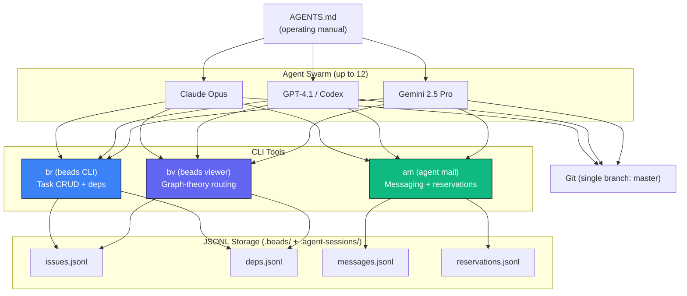

### Bead CLI commands

```bash
br create --title "..." --priority 2 --label backend    # Create bead
br list --status open --json                             # List by status
br ready --json                                          # Unblocked beads only
br show br-021                                           # View details
br update br-021 --status in_progress                    # Claim
br close br-021 --reason "..."                           # Complete
br dep add br-021 br-011                                 # Add dependency
br comments add br-021 "..."                             # Add comment
br sync --flush-only                                     # Export to JSONL
```

### Beads Viewer commands

```bash
bv --robot-triage         # Full recommendations with graph metrics
bv --robot-next           # Single top pick + claim command
bv --robot-plan           # Parallel execution tracks
bv --robot-insights       # PageRank, betweenness, HITS scores
bv --robot-priority       # Priority recommendations with confidence
```

### Metrics tracked

| Category | Metrics |
|----------|---------|
| **Agents** | total registered, active, idle |
| **Beads** | total, open, in_progress, closed, completion rate |
| **Sessions** | total, active, total events |
| **Coordination** | messages, threads, reservations, conflicts detected |
| **Git** | commits, files modified, lines added/removed |
| **Quality** | self-reviews, cross-reviews, bugs found/fixed |

### Integration with existing packages

The Flywheel infrastructure is orthogonal to the 6 WealthWise packages. Beads reference package code via labels and file paths, but no package has a build dependency on the Flywheel. The `.beads/` and `.agent-sessions/` directories are excluded from production builds and Docker images via `.dockerignore` and `.gitignore` rules for ephemeral session data.

