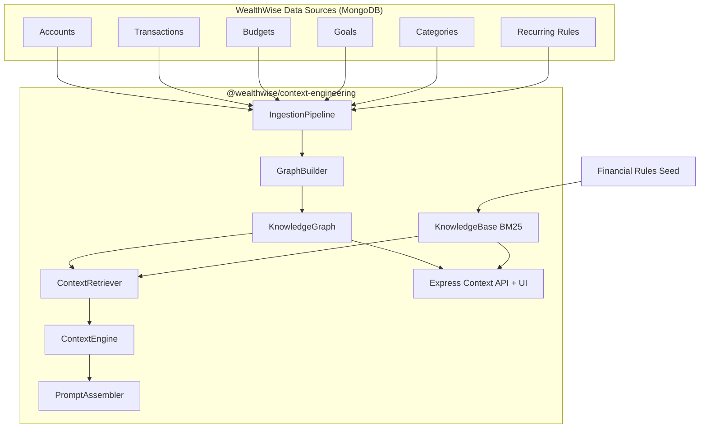
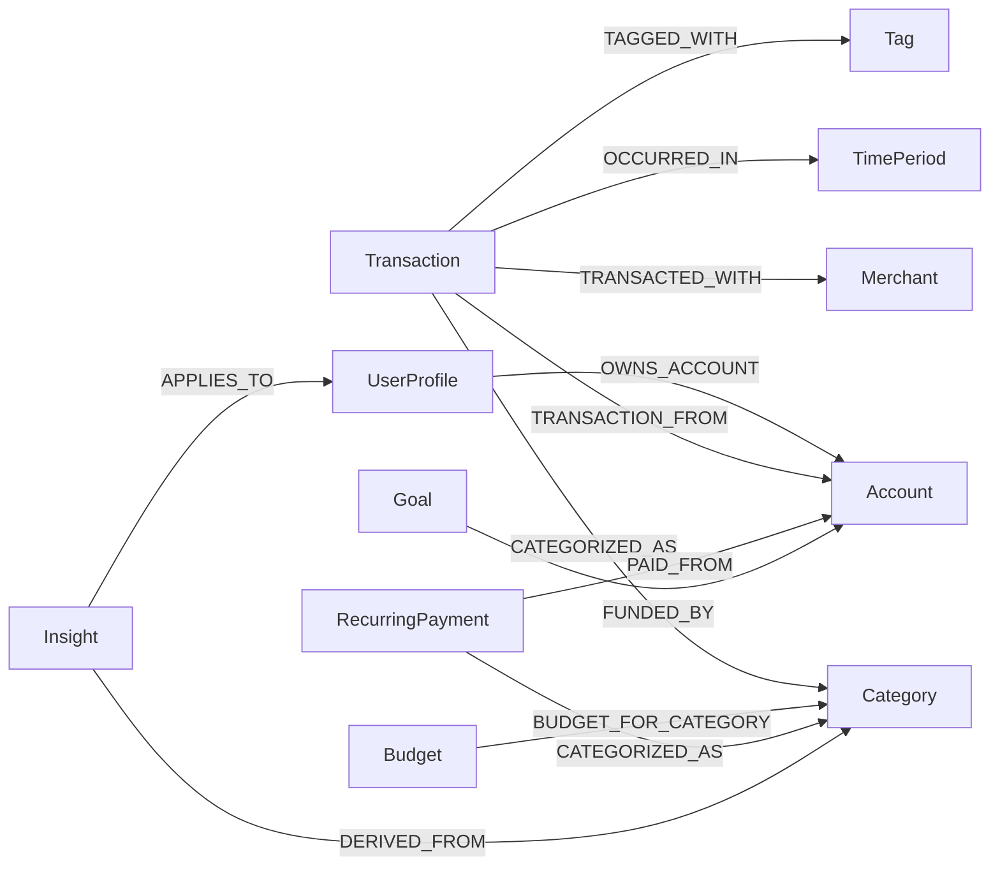
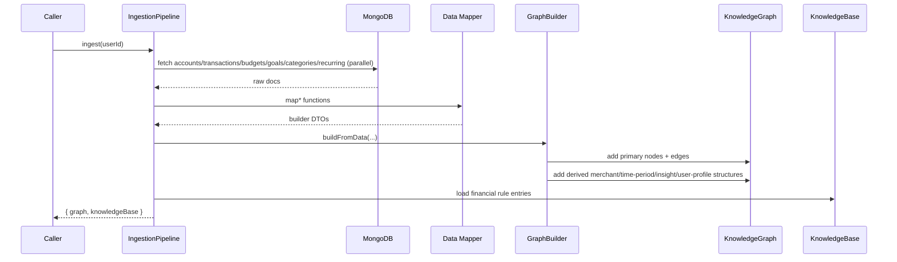
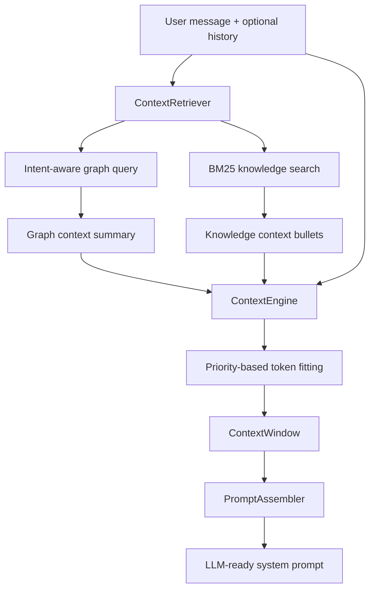

# Context Engineering - WealthWise

[](https://www.typescriptlang.org/)
[](https://expressjs.com/)
[](https://www.mongodb.com/)
[](https://mongoosejs.com/)
[](https://vitest.dev/)

`@wealthwise/context-engineering` is a dedicated context intelligence package for WealthWise.  
It builds a typed financial knowledge graph, indexes financial rules in a BM25-backed knowledge base, and assembles token-budgeted context windows for AI agents.

---

## Table of Contents

- [What this package does](#what-this-package-does)
- [High-level architecture](#high-level-architecture)
- [Core modules](#core-modules)
- [Knowledge graph model](#knowledge-graph-model)
- [Ingestion and graph build flow](#ingestion-and-graph-build-flow)
- [Context assembly flow](#context-assembly-flow)
- [HTTP API (context service)](#http-api-context-service)
- [Visualization UI routes](#visualization-ui-routes)
- [Package exports](#package-exports)
- [Scripts](#scripts)
- [Environment variables](#environment-variables)
- [Testing](#testing)
- [How other services use this package](#how-other-services-use-this-package)

---

## What this package does

- Builds graph nodes for accounts, transactions, budgets, goals, categories, recurring payments, merchants, time periods, tags, insights, and user profile.
- Builds typed graph edges (ownership, categorization, budget relationships, temporal edges, insight derivations, etc.).
- Maintains a financial knowledge base with BM25 search (inverted index + category/tag indexes).
- Retrieves intent-aware context (`budget`, `anomaly`, `goal`, `account`, etc.).
- Assembles agent-ready context windows under token budgets.
- Exposes an Express service with retrieval/query endpoints and a D3-based visualization UI.

---

## High-level architecture



---

## Core modules

| Module | Purpose | Key files |
| --- | --- | --- |
| Graph core | In-memory typed graph, traversal, query engine, statistics | `src/graph/knowledge-graph.ts`, `src/graph/traversal.ts`, `src/graph/query.ts`, `src/graph/types.ts` |
| Graph builder | Converts finance entities into nodes/edges + derived insights | `src/graph/builder.ts` |
| Knowledge base | Financial rules storage + BM25 retrieval | `src/knowledge-base/knowledge-base.ts`, `src/knowledge-base/retriever.ts`, `src/knowledge-base/financial-rules.ts` |
| Context engine | Composes system/user/graph/knowledge/conversation components into token-limited windows | `src/context/context-engine.ts`, `src/context/prompt-assembler.ts` |
| Ingestion | Loads user-scoped records from MongoDB and maps to graph-builder DTOs | `src/ingestion/pipeline.ts`, `src/ingestion/financial-data-mapper.ts` |
| HTTP surface | Health, graph, retrieval APIs, and D3 UI routes | `src/index.ts`, `src/ui/routes/graph.routes.ts` |

---

## Knowledge graph model



`NodeType` and `EdgeType` are strongly typed enums, and every node carries metadata (`source`, `userId`, `version`, access counters, timestamps).

---

## Ingestion and graph build flow



Notable behavior:

- `fetchTransactions` currently limits to latest `500` docs.
- Categories include user categories plus defaults/null-user records.
- Builder generates derived insights like budget warnings and goal attention signals.

---

## Context assembly flow



Default `ContextEngine` token configuration:

- `maxTotalTokens: 8000`
- `systemTokenBudget: 2000`
- `graphTokenBudget: 2500`
- `knowledgeTokenBudget: 1500`
- `conversationTokenBudget: 1500`
- `userTokenBudget: 500`

---

## HTTP API (context service)

Server entry: `src/index.ts`  
Default port: `5300` (`CONTEXT_PORT`)

### Core endpoints

| Method | Path | Description |
| --- | --- | --- |
| `GET` | `/health` | Service health + active user count |
| `GET` | `/api/v1/graph/stats` | Graph statistics |
| `GET` | `/api/v1/graph/data` | Full graph nodes + edges |
| `GET` | `/api/v1/graph/nodes/:type` | Nodes filtered by `NodeType` |
| `POST` | `/api/v1/graph/query` | Structured graph query |
| `POST` | `/api/v1/graph/ingest` | Build graph from posted datasets |
| `DELETE` | `/api/v1/graph` | Clear active user graph |
| `POST` | `/api/v1/context/retrieve` | Retrieve combined graph + knowledge context |
| `POST` | `/api/v1/context/assemble` | Assemble full token-budgeted context window |
| `GET` | `/api/v1/knowledge/search?q=...` | Search financial knowledge entries |
| `GET` | `/api/v1/knowledge/stats` | Knowledge base statistics |

Auth behavior:

- With `Authorization: Bearer <jwt>`: resolves `userId` from token.
- Without token: falls back to `"demo-user"` for local/dev usage.

---

## Visualization UI routes

Mounted under `/ui` via `createGraphRoutes(graph, kb)`.

| Method | Path | Description |
| --- | --- | --- |
| `GET` | `/ui/` | Serves D3 dashboard HTML |
| `GET` | `/ui/data` | Filterable graph export (`nodeTypes`, `edgeTypes`, `minWeight`) |
| `GET` | `/ui/stats` | Graph stats |
| `POST` | `/ui/query` | Graph query execution |
| `GET` | `/ui/node/:id` | Node details with incoming/outgoing edges |
| `GET` | `/ui/node/:id/neighbors` | K-hop neighborhood |
| `GET` | `/ui/path/:startId/:endId` | Shortest path |
| `GET` | `/ui/clusters` | Label-propagation cluster summary |
| `GET` | `/ui/knowledge?q=...` | Knowledge search |
| `GET` | `/ui/knowledge/stats` | Knowledge base stats |
| `GET` | `/ui/knowledge/:id` | Single knowledge entry |

---

## Package exports

Main exports include:

- Graph layer: `KnowledgeGraph`, `GraphTraversal`, `GraphQueryEngine`, `GraphBuilder`, `NodeType`, `EdgeType`, and graph types.
- Knowledge layer: `KnowledgeBase`, `ContextRetriever`, `getFinancialKnowledgeEntries`, and knowledge types.
- Context layer: `ContextEngine`, `PromptAssembler`, and context window types.
- Runtime utilities: `IngestionPipeline`, `connectDatabase`, `disconnectDatabase`, `logger`.

---

## Scripts

From `context-engineering/package.json`:

| Script | Command |
| --- | --- |
| Dev | `npm run dev --workspace=context-engineering` |
| Build | `npm run build --workspace=context-engineering` |
| Start | `npm run start --workspace=context-engineering` |
| Test | `npm run test --workspace=context-engineering` |
| Coverage | `npm run test:coverage --workspace=context-engineering` |
| Type-check | `npm run lint --workspace=context-engineering` |
| Seed KB/demo graph | `npm run seed --workspace=context-engineering` |

---

## Environment variables

Validated via `src/config/env.ts`:

| Variable | Default | Notes |
| --- | --- | --- |
| `MONGODB_URI` | `mongodb://localhost:27017/wealthwise` | Mongo connection |
| `CONTEXT_PORT` | `5300` | HTTP server port |
| `JWT_SECRET` | none | Required, min length 32 |
| `NODE_ENV` | `development` | `development \| production \| test` |
| `LOG_LEVEL` | optional | Pino-compatible level |

---

## Testing

Current test suites:

- `context-engine.test.ts` - context assembly, prompt assembly, retrieval behavior.
- `knowledge-graph.test.ts` - graph CRUD, traversal queries, stats, serialization.
- `knowledge-base.test.ts` - BM25 search, tags/categories, stats, rule loading.
- `traversal.test.ts` - BFS/DFS/weighted traversal/shortest path/clustering/context expansion.

Run:

```bash
npx turbo test --filter=@wealthwise/context-engineering
```

---

## How other services use this package

```mermaid
graph LR
    CE[@wealthwise/context-engineering]
    MCP[mcp package]
    AI[agentic-ai package]

    CE --> MCP
    CE --> AI

    MCP --> T[Context MCP tools]
    MCP --> R[Knowledge graph resources]
    AI --> CI[ContextIntegration cache]
```

- `mcp/src/tools/context.tool.ts` registers context-driven MCP tools (build/query graph, related entities, path search, assembled context, stats, clusters, knowledge search).
- `mcp/src/resources/knowledge-graph.ts` exposes knowledge graph and financial knowledge resources.
- `agentic-ai/src/context/context-integration.ts` ingests user data and builds per-user cached `ContextEngine` instances.

